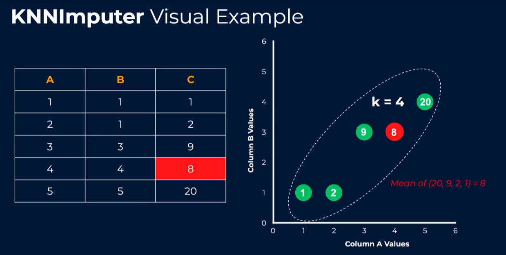

# Handling Missing Values Before ML in Python — Beginner Notes

Below you get the two usual deliverables: the tutorial write-up (`.md`) and the matching runnable script (`dealing_with_missing_values.py`). The `.md` code blocks are numbered and contiguous, so pasting them in order gives you exactly the script at the end.

---



## 📄 `missing_values_tutorial.md`

# Dealing With Missing Values in Python (Before You Train a Model)

## 1. Why missing values matter

Real datasets are almost never complete. A hospital system may not have the lab result for every patient; an e-commerce site may not know the age of every shopper. In pandas, a missing value shows up as `NaN` (`np.nan`), `None`, or `pd.NA`.

Two problems follow:

1. **Most scikit-learn models crash on `NaN`.** A linear regression simply cannot multiply a missing number.
2. **How you fill the gap changes the answer.** Filling with the mean keeps the average but shrinks the spread — which quietly biases the model.

So the goal is not "make the NaNs disappear", it's **"fill them in a way that keeps the signal and doesn't leak information."**

## 2. Three flavours of missingness (know what you're dealing with)

| Type     | Name                         | Meaning                                           | Example                                           |
| -------- | ---------------------------- | ------------------------------------------------- | ------------------------------------------------- |
| **MCAR** | Missing Completely At Random | Missingness is unrelated to anything              | A sensor randomly dropped 5% of readings          |
| **MAR**  | Missing At Random            | Missingness depends on _another observed_ column  | Older patients (`age` known) skip the `bmi` field |
| **MNAR** | Missing Not At Random        | Missingness depends on the _missing value itself_ | High-income people refuse to state income         |

**Why you care:** MCAR is safe to delete or impute simply. MAR is usually fixable with model-based imputation (KNN / iterative). MNAR is dangerous — dropping those rows removes exactly the extreme cases, so the fix is often to **keep a "was it missing?" flag** so the model can learn from the pattern itself.

## 3. Step 0 — Set up

```python
# ===================== BLOCK 1 - imports and settings =====================
"""
dealing_with_missing_values.py
Beginner-friendly tour of how to handle missing values before training
a machine-learning model in Python.

Run:  python dealing_with_missing_values.py
Output: printed summaries + plots saved to ./plots/ and shown on screen.
"""

import os

import numpy as np
import pandas as pd
import matplotlib.pyplot as plt

from sklearn.datasets import load_diabetes
from sklearn.experimental import enable_iterative_imputer  # noqa: F401
from sklearn.impute import SimpleImputer, KNNImputer, IterativeImputer
from sklearn.linear_model import LinearRegression
from sklearn.pipeline import Pipeline
from sklearn.preprocessing import StandardScaler
from sklearn.model_selection import KFold, cross_val_score

RANDOM_STATE = 42
TARGET = "target_progression"
OUT_DIR = "plots"
os.makedirs(OUT_DIR, exist_ok=True)

rng = np.random.default_rng(RANDOM_STATE)
plt.rcParams["figure.figsize"] = (10, 5)
```

_Why `load_diabetes`?_ It ships inside scikit-learn, so the tutorial runs completely offline. We then **inject** missing values ourselves — that way we still know the "true" values and can see what imputation costs us (a luxury you never have with real data).

## 4. Step 0b — Build a dataset with realistic missingness

```python
# ===================== BLOCK 2 - build data with missing values ==========
def load_and_spoil_data():
    """Load a clean dataset, then punch three different kinds of holes in it."""
    df = load_diabetes(as_frame=True).frame
    df = df.rename(columns={"target": TARGET})
    original = df.copy()
    n = len(df)

    # (a) MCAR - missing completely at random
    for col, frac in [("bmi", 0.15), ("bp", 0.08)]:
        df.loc[rng.random(n) < frac, col] = np.nan

    # (b) MAR - missingness driven by ANOTHER observed column (s4)
    z = (df["s4"] - df["s4"].mean()) / df["s4"].std()
    p = 0.40 / (1.0 + np.exp(-1.5 * z))
    df.loc[rng.random(n) < p, "s3"] = np.nan

    # (c) MNAR - missingness driven by the VALUE ITSELF (s5)
    cutoff = df["s5"].quantile(0.80)
    df.loc[(df["s5"] > cutoff) & (rng.random(n) < 0.80), "s5"] = np.nan

    return original, df
```

## 5. Step 1 — Detect missing values

Beginners often miss hidden markers: `"NA"`, `"?"`, `-999`, `0`. Always tell pandas about them when reading a file:

```python
pd.read_csv("data.csv", na_values=["NA", "?", "", "-999", "Unknown"])
```

Then look at the damage:

```python
# ===================== BLOCK 3 - missing-value summary ====================
def summarize_missing(df):
    """Table of columns that actually contain missing values."""
    counts = df.isna().sum()
    pct = (counts / len(df) * 100).round(1)
    table = pd.DataFrame({"missing": counts, "pct_of_rows": pct})
    return table[table["missing"] > 0].sort_values("pct_of_rows", ascending=False)
```

Handy pandas one-liners:

```python
df.isna().sum()          # count per column
df.isna().any()          # True if a column has any NaN
df.isna().sum().sum()    # total NaNs
df["bmi"].isna().mean()  # 15% -> fraction missing
```

**Visual check** — a bar chart for _how much_, and a dark/light map for _where_:

```python
# ===================== BLOCK 4 - missing-value overview plot ==============
def plot_missing_overview(df, out_dir=OUT_DIR):
    counts = df.isna().sum()
    counts = counts[counts > 0].sort_values(ascending=False)
    pct = (counts / len(df) * 100).round(1)

    fig, axes = plt.subplots(1, 2, figsize=(13, 5))

    axes[0].bar(pct.index, pct.values, color="#4C72B0")
    axes[0].set_title("How much is missing?")
    axes[0].set_ylabel("% of rows missing")
    axes[0].tick_params(axis="x", rotation=45)
    for i, v in enumerate(pct.values):
        axes[0].text(i, v + 0.4, f"{v}%", ha="center", fontsize=9)

    axes[1].imshow(df[counts.index].isna().to_numpy().T, aspect="auto",
                   cmap="gray_r", interpolation="nearest")
    axes[1].set_yticks(range(len(counts)))
    axes[1].set_yticklabels(counts.index)
    axes[1].set_xlabel("row index")
    axes[1].set_title("Where is it missing? (dark = missing)")

    fig.suptitle("Missing-value overview", fontsize=14)
    fig.tight_layout()
    fig.savefig(os.path.join(out_dir, "01_missing_overview.png"), dpi=150)
    plt.show()
```

**How to read the picture:** clusters of dark pixels down one side of the right-hand chart are a red flag — they mean missingness is _not_ random (MAR/MNAR), so deleting those rows will distort your data. (If you want fancier plots, the optional `missingno` library does this in one line — but it's not required.)

## 6. Step 2 — The simple fixes, and what they cost you

### 6.1 Delete

```python
df.dropna()                        # drop any row with a NaN
df.dropna(axis=1)                  # drop any column with a NaN
df.dropna(thresh=len(df) * 0.6)    # keep columns that are >=60% complete
```

Fast, honest, and fine when only ~1–5% is missing at random. It becomes a disaster when 40% of rows vanish — and worse when the missing rows are the interesting ones (MNAR).

### 6.2 Fill with one number (univariate imputation)

```python
df["bmi"].fillna(df["bmi"].mean())      # numeric, roughly symmetric
df["bmi"].fillna(df["bmi"].median())    # numeric, skewed / outliers
df["sex"].fillna(df["sex"].mode()[0])   # categorical
df["bmi"].ffill()                       # time series: carry last value forward
df["bmi"].fillna(-1)                    # "constant" — signals "unknown"
```

**Formula — mean imputation:**

$$\hat{x}_i = \bar{x}_{obs} = \frac{1}{n_{obs}}\sum_{j \in obs} x_j$$

**The side effect you must know** — mean imputation keeps the mean exactly, but it shrinks the variance, because every filled value sits on the centre and contributes zero spread:

$$
\text{Var}_{filled} = \frac{n_{obs}}{n}\,\text{Var}_{obs}
\qquad\Rightarrow\qquad
\text{std}_{filled} = \sqrt{\frac{n_{obs}}{n}}\;\text{std}_{obs}
$$

With 15% missing, `sqrt(0.85) ≈ 0.92`: the standard deviation silently drops ~8%. The distribution grows an artificial spike at the mean. The next plot shows this in action.

```python
# ===================== BLOCK 5 - what imputation does to a distribution ===
def plot_imputation_effect(original, df_missing, column="bmi", out_dir=OUT_DIR):
    obs = df_missing[column].dropna()
    knn_col = KNNImputer(n_neighbors=5).fit_transform(df_missing[[column]]).ravel()

    variants = {
        "Original data (no missing)": original[column].to_numpy(),
        "Mean imputation": df_missing[column].fillna(obs.mean()).to_numpy(),
        "Median imputation": df_missing[column].fillna(obs.median()).to_numpy(),
        "KNN imputation (k=5)": knn_col,
    }

    fig, axes = plt.subplots(2, 2, figsize=(12, 8))
    for ax, (title, values) in zip(axes.ravel(), variants.items()):
        ax.hist(values, bins=25, color="#55A868", edgecolor="white")
        ax.axvline(np.mean(values), color="black", linestyle="--", linewidth=1.2,
                   label=f"mean = {np.mean(values):.4f}")
        ax.set_title(f"{title}\nstd = {np.std(values):.4f}")
        ax.set_xlabel(column)
        ax.set_ylabel("count")
        ax.legend(fontsize=8)

    fig.suptitle(f"Imputation shrinks variance: '{column}' example", fontsize=14)
    fig.tight_layout()
    fig.savefig(os.path.join(out_dir, "02_imputation_effect.png"), dpi=150)
    plt.show()

    n, n_obs = len(df_missing), len(obs)
    print(f"\n['{column}'] observed rows           : {n_obs}/{n}  ({n_obs / n:.0%})")
    print(f"           std of observed data      : {obs.std():.4f}")
    print(f"           std after mean imputation : {df_missing[column].fillna(obs.mean()).std():.4f}")
    print(f"           theory sqrt(n_obs/n)*std  : {np.sqrt(n_obs / n) * obs.std():.4f}")
    print(f"           std of the true column    : {original[column].std():.4f}")
```

## 7. Step 3 — scikit-learn's imputers (the professional way)

### 7.1 `SimpleImputer` — same idea, but pipeline-ready

```python
from sklearn.impute import SimpleImputer

SimpleImputer(strategy="mean")                  # mean / median / most_frequent / constant
SimpleImputer(strategy="constant", fill_value=0)
SimpleImputer(strategy="median", add_indicator=True)   # + a 0/1 "was missing" column
```

`add_indicator=True` is the beginner-friendly version of "keep the missingness as a feature" — very useful for **MNAR**, where the fact that a value is absent is itself informative.

### 7.2 `KNNImputer` — borrow from similar rows

For a row with a missing value, find the `k` nearest complete-ish rows and average their values.

**Distance formula (Euclidean, over the observed features `j`):**

$$d(a,b)=\sqrt{\sum_{j\in \text{observed}} \left(a_j-b_j\right)^2}$$

$$\hat{x}_{i}=\frac{1}{k}\sum_{m \in \text{k nearest}} x_{m}$$

Because it uses _other columns_, KNN handles MAR much better than the column mean. Always scale your features first or the distance is dominated by whichever column happens to have the biggest units.

### 7.3 `IterativeImputer` — "MICE": predict each column from the others

For each column with gaps, fit a regression on the other columns, predict the gaps, then repeat:

$$x_j = \beta_0 + \sum_{l \neq j}\beta_l x_l + \varepsilon$$

Two or three passes are usually enough (`max_iter=10`). It's the slowest but the most accurate of the three, and it can model non-linear relationships if you swap in a different estimator.

### 7.4 Always impute **inside** a pipeline

This is the single most common beginner bug: filling NaNs on the full dataset _before_ `train_test_split`/cross-validation leaks the test set's mean into training and gives you optimistic scores.

```python
pipe = Pipeline([
    ("impute", SimpleImputer(strategy="median")),
    ("scale",  StandardScaler()),
    ("model",  LinearRegression()),
])
```

Fit happens on the training fold only; the test fold is transformed with the training statistics. In production, you'd do the same: `imputer.fit(X_train)` → `save` → `imputer.transform(X_live)`.

```python
# ===================== BLOCK 6 - compare strategies with cross-validation =
def evaluate_strategies(df):
    """Cross-validate several imputation strategies, imputation inside the folds."""
    X = df.drop(columns=[TARGET])
    y = df[TARGET].to_numpy()
    cv = KFold(n_splits=5, shuffle=True, random_state=RANDOM_STATE)

    strategies = {
        "Mean": SimpleImputer(strategy="mean"),
        "Median": SimpleImputer(strategy="median"),
        "Most frequent": SimpleImputer(strategy="most_frequent"),
        "Constant (-1)": SimpleImputer(strategy="constant", fill_value=-1),
        "KNN (k=5)": KNNImputer(n_neighbors=5),
        "Iterative (MICE)": IterativeImputer(random_state=RANDOM_STATE, max_iter=10),
        "Median + missing flag": SimpleImputer(strategy="median", add_indicator=True),
    }

    results = {}
    for name, imputer in strategies.items():
        pipe = Pipeline([
            ("impute", imputer),
            ("scale", StandardScaler()),
            ("model", LinearRegression()),
        ])
        scores = cross_val_score(pipe, X, y, cv=cv,
                                 scoring="neg_root_mean_squared_error")
        results[name] = -scores.mean()
    return results


def baseline_drop_rows(df):
    """The 'just delete them' baseline, for comparison."""
    clean = df.dropna()
    X = clean.drop(columns=[TARGET])
    y = clean[TARGET].to_numpy()
    cv = KFold(n_splits=5, shuffle=True, random_state=RANDOM_STATE)
    pipe = Pipeline([("scale", StandardScaler()), ("model", LinearRegression())])
    scores = cross_val_score(pipe, X, y, cv=cv, scoring="neg_root_mean_squared_error")
    return -scores.mean(), len(clean)
```

**Error metric used above — RMSE** (lower is better, same units as the target):

$$\text{RMSE}=\sqrt{\frac{1}{n}\sum_{i=1}^{n}\left(y_i-\hat{y}_i\right)^2}$$

```python
# ===================== BLOCK 7 - plots for model comparison ===============
def plot_model_comparison(results, drop_info, out_dir=OUT_DIR):
    labels = list(results.keys())
    values = [results[k] for k in labels]

    fig, ax = plt.subplots(figsize=(10, 5.5))
    bars = ax.barh(labels, values, color="#C44E52")
    ax.axvline(drop_info["rmse"], color="black", linestyle="--", linewidth=1.2,
               label=f"drop-rows baseline: {drop_info['rmse']:.1f} RMSE "
                     f"({drop_info['n_rows']}/{drop_info['n_total']} rows kept)")
    for bar, v in zip(bars, values):
        ax.text(v + 0.3, bar.get_y() + bar.get_height() / 2, f"{v:.1f}",
                va="center", fontsize=9)
    ax.set_xlabel("5-fold cross-validated RMSE (lower is better)")
    ax.set_title("Imputation strategy vs. model error")
    ax.invert_yaxis()
    ax.legend(fontsize=9, loc="lower right")
    fig.tight_layout()
    fig.savefig(os.path.join(out_dir, "03_strategy_rmse.png"), dpi=150)
    plt.show()


def knn_sweep(df, ks=(1, 2, 3, 5, 10, 20)):
    """Treat the imputer's k like any other hyper-parameter."""
    X = df.drop(columns=[TARGET])
    y = df[TARGET].to_numpy()
    cv = KFold(n_splits=5, shuffle=True, random_state=RANDOM_STATE)
    out = {}
    for k in ks:
        pipe = Pipeline([
            ("impute", KNNImputer(n_neighbors=k)),
            ("scale", StandardScaler()),
            ("model", LinearRegression()),
        ])
        out[k] = -cross_val_score(pipe, X, y, cv=cv,
                                  scoring="neg_root_mean_squared_error").mean()
    return out


def plot_knn_sweep(sweep, out_dir=OUT_DIR):
    ks = list(sweep.keys())
    rmse = [sweep[k] for k in ks]
    best = ks[int(np.argmin(rmse))]

    fig, ax = plt.subplots(figsize=(8, 5))
    ax.plot(ks, rmse, marker="o", color="#4C72B0")
    ax.axvline(best, color="black", linestyle=":", linewidth=1)
    ax.set_xlabel("k (nearest neighbours used for imputation)")
    ax.set_ylabel("CV RMSE")
    ax.set_title(f"Tuning KNN imputation (best k = {best})")
    ax.grid(alpha=0.3)
    fig.tight_layout()
    fig.savefig(os.path.join(out_dir, "04_knn_sweep.png"), dpi=150)
    plt.show()
```

## 8. Step 4 — Put it all together

```python
# ===================== BLOCK 8 - main walkthrough =========================
def main():
    # ---- Step 0: models cannot swallow NaN -------------------------------
    original, df = load_and_spoil_data()
    try:
        LinearRegression().fit(df.drop(columns=[TARGET]), df[TARGET])
    except ValueError as err:
        print("Training on raw NaN data fails with:")
        print(f"   ValueError: {err}\n")

    # ---- Step 1: detect ---------------------------------------------------
    print("=" * 70)
    print("STEP 1 - Detect: how much is missing, and where?")
    print("=" * 70)
    print(df.isna().sum().to_string())
    print("\nColumns with missing values (% of rows):")
    print(summarize_missing(df).to_string())
    plot_missing_overview(df)

    # ---- Step 2: simple fixes and their side effects ---------------------
    print("\n" + "=" * 70)
    print("STEP 2 - Simple imputation and the variance problem")
    print("=" * 70)
    obs = df["bmi"].dropna()
    print(f"bmi mean before imputation : {obs.mean():.4f}")
    print(f"bmi mean after  imputation : {df['bmi'].fillna(obs.mean()).mean():.4f} (unchanged)")
    plot_imputation_effect(original, df)

    # ---- Step 3: honest comparison ---------------------------------------
    print("\n" + "=" * 70)
    print("STEP 3 - Which strategy predicts best? (imputation inside CV!)")
    print("=" * 70)
    results = evaluate_strategies(df)
    for name, rmse in sorted(results.items(), key=lambda kv: kv[1]):
        print(f"   {name:<24} RMSE = {rmse:7.2f}")

    drop_rmse, n_kept = baseline_drop_rows(df)
    drop_info = {"rmse": drop_rmse, "n_rows": n_kept, "n_total": len(df)}
    print(f"   {'Drop rows with NaN':<24} RMSE = {drop_rmse:7.2f} "
          f"(keeps only {n_kept}/{len(df)} rows)")
    plot_model_comparison(results, drop_info)

    # ---- Step 4: tune the imputer ----------------------------------------
    print("\n" + "=" * 70)
    print("STEP 4 - Tune the imputer (KNN example)")
    print("=" * 70)
    sweep = knn_sweep(df)
    for k, rmse in sweep.items():
        print(f"   k={k:<3} RMSE = {rmse:7.2f}")
    plot_knn_sweep(sweep)

    print(f"\nDone. Figures are in ./{OUT_DIR}/")


if __name__ == "__main__":
    main()
```

```python
# ===================== BLOCK 9 - entry point ==============================
if __name__ == "__main__":
    main()
```

## 9. Decision guide

| Situation                             | Recommended approach                                                     |
| ------------------------------------- | ------------------------------------------------------------------------ |
| < 5% missing, MCAR, plenty of rows    | `dropna()` — simple and unbiased                                         |
| One numeric column, roughly symmetric | median or mean via `SimpleImputer` (median is safer with outliers)       |
| One categorical column                | `strategy="most_frequent"` or a `"Unknown"` category                     |
| Time series                           | `ffill()` / `bfill()` / interpolation, never a global mean               |
| Several correlated columns, MAR       | `KNNImputer` or `IterativeImputer`                                       |
| Suspected MNAR                        | Keep the data, add `add_indicator=True`, and treat the flag as a feature |
| > 60% of a column missing             | Usually drop the column; a nearly-empty column adds noise                |
| Always                                | Fit the imputer on **training data only**                                |

## 10. Business / company use cases

- **Healthcare analytics** — a hospital predicts 30-day readmission. Lab tests (`HbA1c`, cholesterol) are missing for patients who didn't get tested. That's MAR (driven by age, insurance, department). Median imputation per department + a "test not ordered" indicator beats dropping rows, because dropping silently deletes the under-tested — and often sickest — patients.
- **Banking / credit scoring** — loan applications missing `annual_income` are usually MNAR (high earners decline to disclose). Deleting them changes the applicant mix; instead keep them, impute the median, and add a `income_missing` flag. The flag itself becomes a real risk signal.
- **E-commerce churn** — `age` is missing for ~20% of sign-ups. KNN imputation using `avg_order_value`, `sessions_per_month`, and `tenure` recovers plausible values, and churn models stop under-scoring anonymous users.
- **Manufacturing / IoT** — vibration sensors drop readings during network outages. Time-series forward-fill plus a "sensor offline" flag keeps the production line's anomaly detector from firing on gaps.
- **Insurance claims** — claim forms often miss `vehicle_mileage`. Region-level median imputation (grouped by vehicle type) is far better than a single global number, because mileage distributions differ wildly between segments.
- **Marketing / CRM** — campaign data missing `industry` for SMB leads: fill with `"Unknown"` as its own category rather than the most frequent industry, so the model can learn that unknown-industry leads behave differently.

## 11. Common pitfalls

1. **Leakage** — imputing before `train_test_split`. Always impute inside a `Pipeline`.
2. **Mean-imputing a skewed column** — the mean is dragged by outliers; use the median.
3. **Mean-imputing a categorical column** — meaningless; use the mode or a new `"Unknown"` level.
4. **Forgetting variance shrinkage** — mean imputation understates uncertainty and weakens correlation-based models.
5. **Imputing the target** — never invent `y`. Drop rows whose target is missing.
6. **Dropping rows that are missing _because_ they're special (MNAR)** — you delete the extreme cases and flatten your model.
7. **Different treatment at inference** — fit the imputer once, save it (`joblib.dump`), reuse it in production. Never re-fit on live data.
8. **Imputing before scaling for KNN** — distance-based methods need `StandardScaler` first.

## 12. Cheat sheet

```python
# detect
df.isna().sum(); df.isna().mean()
df.isna().any(axis=1).sum()          # rows containing at least one NaN

# drop
df.dropna(); df.dropna(axis=1, thresh=len(df) * 0.6)

# fill (quick and dirty)
df["x"].fillna(df["x"].median())
df["x"].fillna(df["x"].mode()[0])
df["x"].ffill()

# fill (proper, in a pipeline)
from sklearn.impute import SimpleImputer, KNNImputer
from sklearn.experimental import enable_iterative_imputer  # noqa: F401
from sklearn.impute import IterativeImputer

SimpleImputer(strategy="median", add_indicator=True)
KNNImputer(n_neighbors=5)             # scale first!
IterativeImputer(random_state=0)      # slowest, usually best (MAR)

# always
Pipeline([("impute", SimpleImputer(strategy="median")),
          ("scale",  StandardScaler()),
          ("model",  LinearRegression())])
```

**Rule of thumb:** detect → understand _why_ it's missing → choose the cheapest method that keeps the signal → validate it like any other hyper-parameter with cross-validation.

---

## 🐍 `dealing_with_missing_values.py` (full copy-pasteable script)

```python
"""
dealing_with_missing_values.py
------------------------------
Beginner-friendly tour of how to handle missing values before training
a machine-learning model in Python.

Run:
    python dealing_with_missing_values.py

Output:
    - printed summaries at every step
    - plots saved to ./plots/*.png and then shown on screen
"""

import os

import numpy as np
import pandas as pd
import matplotlib.pyplot as plt

from sklearn.datasets import load_diabetes
from sklearn.experimental import enable_iterative_imputer  # noqa: F401
from sklearn.impute import SimpleImputer, KNNImputer, IterativeImputer
from sklearn.linear_model import LinearRegression
from sklearn.pipeline import Pipeline
from sklearn.preprocessing import StandardScaler
from sklearn.model_selection import KFold, cross_val_score

RANDOM_STATE = 42
TARGET = "target_progression"
OUT_DIR = "plots"
os.makedirs(OUT_DIR, exist_ok=True)

rng = np.random.default_rng(RANDOM_STATE)
plt.rcParams["figure.figsize"] = (10, 5)


# ----------------------------------------------------------------------
# Data: load clean, then punch three kinds of holes in it
# ----------------------------------------------------------------------
def load_and_spoil_data():
    df = load_diabetes(as_frame=True).frame
    df = df.rename(columns={"target": TARGET})
    original = df.copy()
    n = len(df)

    # (a) MCAR - missing completely at random
    for col, frac in [("bmi", 0.15), ("bp", 0.08)]:
        df.loc[rng.random(n) < frac, col] = np.nan

    # (b) MAR - missingness driven by another observed column (s4)
    z = (df["s4"] - df["s4"].mean()) / df["s4"].std()
    p = 0.40 / (1.0 + np.exp(-1.5 * z))
    df.loc[rng.random(n) < p, "s3"] = np.nan

    # (c) MNAR - missingness driven by the value itself (s5)
    cutoff = df["s5"].quantile(0.80)
    df.loc[(df["s5"] > cutoff) & (rng.random(n) < 0.80), "s5"] = np.nan

    return original, df


def summarize_missing(df):
    counts = df.isna().sum()
    pct = (counts / len(df) * 100).round(1)
    table = pd.DataFrame({"missing": counts, "pct_of_rows": pct})
    return table[table["missing"] > 0].sort_values("pct_of_rows", ascending=False)


# ----------------------------------------------------------------------
# Plots
# ----------------------------------------------------------------------
def plot_missing_overview(df, out_dir=OUT_DIR):
    counts = df.isna().sum()
    counts = counts[counts > 0].sort_values(ascending=False)
    pct = (counts / len(df) * 100).round(1)

    fig, axes = plt.subplots(1, 2, figsize=(13, 5))

    axes[0].bar(pct.index, pct.values, color="#4C72B0")
    axes[0].set_title("How much is missing?")
    axes[0].set_ylabel("% of rows missing")
    axes[0].tick_params(axis="x", rotation=45)
    for i, v in enumerate(pct.values):
        axes[0].text(i, v + 0.4, f"{v}%", ha="center", fontsize=9)

    axes[1].imshow(df[counts.index].isna().to_numpy().T, aspect="auto",
                   cmap="gray_r", interpolation="nearest")
    axes[1].set_yticks(range(len(counts)))
    axes[1].set_yticklabels(counts.index)
    axes[1].set_xlabel("row index")
    axes[1].set_title("Where is it missing? (dark = missing)")

    fig.suptitle("Missing-value overview", fontsize=14)
    fig.tight_layout()
    fig.savefig(os.path.join(out_dir, "01_missing_overview.png"), dpi=150)
    plt.show()


def plot_imputation_effect(original, df_missing, column="bmi", out_dir=OUT_DIR):
    obs = df_missing[column].dropna()
    knn_col = KNNImputer(n_neighbors=5).fit_transform(df_missing[[column]]).ravel()

    variants = {
        "Original data (no missing)": original[column].to_numpy(),
        "Mean imputation": df_missing[column].fillna(obs.mean()).to_numpy(),
        "Median imputation": df_missing[column].fillna(obs.median()).to_numpy(),
        "KNN imputation (k=5)": knn_col,
    }

    fig, axes = plt.subplots(2, 2, figsize=(12, 8))
    for ax, (title, values) in zip(axes.ravel(), variants.items()):
        ax.hist(values, bins=25, color="#55A868", edgecolor="white")
        ax.axvline(np.mean(values), color="black", linestyle="--", linewidth=1.2,
                   label=f"mean = {np.mean(values):.4f}")
        ax.set_title(f"{title}\nstd = {np.std(values):.4f}")
        ax.set_xlabel(column)
        ax.set_ylabel("count")
        ax.legend(fontsize=8)

    fig.suptitle(f"Imputation shrinks variance: '{column}' example", fontsize=14)
    fig.tight_layout()
    fig.savefig(os.path.join(out_dir, "02_imputation_effect.png"), dpi=150)
    plt.show()

    n, n_obs = len(df_missing), len(obs)
    print(f"\n['{column}'] observed rows           : {n_obs}/{n}  ({n_obs / n:.0%})")
    print(f"           std of observed data      : {obs.std():.4f}")
    print(f"           std after mean imputation : {df_missing[column].fillna(obs.mean()).std():.4f}")
    print(f"           theory sqrt(n_obs/n)*std  : {np.sqrt(n_obs / n) * obs.std():.4f}")
    print(f"           std of the true column    : {original[column].std():.4f}")


def plot_model_comparison(results, drop_info, out_dir=OUT_DIR):
    labels = list(results.keys())
    values = [results[k] for k in labels]

    fig, ax = plt.subplots(figsize=(10, 5.5))
    bars = ax.barh(labels, values, color="#C44E52")
    ax.axvline(drop_info["rmse"], color="black", linestyle="--", linewidth=1.2,
               label=f"drop-rows baseline: {drop_info['rmse']:.1f} RMSE "
                     f"({drop_info['n_rows']}/{drop_info['n_total']} rows kept)")
    for bar, v in zip(bars, values):
        ax.text(v + 0.3, bar.get_y() + bar.get_height() / 2, f"{v:.1f}",
                va="center", fontsize=9)
    ax.set_xlabel("5-fold cross-validated RMSE (lower is better)")
    ax.set_title("Imputation strategy vs. model error")
    ax.invert_yaxis()
    ax.legend(fontsize=9, loc="lower right")
    fig.tight_layout()
    fig.savefig(os.path.join(out_dir, "03_strategy_rmse.png"), dpi=150)
    plt.show()


def plot_knn_sweep(sweep, out_dir=OUT_DIR):
    ks = list(sweep.keys())
    rmse = [sweep[k] for k in ks]
    best = ks[int(np.argmin(rmse))]

    fig, ax = plt.subplots(figsize=(8, 5))
    ax.plot(ks, rmse, marker="o", color="#4C72B0")
    ax.axvline(best, color="black", linestyle=":", linewidth=1)
    ax.set_xlabel("k (nearest neighbours used for imputation)")
    ax.set_ylabel("CV RMSE")
    ax.set_title(f"Tuning KNN imputation (best k = {best})")
    ax.grid(alpha=0.3)
    fig.tight_layout()
    fig.savefig(os.path.join(out_dir, "04_knn_sweep.png"), dpi=150)
    plt.show()


# ----------------------------------------------------------------------
# Evaluation
# ----------------------------------------------------------------------
def evaluate_strategies(df):
    X = df.drop(columns=[TARGET])
    y = df[TARGET].to_numpy()
    cv = KFold(n_splits=5, shuffle=True, random_state=RANDOM_STATE)

    strategies = {
        "Mean": SimpleImputer(strategy="mean"),
        "Median": SimpleImputer(strategy="median"),
        "Most frequent": SimpleImputer(strategy="most_frequent"),
        "Constant (-1)": SimpleImputer(strategy="constant", fill_value=-1),
        "KNN (k=5)": KNNImputer(n_neighbors=5),
        "Iterative (MICE)": IterativeImputer(random_state=RANDOM_STATE, max_iter=10),
        "Median + missing flag": SimpleImputer(strategy="median", add_indicator=True),
    }

    results = {}
    for name, imputer in strategies.items():
        pipe = Pipeline([
            ("impute", imputer),
            ("scale", StandardScaler()),
            ("model", LinearRegression()),
        ])
        scores = cross_val_score(pipe, X, y, cv=cv,
                                 scoring="neg_root_mean_squared_error")
        results[name] = -scores.mean()
    return results


def baseline_drop_rows(df):
    clean = df.dropna()
    X = clean.drop(columns=[TARGET])
    y = clean[TARGET].to_numpy()
    cv = KFold(n_splits=5, shuffle=True, random_state=RANDOM_STATE)
    pipe = Pipeline([("scale", StandardScaler()), ("model", LinearRegression())])
    scores = cross_val_score(pipe, X, y, cv=cv, scoring="neg_root_mean_squared_error")
    return -scores.mean(), len(clean)


def knn_sweep(df, ks=(1, 2, 3, 5, 10, 20)):
    X = df.drop(columns=[TARGET])
    y = df[TARGET].to_numpy()
    cv = KFold(n_splits=5, shuffle=True, random_state=RANDOM_STATE)
    out = {}
    for k in ks:
        pipe = Pipeline([
            ("impute", KNNImputer(n_neighbors=k)),
            ("scale", StandardScaler()),
            ("model", LinearRegression()),
        ])
        out[k] = -cross_val_score(pipe, X, y, cv=cv,
                                  scoring="neg_root_mean_squared_error").mean()
    return out


# ----------------------------------------------------------------------
# Main walkthrough
# ----------------------------------------------------------------------
def main():
    # ---- Step 0: models cannot swallow NaN -------------------------------
    original, df = load_and_spoil_data()
    try:
        LinearRegression().fit(df.drop(columns=[TARGET]), df[TARGET])
    except ValueError as err:
        print("Training on raw NaN data fails with:")
        print(f"   ValueError: {err}\n")

    # ---- Step 1: detect ---------------------------------------------------
    print("=" * 70)
    print("STEP 1 - Detect: how much is missing, and where?")
    print("=" * 70)
    print(df.isna().sum().to_string())
    print("\nColumns with missing values (% of rows):")
    print(summarize_missing(df).to_string())
    plot_missing_overview(df)

    # ---- Step 2: simple fixes and their side effects ---------------------
    print("\n" + "=" * 70)
    print("STEP 2 - Simple imputation and the variance problem")
    print("=" * 70)
    obs = df["bmi"].dropna()
    print(f"bmi mean before imputation : {obs.mean():.4f}")
    print(f"bmi mean after  imputation : {df['bmi'].fillna(obs.mean()).mean():.4f} (unchanged)")
    plot_imputation_effect(original, df)

    # ---- Step 3: honest comparison ---------------------------------------
    print("\n" + "=" * 70)
    print("STEP 3 - Which strategy predicts best? (imputation inside CV!)")
    print("=" * 70)
    results = evaluate_strategies(df)
    for name, rmse in sorted(results.items(), key=lambda kv: kv[1]):
        print(f"   {name:<24} RMSE = {rmse:7.2f}")

    drop_rmse, n_kept = baseline_drop_rows(df)
    drop_info = {"rmse": drop_rmse, "n_rows": n_kept, "n_total": len(df)}
    print(f"   {'Drop rows with NaN':<24} RMSE = {drop_rmse:7.2f} "
          f"(keeps only {n_kept}/{len(df)} rows)")
    plot_model_comparison(results, drop_info)

    # ---- Step 4: tune the imputer ----------------------------------------
    print("\n" + "=" * 70)
    print("STEP 4 - Tune the imputer (KNN example)")
    print("=" * 70)
    sweep = knn_sweep(df)
    for k, rmse in sweep.items():
        print(f"   k={k:<3} RMSE = {rmse:7.2f}")
    plot_knn_sweep(sweep)

    print(f"\nDone. Figures are in ./{OUT_DIR}/")


if __name__ == "__main__":
    main()
```

**What you'll see when you run it:**

1. A `ValueError` proving scikit-learn refuses raw `NaN` input.
2. A missing-value summary table plus `plots/01_missing_overview.png` (bar chart + missingness map).
3. `plots/02_imputation_effect.png` — four histograms showing the original distribution vs. mean, median and KNN imputation, with the measured standard deviation in each title (watch the mean-imputed panel's std drop). The console also prints the observed std versus the theoretical `sqrt(n_obs/n) × std_obs`.
4. `plots/03_strategy_rmse.png` — 5-fold CV RMSE for every strategy, with the drop-rows baseline as a dashed line (note how few rows survive).
5. `plots/04_knn_sweep.png` — RMSE as a function of `k`, showing that the imputer itself is a tunable hyper-parameter.

The takeaway: **detect first, understand the missingness mechanism, pick the cheapest method that preserves signal, and always cross-validate it inside a pipeline.**
