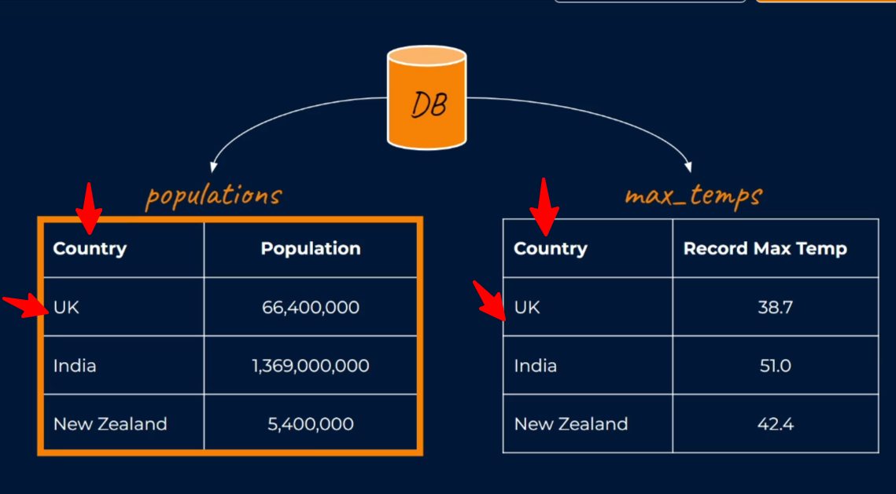
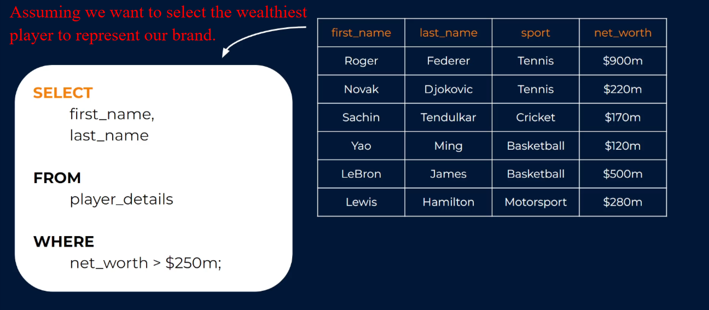
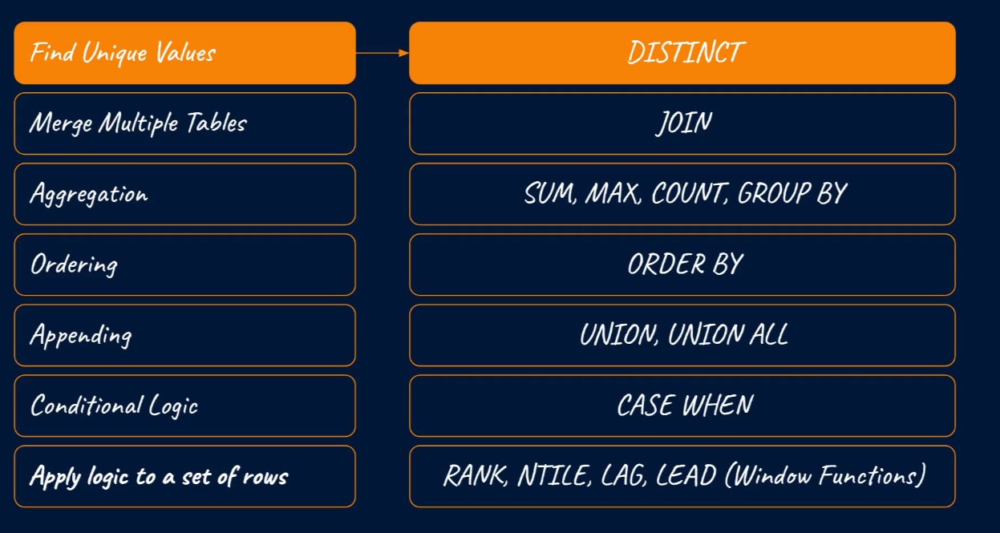

# Introduction to SQL for Data Science & Analytics

## SQL - Structured Query Language

This means it is a query language and main purpose is to query, with the query you can analyze data and draw conclusions for businesses or project.

## Easy To Learn And Use

The reason being that it is closest to how a human being ask for something to happen.

## Uses

It is used to `store`, `manipulate` and `extract` data in relational databases.

## Relational Databases

This is a collection of tabular datasets (think column & rows) that relate to each other through shared (PK & FK) columns.

## What We Can Do With The Data In A RDBMS

What we can do is better described using `CRUD`.

This describes the core functions or operations that can be performed on a relational database.

**C - Create**: For creating databases, schemas.

**R - Read**: This sis the actual querying of the databases. It's essentially grabbing the relevant rows and columns from tables that will provide us with the information that we need.

**U - Update**: This means we can add more rows and columns to tables that are already exist as well as modify records within table. E.g. We can update marital status from `single` to `married`.

**D - Delete**: With this we can delete specific rows and columns, or we can delete whole tables, schemas and even databases.

## Some of the common tasks that a `data professional` might undertake using `sql` in a business setting

> Querying & exploring data to extract useful business insights.

> Trying to distill customer behaviors, trends or patterns that will make an impact on the business, seldom come from an opinion or an idea. These are data driven insights, which can only come from exploring the data.

> In your career you will often see managers or stakeholders will have theories around which customers are driving certain business metrics. And the only way to confirm, deny or refine these ideas is to simply ask the data (The theories must be data driven).

> In many cases, even a simple sql query can have a huge impact on a business, providing key evidence for strategic decisions.

> You're often going to be using sql to gather and aggregate data for business reporting.

> Use sql for selecting data for a specific treatment. In other words selecting specific customers, users or data points based on certain criteria. In many retail business for example, you might select customers to either be sent email or contact them to remind them of any offer or any other treatment the business needs to apply for a specific a specific objective. this sort of task leans itself very well to sequel.

> Use sql for Extracting data for Machine Learning & Similar: It's very common to see sql used to extract data for machine learning task or other predictive models.

**SELECT**: References the columns we want to target.

**FROM**: References the table we want to select from.
**WHERE**: Is a clause for filtering.

The `semicolon(;)` shows the end of that query.

