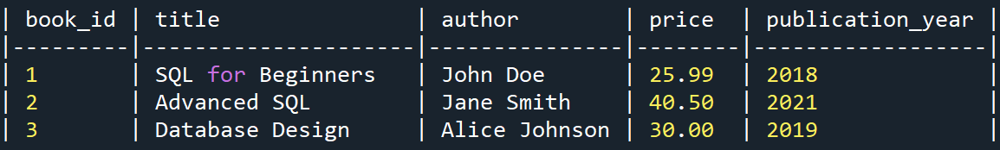
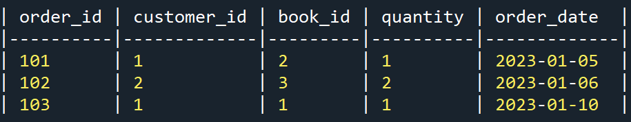

# Weekly SQL Challenge 11

## Problem Summary

You are analyzing an online bookstore database with two tables:

- `books`
- `orders`

Your goal is to calculate the **total revenue generated by each book**.

## Table References

Books table image:


Orders table image:


## Business Goal

This query helps a company understand which books are driving revenue so the team can make better business decisions.

### Company Use Cases (Competition + Profitability)

- Identify top revenue books and prioritize them in homepage promotions.
- Increase stock for high-revenue titles to avoid lost sales from stockouts.
- Negotiate better supplier terms for top-performing books to improve margins.
- Use this data to decide where to spend marketing budget for best return.
- Compare high-revenue titles versus low-revenue titles and decide whether to bundle, discount, or retire weak performers.

## SQL Solution

```sql
select
  b.title,
  sum(o.quantity * b.price) as total_revenue
from
  books b
inner join orders o on b.book_id = o.book_id
group by
  b.title
order by
  total_revenue desc;
```

## Beginner Explanation (What the Query Is Doing)

### 1) Join books and orders

We need data from both tables:

- `books` has the title and price.
- `orders` has the quantity sold.

By joining on `book_id`, each order row gets matched to the correct book row.

### 2) Calculate revenue per order row

Revenue for each order row is:

- `quantity * price`

If a customer buys 3 copies of a $20 book, that order row contributes $60.

### 3) Add revenue for each title

`sum(...)` adds all order-row revenues for the same book title.

### 4) Sort from highest to lowest

`order by total_revenue desc` puts the top revenue books first so decision-makers can act quickly.

## Line-by-Line SQL Breakdown

1. `select`
   - Starts the query and tells SQL which columns to return.

2. `b.title,`
   - Returns the book title from table alias `b` (the `books` table).

3. `sum(o.quantity * b.price) as total_revenue`
   - Multiplies quantity from `orders` by price from `books` for each matching row.
   - `sum(...)` adds those values for each group.
   - `as total_revenue` names the calculated column.

4. `from`
   - Specifies the primary table source.

5. `books b`
   - Uses `books` as the starting table and gives it alias `b`.

6. `inner join orders o on b.book_id = o.book_id`
   - Joins `orders` (alias `o`) to `books`.
   - Match condition: `book_id` in both tables must be equal.
   - `inner join` keeps only rows where a matching order exists.

7. `group by`
   - Tells SQL to aggregate rows by one or more columns.

8. `b.title`
   - Groups all rows of the same title together.
   - This lets `sum(...)` calculate one revenue total per title.

9. `order by`
   - Sorts the final result set.

10. `total_revenue desc;`
    - Sorts by `total_revenue` from highest to lowest.
    - `desc` means descending order.

## Why This Query Supports Better Decisions

- Sales team: focus campaigns on books with strong revenue momentum.
- Inventory team: reorder profitable titles earlier.
- Finance team: estimate revenue concentration risk (too much revenue from too few titles).
- Leadership: make data-driven portfolio decisions to stay competitive in the market.

## Optional Next-Level Improvement

If two books have the same title but are different editions, grouping only by title could merge them incorrectly. In production, prefer grouping by `book_id` and include `title` in the output.
