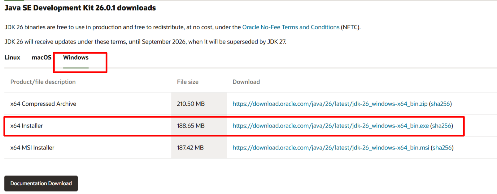
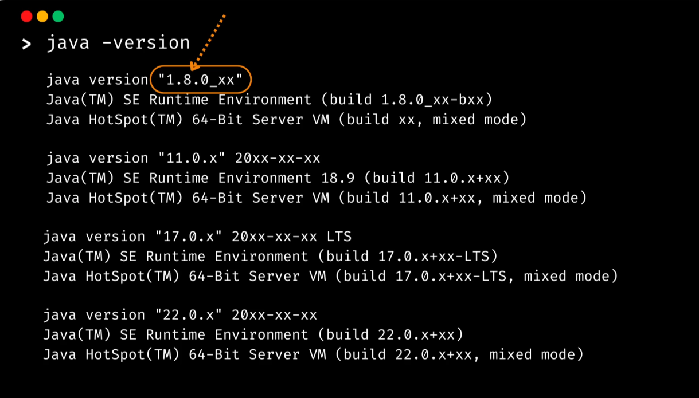
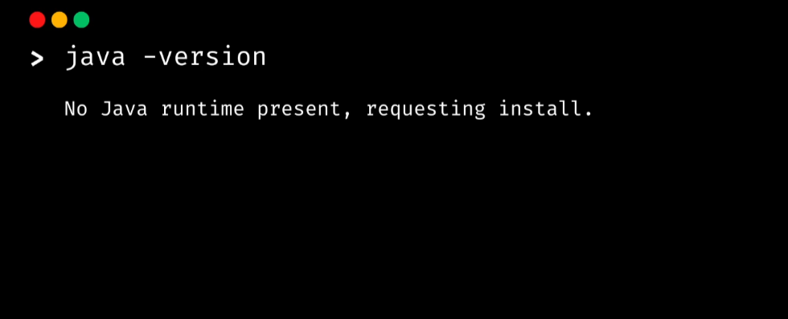
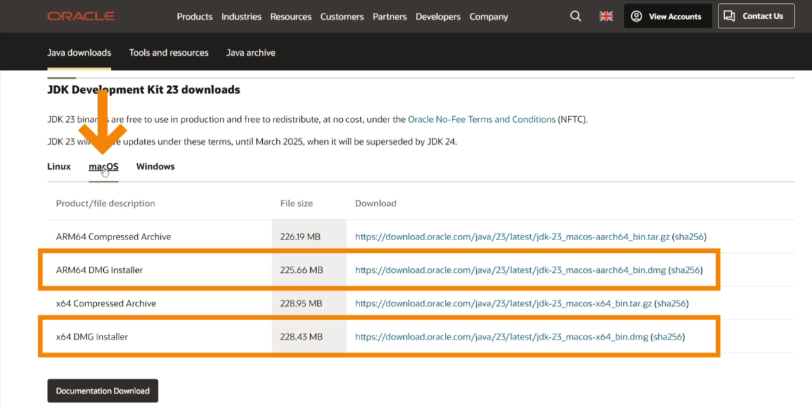

## SET UP SQL WORKBENCH

> STEPS

1. Check your Java version on windows: Type `about Java` in the windows search in taskbar.

2. If no Java is installed, then visit this [download java](https://www.oracle.com/java/technologies/downloads/#jdk26-windows) to download.

3. Download what applies to you based on system configurations.



4. Follow the wizard to install.

## Mac & Linux

> Goto terminal and type `java -version` and hit `Enter`, then you'll see the java version.
>
> 

If not installed, you'll see a message in respect of it not being installed such as below:



You should see a message prompting you to install it, if not head over again to the [java site](https://www.oracle.com/java/technologies/downloads/#jdk26-mac) and download for your `OS`.



5. Next is to connect to the amazing frontend tool called SQL Workbench/J.

Updated todo list

You’re asking for a clear explanation of what SQL Workbench/J is plus practical install-and-run steps; I’ll quickly check your current guide file so I can align the answer with your repo’s instructions.

SQL Workbench/J is a free, cross-platform SQL client (GUI tool) written in Java.  
You use it to connect to databases, run SQL queries/scripts, browse schema objects, and export results.

### Install and run it

1. Install Java (JDK/JRE) first.
2. Verify Java is available:
   - Windows: open Command Prompt and run `java -version`
   - macOS/Linux: open Terminal and run `java -version`
3. If Java is missing, install it from Oracle (or another JDK provider), then re-run `java -version`.
4. Download SQL Workbench/J from its official site.
5. Extract the downloaded archive to a folder (for example, `C:\tools\sqlworkbench` or `~/tools/sqlworkbench`).
6. Start SQL Workbench/J:
   - Windows: run `SQLWorkbench64.exe` (or the launcher included in the package)
   - macOS/Linux: run the startup script (commonly `sqlworkbench.sh`) from Terminal
7. In SQL Workbench/J, create a database profile:
   - Enter JDBC URL
   - Username/password
   - JDBC driver JAR (if required by your database)
8. Test the connection, save the profile, and connect.
9. Open an SQL tab and run a simple query like `SELECT 1;` to confirm everything works.

### In short

The key prerequisites are:

- Java installed and working
- SQL Workbench/J downloaded and launched
- Correct JDBC driver + connection details for your target database

If you want, I can also give you a database-specific quick setup (MySQL, PostgreSQL, SQL Server, Oracle) with the exact JDBC URL format.

`Java Database Connectivity (JDBC) is an application programming interface (API) for the Java programming language which defines how a client may access a database.`

Great. Here is a practical quick setup to get SQL Workbench/J running with real databases.

1. Install prerequisites

- Install Java (JDK 17+ recommended).
- Verify:
  Windows: java -version
  Mac/Linux: java -version
- Download SQL Workbench/J from:
  https://www.sql-workbench.eu/downloads.html
- Extract it and launch:
  Windows: SQLWorkbench64.exe (or SQLWorkbench.exe)
  Mac/Linux: sqlworkbench.sh

2. Open SQL Workbench/J and create a connection

- Go to File > Connect Window.
- Click Create new profile.
- Fill:
  Profile name
  JDBC URL
  Username
  Password
  Driver (JAR file)

3. Add JDBC driver JAR (first time only)

- In the connect window, click Manage Drivers.
- Create a driver entry and point to the downloaded JDBC JAR.
- Save the driver definition.

4. Use one of these database templates

MySQL

- Driver class: com.mysql.cj.jdbc.Driver
- JDBC URL: jdbc:mysql://localhost:3306/your_database
- Driver JAR: mysql-connector-j-<version>.jar

PostgreSQL

- Driver class: org.postgresql.Driver
- JDBC URL: jdbc:postgresql://localhost:5432/your_database
- Driver JAR: postgresql-<version>.jar

SQL Server

- Driver class: com.microsoft.sqlserver.jdbc.SQLServerDriver
- JDBC URL: jdbc:sqlserver://localhost:1433;databaseName=your_database;encrypt=true;trustServerCertificate=true
- Driver JAR: mssql-jdbc-<version>.jar

Oracle

- Driver class: oracle.jdbc.OracleDriver
- JDBC URL: jdbc:oracle:thin:@//localhost:1521/your_service_name
- Driver JAR: ojdbc11.jar (or matching version)

5. Test and run

- Click Test, then OK/Connect.
- Open SQL tab and run:
  SELECT 1;

6. If connection fails, check these first

- Database service is running and reachable.
- Host/port/database name are correct.
- Username/password are correct.
- JDBC driver JAR matches your DB version.
- Firewall/VPN/network rules are not blocking the port.

If you tell me which database you are using right now (MySQL, PostgreSQL, SQL Server, or Oracle), I will give you the exact ready-to-paste profile values for your machine.

## ENCOUNTERING ERRORS

`2026-07-03 21:01:12 - === Starting 32bit SQL Workbench/J launcher ===
2026-07-03 21:01:12 - Base directory: C:\Users\uimar\tools
2026-07-03 21:01:12 - Launcher config file: C:\Users\uimar\tools\SQLWorkbench.cfg
2026-07-03 21:01:12 - Using Java from PATH:C:\Program Files\Common Files\Oracle\Java\javapath
2026-07-03 21:01:12 - Using 1400MB memory
2026-07-03 21:01:12 - Starting Java using:   -cp C:\Users\uimar\tools\sqlworkbench.jar;C:\Users\uimar\tools\ext\* workbench.WbStarter  -Dvisualvm.display.name=SQLWorkbench/J --add-opens=java.desktop/com.sun.java.swing.plaf.windows=ALL-UNNAMED -Xverify:none -Xmx1400m
2026-07-03 21:01:12 - ERROR: could not start java process: The system cannot find the path specified.`

Perfect, you already have Java. Do these exact steps on Windows to run SQL Workbench now.

1. Open Command Prompt and run this temporary setup for this session:

```bat
set "JAVA_HOME=C:\Program Files\Java\jdk-26.0.1"
set "PATH=C:\Program Files\Java\jdk-26.0.1\bin;%PATH%"
where java
java -version
```

2. Start SQL Workbench 64-bit:

```bat
cd /d C:\Users\uimar\tools
SQLWorkbench64.exe
```

If it opens, Java is fixed and the problem was PATH priority.

3. Make it permanent (so you do not repeat step 1):

- Open Start and search: Edit the system environment variables
- Click Environment Variables
- Under User variables:

1. Create or edit JAVA_HOME = C:\Program Files\Java\jdk-26.0.1
2. Edit Path and move/add this to the top:
   C:\Program Files\Java\jdk-26.0.1\bin
3. Remove or move down:
   C:\Program Files\Common Files\Oracle\Java\javapath

- Click OK and reopen Command Prompt

4. Verify permanent config:

```bat
where java
java -version
```

Then run:

```bat
cd /d C:\Users\uimar\tools
SQLWorkbench64.exe
```

If it still fails, run this direct command (bypasses launcher Java lookup):

```bat
"C:\Program Files\Java\jdk-26.0.1\bin\java.exe" -cp "C:\Users\uimar\tools\sqlworkbench.jar;C:\Users\uimar\tools\ext\*" workbench.WbStarter -Xmx1400m
```

If you paste the output of where java, I can confirm in one line whether your PATH order is now correct.
