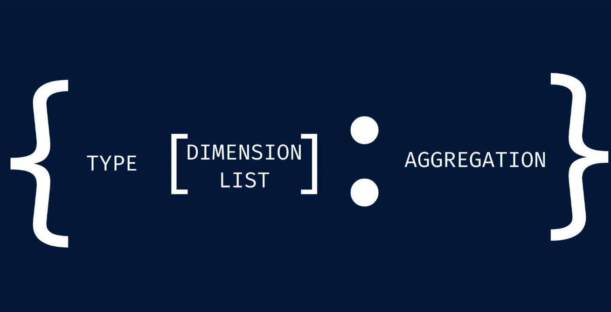

## LEVEL OF DETAIL (LOD) EXPRESSIONS



### What is an LOD Expression?

An **LOD (Level of Detail) Expression** lets you control the granularity — or the "grouping level" — at which a calculation is performed, **independent** of the dimensions present in your chart view.

In simple terms:

> LOD expressions allow you to say: _"Compute this metric at this specific grouping level, regardless of what's on the Columns/Rows shelves."_

This is a **superpower** in Tableau because it breaks the normal rule that aggregations follow whatever dimensions are in the view.

---

### The Problem LOD Expressions Solve

Recall this beginner mistake from **Calculated Fields (Day 24)** :

```tableau
IF [Sales] > AVG([Sales]) THEN "Above Average" ELSE "Below Average" END
```

This fails because `[Sales]` is row-level and `AVG([Sales])` is an aggregate — you can't mix them directly. To fix this without LOD, you'd need a table calculation or a secondary data source. But with LOD:

```tableau
IF [Sales] > {AVG([Sales])} THEN "Above Average" ELSE "Below Average" END
```

The curly braces `{}` create an LOD expression that computes the overall average sales **once**, regardless of the view dimensions, and then compares each row against that single value.

---

### Core Syntax

```
{  [FIXED | INCLUDE | EXCLUDE]  <Dimension(s)>  :  <Aggregate(Measure)>  }
```

| Part                   | Required?                                           | Description                                                                  |
| ---------------------- | --------------------------------------------------- | ---------------------------------------------------------------------------- |
| `{}`                   | **Yes**                                             | Curly braces mark the expression as an LOD calculation                       |
| Keyword                | Optional (defaults to `INCLUDE` with no dimensions) | `FIXED`, `INCLUDE`, or `EXCLUDE`                                             |
| `<Dimension(s)>`       | Depends on keyword                                  | One or more dimensions to group by (comma-separated)                         |
| `:`                    | **Yes**                                             | Colon separator between the dimension declaration and the aggregation        |
| `<Aggregate(Measure)>` | **Yes**                                             | An aggregation like `SUM([Sales])`, `AVG([Profit])`, `COUNTD([Customer ID])` |

#### Examples of the syntax:

```tableau
// Overall average sales — ignores view dimensions entirely
{ AVG([Sales]) }

// Total sales per Category — fixed at Category level
{ FIXED [Category] : SUM([Sales]) }

// Average sales per Customer — adds Customer granularity to view
{ INCLUDE [Customer Name] : AVG([Sales]) }

// Total sales excluding the Region dimension
{ EXCLUDE [Region] : SUM([Sales]) }
```

---

### The Three Types of LOD Expressions

---

## 1. FIXED LOD — "Compute at this exact level, ignoring the view"

`{ FIXED [Dimension1], [Dimension2] : AGGREGATE([Measure]) }`

**What it does:** Ignores the view dimensions entirely and computes the aggregation **only** at the dimensions you specify inside the FIXED clause.

| Keyword | Granularity controlled by | Respects view filters?             |
| ------- | ------------------------- | ---------------------------------- |
| `FIXED` | Dimensions inside `{}`    | No (unless used as context filter) |

### Example 1: Sales as % of Overall Total

You want to show each Category's sales as a percentage of **total sales across all categories**, regardless of any filters.

**LOD Expression (Calculated Field named `% of Total Sales`):**

```tableau
SUM([Sales]) / { SUM([Sales]) }
```

- The numerator `SUM([Sales])` respects view dimensions.
- The denominator `{ SUM([Sales]) }` is a **FIXED** LOD (no dimensions specified), so it always returns the grand total.

**Result in a view by Category:**

| Category        | Sales    | % of Total Sales |
| --------------- | -------- | ---------------- |
| Furniture       | $150,000 | 32.6%            |
| Office Supplies | $145,000 | 31.5%            |
| Technology      | $165,000 | 35.9%            |

> Without the LOD, dividing `SUM([Sales])` by itself would always give 100%.

### Example 2: Sales as % of Category Total (Nested)

You want each Sub-Category's sales as a percentage of its parent Category's sales.

**Calculated Field `% of Category Sales`:**

```tableau
SUM([Sales]) / { FIXED [Category] : SUM([Sales]) }
```

For the Sub-Category "Chairs" under "Furniture":

- Numerator: SUM of Chairs sales
- Denominator: SUM of all Furniture sales

This works **regardless** of whether Category is in the view. If you later filter to one Category, the LOD still knows the original Category total.

### Example 3: Customer's First Purchase Date

You want to know, for every order row, the date of that customer's first ever purchase.

**Calculated Field `First Purchase Date`:**

```tableau
{ FIXED [Customer ID] : MIN([Order Date]) }
```

Now you can use this field anywhere — compute customer tenure, cohort analysis, etc. — without needing sub-queries.

### Example 4: Total Sales Per Customer (for per-customer averages)

You want to compute average sales **per customer**, not per row.

**Calculated Field `Sales Per Customer`:**

```tableau
{ FIXED [Customer ID] : SUM([Sales]) }
```

Now you can take `AVG([Sales Per Customer])` to answer: _"What's the average revenue per customer?"_ — a very different number from `AVG([Sales])` which averages across individual transactions.

---

## 2. INCLUDE LOD — "Add these dimensions to the view level"

`{ INCLUDE [Dimension1], [Dimension2] : AGGREGATE([Measure]) }`

**What it does:** Computes the aggregation at a level that **includes** the specified dimensions **in addition to** whatever dimensions are in the view.

| Keyword   | Granularity controlled by                | Respects view filters? |
| --------- | ---------------------------------------- | ---------------------- |
| `INCLUDE` | View dimensions + dimensions inside `{}` | Yes                    |

### Example 1: Average Sales Per Customer in a Region View

Your view has **Region** on Rows. You want to see **average sales per customer** for each region.

**Calculated Field `Avg Sales Per Customer`:**

```tableau
{ INCLUDE [Customer ID] : AVG([Sales]) }
```

**How it works:**

1. Even though Region is the only dimension in the view, the INCLUDE LOD computes sales at the **Customer ID + Region** level.
2. Tableau then aggregates that result back up to the Region level for display.

**Result (at Region level):**

| Region  | Avg Sales Per Customer |
| ------- | ---------------------- |
| East    | $2,450                 |
| West    | $3,120                 |
| Central | $1,980                 |
| South   | $2,100                 |

> Without `INCLUDE`, `AVG([Sales])` would average individual transactions, not customers. If a customer has 10 transactions, those would all be averaged separately. INCLUDE first groups by Customer, averages per customer, then shows the per-region average of those customer averages.

### Example 2: Count of Products Per Order

**Calculated Field `Products Per Order`:**

```tableau
{ INCLUDE [Order ID] : COUNTD([Product ID]) }
```

Even if your view is at the Category level, this LOD computes distinct products per individual order, then aggregates up.

---

## 3. EXCLUDE LOD — "Remove these dimensions from the view level"

`{ EXCLUDE [Dimension1], [Dimension2] : AGGREGATE([Measure]) }`

**What it does:** Removes specified dimensions from the level of detail, effectively computing the aggregation at a **higher** (less granular) level than the view.

| Keyword   | Granularity controlled by                    | Respects view filters? |
| --------- | -------------------------------------------- | ---------------------- |
| `EXCLUDE` | View dimensions minus dimensions inside `{}` | Yes                    |

### Example 1: Show Regional Total as a Reference Line

Your view has **Region** on Rows and **Category** on Columns. You want to show each cell's sales as a percentage of the **Region total** (across all Categories).

**Calculated Field `% of Region Total`:**

```tableau
SUM([Sales]) / { EXCLUDE [Category] : SUM([Sales]) }
```

For the "Technology" cell in the "East" region:

- Numerator: SUM of Technology sales in East
- Denominator: SUM of all Category sales in East

### Example 2: Overall Average as a Benchmark

Your view has **Month** on Columns and **Sales** on Rows. You want to compare each month's sales to the **overall average across all months**.

**Calculated Field `Sales vs Overall Avg`:**

```tableau
SUM([Sales]) - { EXCLUDE [Month (Order Date)] : AVG([Sales]) }
```

This subtracts the overall average (excluding Month) from each month's sales, showing which months are above/below the full-year baseline.

---

### Visual Comparison: When to Use Which

```
View Dimensions: [Region], [Category]
LOD Dimension:   [Customer ID]

FIXED  [Customer ID] :           Ignores Region & Category entirely.
                                 Result: one value per customer globally.

INCLUDE [Customer ID] :          Computes at Region + Category + Customer level,
                                 then aggregates up to Region + Category.

EXCLUDE [Customer ID] :          Removes Customer ID. Same as just Region + Category.
                                 (Not useful here — Customer isn't in the view.)

EXCLUDE [Category] :             Removes Category. Computes at Region level only,
                                 even though Category is in the view.
```

---

### LOD vs. Table Calculations vs. Regular Aggregation

| Feature                             | Regular Aggregation (non-LOD) | LOD Expression                     | Table Calculation            |
| ----------------------------------- | ----------------------------- | ---------------------------------- | ---------------------------- |
| Granularity                         | Tied to view dimensions       | Independently specified            | Tied to view dimensions      |
| Where computed                      | In the data source (SQL)      | In the data source (SQL)           | In the client (after query)  |
| Impact on performance               | Fastest                       | Fast (pre-aggregated)              | Can be slower for large data |
| Affected by view filters            | Yes                           | FIXED: No / INCLUDE & EXCLUDE: Yes | Yes                          |
| Affected by dimension filtering     | Yes                           | FIXED: No / INCLUDE & EXCLUDE: Yes | Yes                          |
| Can be used in other calculations   | Yes                           | Yes                                | Limited                      |
| Needs "Compute Using" configuration | No                            | No                                 | Yes                          |

**Decision framework:**

- Use **Regular Aggregation** when you want the standard view-level behavior.
- Use **LOD** when you need computation at a specific granularity that differs from the view.
- Use **Table Calculations** when you need positioning (RANK, INDEX), windowing (RUNNING_SUM, LOOKUP), or when the computation naturally depends on the visual layout.

---

### Real-World Business Scenarios

#### Scenario 1: Sales Target Achievement

You have daily transaction data and a monthly sales target of $100,000.

**Calculated Field `Running Total Sales` (LOD for monthly total):**

```tableau
{ FIXED MONTH([Order Date]) : SUM([Sales]) }
```

**Calculated Field `Target Achievement %`:**

```tableau
{ FIXED MONTH([Order Date]) : SUM([Sales]) } / 100000
```

Now even if your view drills to the daily or weekly level, the target percentage remains accurate at the monthly level.

#### Scenario 2: Customer Acquisition Cost (CAC) by Channel

Your data has Marketing Spend per Channel and Sales per Customer.

**Calculated Field `Total Spend per Channel`:**

```tableau
{ FIXED [Channel] : SUM([Marketing Spend]) }
```

**Calculated Field `New Customers per Channel`:**

```tableau
{ FIXED [Channel] : COUNTD([Customer ID]) }
```

**Calculated Field `CAC`:**

```tableau
{ FIXED [Channel] : SUM([Marketing Spend]) } / { FIXED [Channel] : COUNTD([Customer ID]) }
```

Now you can drop [Channel] into the view and see CAC directly.

#### Scenario 3: High-Value Customer Flag

Flag customers whose total purchases exceed $5,000 — usable at any view granularity.

**Calculated Field `Is High Value Customer`:**

```tableau
{ FIXED [Customer ID] : SUM([Sales]) } > 5000
```

This returns TRUE/FALSE per customer. Even if you're viewing data by Product or Order, a customer remains flagged correctly.

#### Scenario 4: Month-over-Month Change (with FIXED)

**Calculated Field `Previous Month Sales`:**

```tableau
{ FIXED [Category], DATETRUNC('month', [Order Date]) : SUM([Sales]) }
```

Then create a table calculation to compute month-over-month change — the FIXED LOD ensures the aggregation is stable regardless of view changes.

---

### Important Rules & Gotchas

| Rule                                     | Explanation                                                                                                                                                          |
| ---------------------------------------- | -------------------------------------------------------------------------------------------------------------------------------------------------------------------- |
| **Must use aggregation**                 | Inside the `{}`, the measure must be wrapped in an aggregate function: `SUM`, `AVG`, `COUNT`, `MIN`, `MAX`, etc.                                                     |
| **FIXED ignores view filters**           | Unless you promote a filter to **Context Filter** (right-click filter → "Add to Context"). This is a common source of confusion.                                     |
| **INCLUDE can be expensive**             | If you INCLUDE a high-cardinality dimension (like Customer ID with 100k+ unique values), the LOD must compute at that granularity first, which can slow performance. |
| **EXCLUDE is the inverse of INCLUDE**    | `EXCLUDE [X]` when [X] is in the view = compute at the view level without X.                                                                                         |
| **EXCLUDE with nothing to exclude**      | If you `EXCLUDE` a dimension not present in the view, the result is the same as without the EXCLUDE.                                                                 |
| **Nesting LODs**                         | LOD expressions can be nested but it's rarely needed. One LOD inside another is valid but complex.                                                                   |
| **LODs return a single value per group** | Because they are aggregated, LOD expressions return one value per unique combination of their grouping dimensions.                                                   |

---

### Common Beginner Mistakes

| Mistake                                       | Why It's Wrong                                                                             | Correct Version                                 |
| --------------------------------------------- | ------------------------------------------------------------------------------------------ | ----------------------------------------------- |
| `{FIXED [Category] : [Sales]}`                | Missing aggregation function                                                               | `{FIXED [Category] : SUM([Sales])}`             |
| `FIXED [Category] : SUM([Sales])` (no braces) | Curly braces are required                                                                  | `{FIXED [Category] : SUM([Sales])}`             |
| `{FIXED SUM([Sales])}`                        | Missing colon separator                                                                    | `{FIXED : SUM([Sales])}` or `{SUM([Sales])}`    |
| Expecting FIXED to respect filters            | FIXED ignores dimension filters by design                                                  | Use Context Filter or switch to INCLUDE/EXCLUDE |
| Using LOD inside a table calculation          | LODs are database-level, table calcs are client-level — mixing can give unexpected results | Prefer one or the other                         |

---

### Quick Reference

| LOD Type              | Syntax                             | Ignores View Dims?                | Respects Filters?                     | Use Case                                              |
| --------------------- | ---------------------------------- | --------------------------------- | ------------------------------------- | ----------------------------------------------------- |
| **FIXED**             | `{FIXED [Dim] : SUM([Measure])}`   | Yes — uses only dims in `{}`      | No (unless context filter)            | % of total, first purchase date, per-customer metrics |
| **INCLUDE**           | `{INCLUDE [Dim] : SUM([Measure])}` | No — adds dims to view level      | Yes                                   | Avg per customer at region level, per-order counts    |
| **EXCLUDE**           | `{EXCLUDE [Dim] : SUM([Measure])}` | No — removes dims from view level | Yes                                   | Subtotal within groups, overall benchmarks            |
| **No keyword** (bare) | `{SUM([Measure])}`                 | Yes — no dims, single value       | Yes (FIXED-like but respects filters) | Grand total, overall average                          |

---

### Quick Practice Exercises

1. **Exercise 1:** Create a calculated field that shows each Product's sales as a percentage of its Sub-Category's total sales.
   - _Hint: Use FIXED on Sub-Category._

2. **Exercise 2:** In a view showing Sales by Region, create a calculated field that shows **average sales per customer** for each region.
   - _Hint: Use INCLUDE on Customer ID._

3. **Exercise 3:** Your view has Category and Region. Create a field that shows each Category's total sales across all regions, regardless of which Region is filtered.
   - _Hint: Use FIXED on Category._

4. **Exercise 4:** In a daily sales view, create a field that compares each day's sales to the **overall average daily sales**.
   - _Hint: Use EXCLUDE on the date dimension (or FIXED with no dimensions)._

5. **Exercise 5:** Flag customers who have placed more than 5 orders.
   - _Hint: Use FIXED on Customer ID with COUNTD(Order ID)._

---

### Summary

```
LOD Expression = Braces + Keyword + Dimension(s) + Colon + Aggregate
     {            FIXED    [Category]       :      SUM([Sales])     }
```

**LOD expressions are the bridge between row-level detail and view-level aggregation.** They let you compute metrics at one granularity and display them at another — a capability that sets Tableau apart from most other visualization tools. Master these, and you unlock the ability to answer almost any business question without reshaping your data.

| Concept               | Key Takeaway                                               |
| --------------------- | ---------------------------------------------------------- |
| **FIXED**             | "Compute at exactly this level, ignoring the view"         |
| **INCLUDE**           | "Add these dimensions to whatever is in the view"          |
| **EXCLUDE**           | "Remove these dimensions from whatever is in the view"     |
| **Curly braces `{}`** | The signal that says "this is an LOD expression"           |
| **Colon `:`**         | Separates the dimension specification from the aggregation |
| **Context Filter**    | The only filter type that FIXED LOD respects               |
