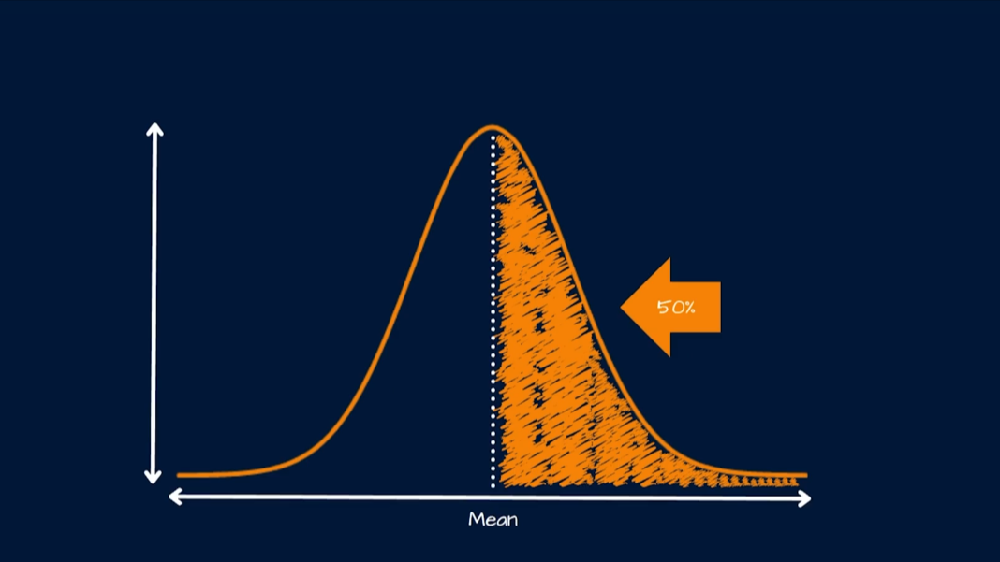
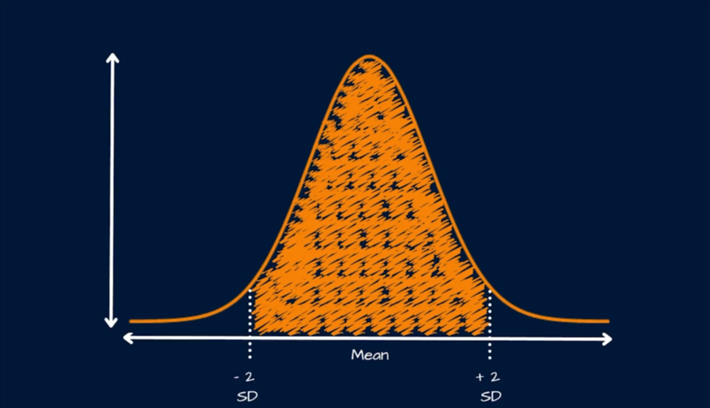
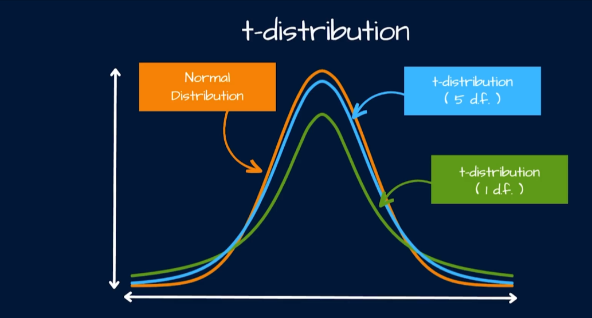
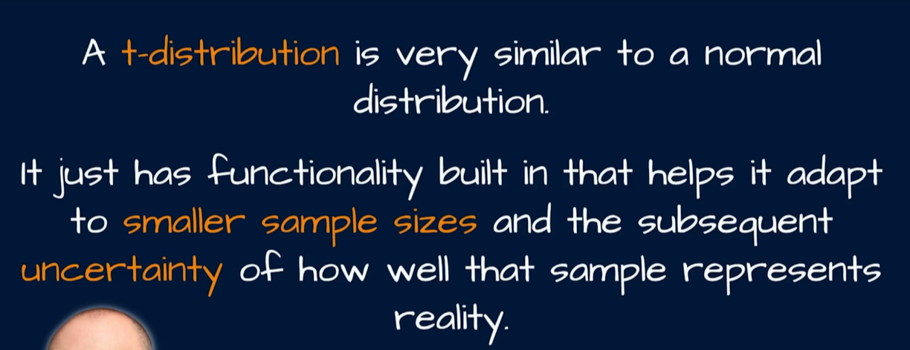
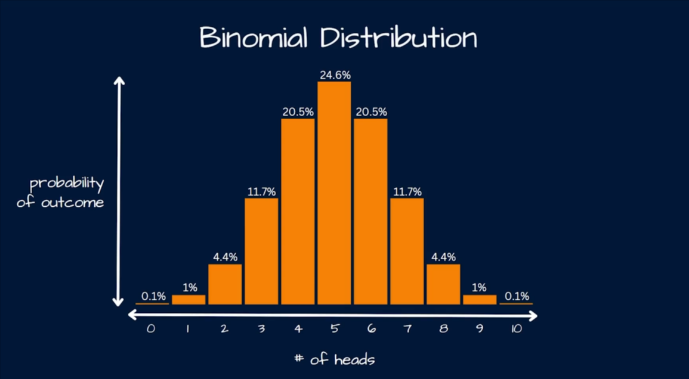
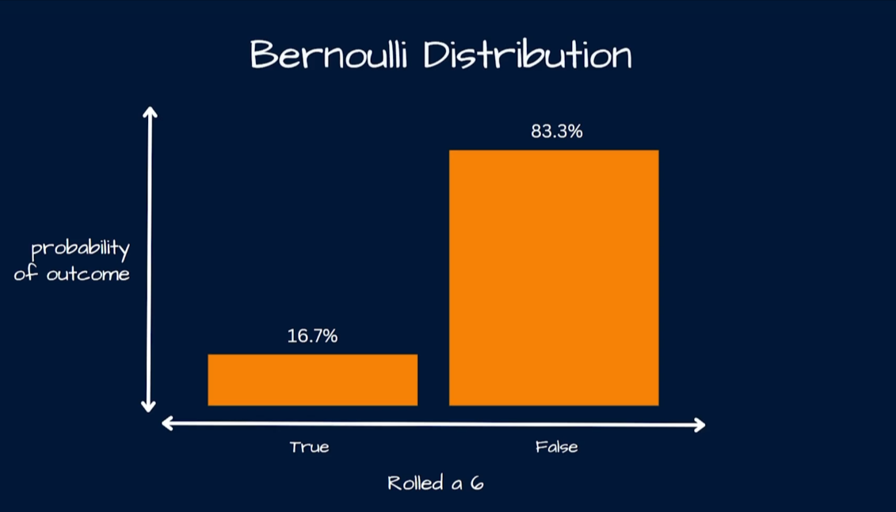
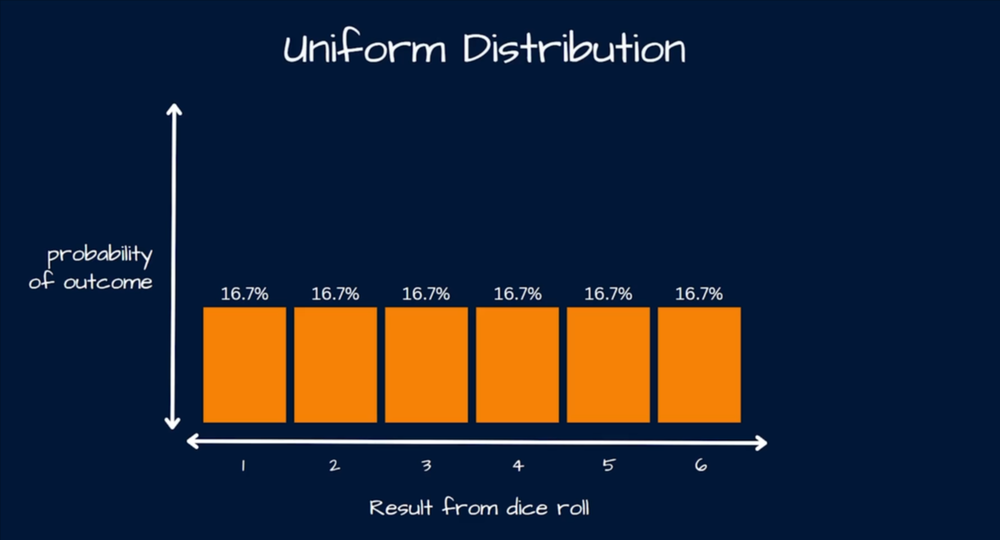
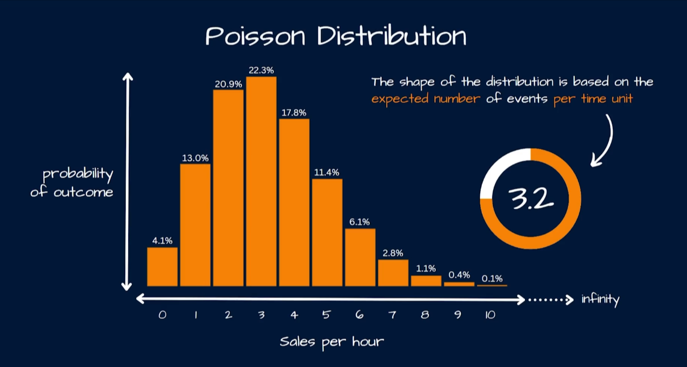
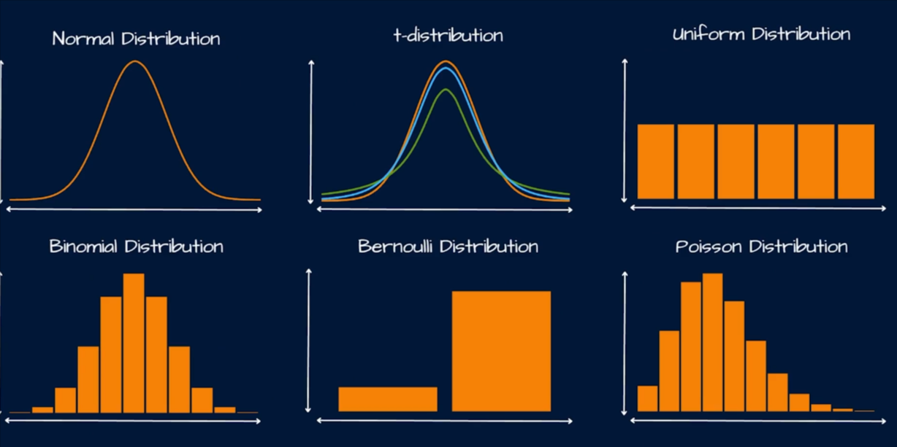

# 📊 The Normal Distribution & Z-Scores: A Beginner-Friendly Data Science Guide (with Python)

`Normal Distribution` is distributed symetrically around the mean.



> The spread of the data in a `NORMAL DISTRIBUTION` is represented by the `Standard Deviation`.
>
> 
>
> 
>
> 
>
> 
>
> 
>
> 
>
> 
>
> 

> **Goal:** Understand _what_ the normal distribution is, _why_ it powers half of statistics and data science, _how_ Z-scores turn any normal dataset into a universal ruler, and _how_ companies use these ideas to make money or avoid losing it.
> Everything is explained step by step, with runnable Python code, and every chart is explained **element by element**.

---

## 0. How to use this guide (read me first)

1. Install the required libraries once:
   ```bash
   pip install numpy scipy matplotlib
   ```
2. Run every code block **in order**. Each block:
   - creates a chart and saves it into a `figures/` folder next to this file, **and**
   - prints numbers/statistics to your console.
3. The images are embedded in this document with `` tags, so once the figures exist you can preview this `.md` file (VS Code, Typora, Obsidian, GitHub, etc.) and see the charts between the sections.

---

## 1. What is the Normal Distribution?

The **normal distribution** (also called the _Gaussian distribution_ or the _bell curve_) is the most famous probability distribution in statistics. It describes data that:

- clusters around a central **average** value,
- falls off symmetrically on both sides,
- has _few_ very small and _few_ very large values, and _most_ values near the middle.

### A friendly analogy 🛎️

Imagine you measure the heights of 10,000 adult men. A few are 150 cm, a few are 200 cm — but _most_ are packed around 170–180 cm. Plot that as a histogram and it looks like a **bell**: tall in the middle, smoothly tapering at both ends. That shape _is_ the normal distribution.

Other everyday examples that often look (approximately) normal:

- Test scores of a large class
- Blood pressure readings of healthy adults
- The fill weight of a soda can on a production line
- Daily returns of a stock or index (approximately)
- Measurement errors of a lab instrument

### Why data scientists care so much

1. **The Central Limit Theorem (CLT):** if you take many samples from _almost any_ population and average each sample, those **averages** are normally distributed — even if the original data is not. This is why the normal curve shows up everywhere, and why t-tests, confidence intervals and A/B test p-values work.
2. **Percentiles & outliers:** once data is normal, we can answer "how unusual is this value?" precisely with Z-scores.
3. **Many algorithms & models assume normality:** linear regression residuals, LDA, various anomaly detectors, and process-control charts.
4. **It converts probability questions into simple geometry:** probabilities are just _areas under the curve_.

---

## 2. The Formula, Broken Down Piece by Piece

The _probability density function_ (PDF) of the normal distribution is:

$$
f(x) = \frac{1}{\sigma \sqrt{2\pi}} \; e^{-\frac{(x-\mu)^2}{2\sigma^2}}
$$

This formula looks scary, but it is just a recipe that says: _given the center μ and the spread σ, how "dense" is probability at each value x?_

| Symbol           | Name                   | What it means                         | Analogy                                 |
| ---------------- | ---------------------- | ------------------------------------- | --------------------------------------- |
| $x$              | value of the variable  | the point where we evaluate the curve | "a height of 180 cm"                    |
| $f(x)$           | probability density    | height of the bell curve at $x$       | how crowded the histogram bar is at $x$ |
| $\mu$ (mu)       | mean                   | center of the bell; peak location     | where most people are                   |
| $\sigma$ (sigma) | standard deviation     | typical distance from the mean        | how spread out people are               |
| $\sigma^2$       | variance               | $\sigma \times \sigma$                | spread, squared                         |
| $e$              | Euler's number ≈ 2.718 | base of natural logarithms            | a growth/decay constant                 |
| $\pi$            | pi ≈ 3.14159           | circle constant                       | shows up in the normalizing constant    |

### Breaking the formula into 3 parts

**Part 1 — The exponent: $-\frac{(x-\mu)^2}{2\sigma^2}$**

- $(x - \mu)$ is the **distance from the mean**. Squaring it makes the curve _symmetric_ (left and right of μ behave identically) and makes far-away points count extra heavily.
- Dividing by $2\sigma^2$ scales that distance by the spread. If σ is large, values can wander far from μ before the curve drops.
- The minus sign means: the further $x$ is from μ, the more negative the exponent, so $e^{\text{negative}}$ shrinks → the curve **falls** as you move away from μ. At $x = \mu$ the exponent is 0 and $e^0 = 1$, so the curve is at its **peak**.

**Part 2 — The scaling factor: $\frac{1}{\sigma \sqrt{2\pi}}$**

- It exists for one crucial reason: **the total area under the curve must equal 1**, because the total probability of "something happens" is 100%.
- Mathematicians proved $\int_{-\infty}^{\infty} e^{-x^2/2} dx = \sqrt{2\pi}$. Dividing by that constant "normalizes" the curve so the area is exactly 1.
- Notice: bigger σ → smaller peak height (the curve is shorter but wider, keeping the area = 1). This is a trade-off you will see in the charts.

**Part 3 — The density vs. probability subtlety**
Because the normal distribution is _continuous_, the probability of hitting one exact value (like exactly 175.0000 cm) is technically 0. Instead, probabilities are **areas**:

$$
P(a \le X \le b) = \int_a^b f(x)\,dx = \text{shaded area between } a \text{ and } b
$$

So $f(x)$ is a **density** (height), not a probability. Only the _area_ is a probability.

### The Standard Normal Distribution

If we set $\mu = 0$ and $\sigma = 1$, we get the **standard normal distribution**, usually written $N(0,1)$:

$$
\phi(z) = \frac{1}{\sqrt{2\pi}} e^{-z^2/2}
$$

This single curve is the universal reference — and **Z-scores** (Section 4) are exactly the trick that lets us convert _any_ normal distribution into this one.

---

## 3. The 68–95–99.7 (Empirical) Rule

For any normal distribution, no matter the mean or standard deviation:

| Interval          | Share of data | Meaning                        |
| ----------------- | ------------- | ------------------------------ |
| $\mu \pm 1\sigma$ | **~68%**      | about two thirds of all values |
| $\mu \pm 2\sigma$ | **~95%**      | almost everything              |
| $\mu \pm 3\sigma$ | **~99.7%**    | essentially everything         |

Consequences that matter in business:

- A value more than **2σ** from the mean is rarer than 1 in 20 (≈ 5%).
- A value more than **3σ** from the mean is rarer than 1 in 370 (≈ 0.27%) — a classic **anomaly/defect** threshold.

---

## 4. Z-Scores: Putting Everything on the Same Ruler 📏

### Definition

A **Z-score** answers: _"How many standard deviations is this value above or below the mean?"_

$$
z = \frac{x - \mu}{\sigma}
$$

### Breaking the formula down

| Part          | Meaning                                                                                    |
| ------------- | ------------------------------------------------------------------------------------------ |
| $x$           | the raw value you are examining (e.g., a score of 90)                                      |
| $x - \mu$     | the **signed distance** from the mean. Positive = above average; negative = below          |
| $\div \sigma$ | convert that distance into **standard-deviation units**. Dividing by σ "undoes" the spread |

### What the result means

| Z-score     | Interpretation                                             |
| ----------- | ---------------------------------------------------------- |
| $z = 0$     | exactly at the mean                                        |
| $z = +1$    | 1 standard deviation **above** the mean                    |
| $z = -2.5$  | 2.5 standard deviations **below** the mean (very unusual!) |
| $\|z\| > 2$ | unusual (only ~5% of data)                                 |
| $\|z\| > 3$ | very unusual (~0.27%) → classic outlier flag               |

Because $z$ is **unitless**, you can compare a height in cm, an exam score, and a delivery time in minutes on the same scale. Z-scores are also called **standardization** or **normalization** in machine-learning pipelines (though ML standardization doesn't require the data to be normal — it just centers/scales it).

### Worked example (before any code)

Exam scores are normal with $\mu = 75$, $\sigma = 10$. A student scored $x = 90$.

$$
z = \frac{90 - 75}{10} = 1.5
$$

So 90 is **1.5 standard deviations above the mean**. We can later translate that into a percentile (~93.3% of students scored below 90).

---

## 5. Python Setup

```python
# setup.py — run once at the top of your notebook/script
import os
import numpy as np
import pandas as pd
import matplotlib.pyplot as plt
from scipy import stats

os.makedirs("figures", exist_ok=True)   # folder where charts will be saved

# A consistent, readable style for all charts
plt.rcParams.update({
    "figure.dpi": 120,
    "axes.grid": True,
    "grid.alpha": 0.3,
    "font.size": 10,
})
np.random.seed(42)  # reproducibility: same "random" numbers every run
print("Setup OK. Libraries imported, figures/ folder ready.")
```

**What this code does, line by line:**

- `import numpy as np` → numerical arrays and random number generation.
- `import pandas as pd` → DataFrames (nice tables for showing Z-scores later).
- `import matplotlib.pyplot as plt` → plotting library.
- `from scipy import stats` → SciPy's statistics module, which contains `norm` — the _entire_ normal distribution toolbox (PDF, CDF, percentiles, etc.).
- `os.makedirs(...)` → creates the `figures/` folder if missing; charts will be saved there.
- `np.random.seed(42)` → makes the random data reproducible. Without it, every run would give you a different (but statistically similar) dataset.

---

## 6. Chart 1 — The Bell Curve and Its Anatomy

```python
# fig1_normal_pdf.py
mu, sigma = 0, 1                          # standard normal N(0, 1)
x = np.linspace(-4.5, 4.5, 1000)          # 1000 evenly spaced x values
y = stats.norm.pdf(x, mu, sigma)          # density (curve height) at each x

fig, ax = plt.subplots(figsize=(9, 5))
ax.plot(x, y, color="#1f77b4", lw=2.5, label=f"N(μ={mu}, σ={sigma})")
ax.fill_between(x, y, color="#1f77b4", alpha=0.15)          # area under curve
ax.axvline(mu, color="black", ls="--", lw=1.2)              # mean line

# mark the inflection points at mu ± sigma
for sign in (-1, 1):
    ax.axvline(mu + sign * sigma, color="#ff7f0e", ls=":", lw=1.5)

ax.annotate("mean = median = mode\n(peak, x = μ)",
            xy=(0, 0.40), xytext=(1.9, 0.36),
            arrowprops=dict(arrowstyle="->", color="black"))
ax.annotate("curve changes\nslope here (μ ± σ)",
            xy=(1, 0.24), xytext=(2.2, 0.20),
            arrowprops=dict(arrowstyle="->", color="#ff7f0e"))
ax.set_title("Anatomy of the Normal Distribution N(0, 1)")
ax.set_xlabel("x  (value of the variable)")
ax.set_ylabel("f(x)  (probability density)")
ax.legend(loc="upper left")
ax.set_xlim(-4.5, 4.5)
plt.tight_layout()
plt.savefig("figures/fig1_normal_pdf.png", bbox_inches="tight")
plt.show()
```


**What the code does, step by step:**

1. `mu, sigma = 0, 1` → we draw the _standard_ normal first (the reference curve).
2. `np.linspace(-4.5, 4.5, 1000)` → builds 1000 evenly spaced x-values between −4.5 and 4.5. Why 1000? Enough points that the drawn curve looks perfectly smooth (fewer points → jagged polygon).
3. `stats.norm.pdf(x, mu, sigma)` → evaluates the PDF formula from Section 2 at every one of the 1000 x-values. The result `y` is 1000 heights.
4. `ax.plot(x, y)` → draws the smooth bell curve by connecting the 1000 (x, y) pairs.
5. `ax.fill_between(x, y, alpha=0.15)` → shades everything under the curve. **The shaded area totals exactly 1.0** — that is the "100% probability" budget.
6. `ax.axvline(mu)` → dashed line at the mean (0). The curve is perfectly symmetric around it.
7. Dotted orange lines at ±1σ → mark the **inflection points** where the curve stops curving down and starts flattening out. In a normal curve these always sit exactly 1 standard deviation from the mean.

**What the data points in the graph mean:**

- Every point on the blue curve is a pair $(x, f(x))$: "at value x, the density is f(x)".
- The **peak** (x = μ = 0, height ≈ 0.399) is the most likely region; that is why the curve is tallest there.
- The curve never touches the x-axis (it asymptotically approaches 0). Technically a normal variable can take _any_ value — even −100 or +100 — but the density there is vanishingly small.
- The **area** between any two vertical lines a and b (shaded region sliced between them) equals $P(a \le X \le b)$, the probability of observing a value in that range.

---

## 7. Chart 2 — Real Data vs. the Theoretical Curve (Histogram Overlay)

```python
# fig2_histogram_overlay.py
mu, sigma = 170, 7                     # adult male heights in cm
n = 10_000
heights = np.random.normal(loc=mu, scale=sigma, size=n)   # simulated data

fig, ax = plt.subplots(figsize=(9, 5))
# histogram: bars show the FREQUENCY of the sampled data
ax.hist(heights, bins=50, density=True, color="#8ecae6",
        edgecolor="white", alpha=0.85, label="10,000 simulated heights (histogram)")

# theoretical smooth curve
x = np.linspace(heights.min(), heights.max(), 500)
y = stats.norm.pdf(x, mu, sigma)
ax.plot(x, y, color="#d1495b", lw=2.5, label="Theoretical normal PDF")

ax.axvline(mu, color="black", ls="--", lw=1.2)
ax.text(mu + 0.5, 0.001, f"μ = {mu} cm", fontsize=11, color="black")

ax.set_title("Simulated Height Data vs. the Theoretical Normal Curve")
ax.set_xlabel("Height (cm)")
ax.set_ylabel("Density (share of data per cm)")
ax.legend()
plt.tight_layout()
plt.savefig("figures/fig2_histogram_overlay.png", bbox_inches="tight")
plt.show()

print(f"Sample mean: {heights.mean():.2f} cm   |   Sample std: {heights.std():.2f} cm")
print(f"True mean:   {mu} cm                |   True std:   {sigma} cm")
```


**What the code does:**

1. `np.random.normal(loc=170, scale=7, size=10_000)` → simulates 10,000 heights drawn from $N(170, 7)$. This mimics what you'd get measuring real people.
2. `ax.hist(..., density=True)` → splits the 10,000 values into 50 bins (small intervals of height) and draws a bar per bin. The bar height = the **proportion of data in that interval per unit width**, so the histogram and the PDF use the same scale and can be overlaid.
3. The red curve is the _theoretical_ PDF — what the data _should_ look like with an infinite number of samples.
4. `ax.axvline(mu)` + `text` → draws and labels the mean.

**What the data points in the graph mean:**

- **Each bar** represents the number (share) of the 10,000 simulated people whose height fell in that interval — e.g., the tallest bar around 170 cm might contain ~1,400 people, the bars at 150 cm only a handful.
- The **bar tops are jagged** because 10,000 samples is not infinite — this is _sampling noise_. Run the cell again with `n = 100_000` and the bars hug the red curve almost perfectly.
- The **red curve** is the idealized "population truth" (μ = 170, σ = 7). The closeness of the bars to the curve is a visual proof that _sample data approximates the underlying distribution_.
- The dashed line at 170 cm splits the histogram into two mirror halves → **symmetry**, one of the normal distribution's signatures.
- Console output shows the sample mean/std (≈ 170.0 and ≈ 7.0) very close to the true parameters. With bigger n they converge even tighter.

---

## 8. Chart 3 — What σ (Spread) Does to the Shape

```python
# fig3_sigma_comparison.py
fig, ax = plt.subplots(figsize=(9, 5))
x = np.linspace(-8, 8, 1000)

colors = {"σ = 1": "#1f77b4", "σ = 2": "#ff7f0e", "σ = 3": "#2ca02c"}
for sigma, color in colors.items():
    y = stats.norm.pdf(x, 0, float(sigma.split("= ")[1]))
    ax.plot(x, y, color=color, lw=2.2, label=f"N(μ=0, {sigma})")

ax.set_title("Same Mean (0), Different Standard Deviations")
ax.set_xlabel("x")
ax.set_ylabel("f(x)")
ax.legend()
plt.tight_layout()
plt.savefig("figures/fig3_sigma_comparison.png", bbox_inches="tight")
plt.show()
```


**What the code does:** loops over σ = 1, 2, 3, computes the PDF for each, and plots all three curves on the same axes with a legend.

**What the graph shows:**

- **σ = 1 (blue):** narrow and tall — values concentrate tightly around 0.
- **σ = 3 (green):** wide and flat — values spread far from 0; the peak is lower.
- Notice the **area under every curve is still exactly 1**. Tall-narrow vs. short-wide is a visual trade-off: total probability must stay 100%.
- μ only shifts the curve left/right; **σ alone controls the spread**. If a business says "our delivery times have σ = 3 days", that single number tells you how reliable (or unreliable) the process is.

---

## 9. Chart 4 — From Raw Scores to Z-Scores (Standardization)

```python
# fig4_zscore_transformation.py
mu, sigma = 75, 10          # exam scores: N(75, 10)
score = 90
z_score = (score - mu) / sigma      # the Z-score formula in action!

fig, axes = plt.subplots(1, 2, figsize=(12, 4.5), sharey=False)

# LEFT PANEL: raw score distribution
x1 = np.linspace(mu - 4*sigma, mu + 4*sigma, 500)
y1 = stats.norm.pdf(x1, mu, sigma)
axes[0].plot(x1, y1, color="#1f77b4", lw=2)
axes[0].fill_between(x1, y1, where=(x1 >= score), color="#e63946", alpha=0.5)
axes[0].axvline(score, color="#e63946", ls="--", lw=1.5)
axes[0].axvline(mu, color="black", ls=":", lw=1)
axes[0].annotate(f"x = {score}\n(z = {z_score:.1f})", xy=(score, 0.015),
                 xytext=(78, 0.035), arrowprops=dict(arrowstyle="->", color="#e63946"))
axes[0].set_title("Raw scale: X ~ N(75, 10)")
axes[0].set_xlabel("Exam score (x)")
axes[0].set_ylabel("density")

# RIGHT PANEL: same value on the standard normal
z = np.linspace(-4, 4, 500)
yz = stats.norm.pdf(z, 0, 1)
axes[1].plot(z, yz, color="#1f77b4", lw=2)
axes[1].fill_between(z, yz, where=(z >= z_score), color="#e63946", alpha=0.5)
axes[1].axvline(z_score, color="#e63946", ls="--", lw=1.5)
axes[1].axvline(0, color="black", ls=":", lw=1)
axes[1].annotate(f"z = {z_score:.1f}", xy=(z_score, 0.03),
                 xytext=(1.1, 0.10), arrowprops=dict(arrowstyle="->", color="#e63946"))
axes[1].set_title("Standard scale: Z ~ N(0, 1)")
axes[1].set_xlabel("Z-score")
axes[1].set_ylabel("density")

plt.suptitle(f"Standardization keeps probabilities identical: z = (x − μ)/σ = (90 − 75)/10 = {z_score:.1f}")
plt.tight_layout()
plt.savefig("figures/fig4_zscore_transformation.png", bbox_inches="tight")
plt.show()

print(f"z = ({score} - {mu}) / {sigma} = {z_score:.2f}")
print(f"P(X >= 90) on raw scale = {1 - stats.norm.cdf(score, mu, sigma):.4f}")
print(f"P(Z >= {z_score:.2f}) on z-scale = {1 - stats.norm.cdf(z_score, 0, 1):.4f}")
```


**What the code does:**

1. Computes the Z-score with the formula `(score - mu) / sigma` → (90 − 75)/10 = **1.5**.
2. **Left panel:** plots the raw distribution N(75,10) and shades the area to the right of x = 90 (the "score above 90" region).
3. **Right panel:** plots the standard normal N(0,1) and shades the area right of z = 1.5.

**What the graph shows — the key insight of Z-scores:**

- The two shaded areas are **the same size**. `P(X ≥ 90) = P(Z ≥ 1.5) ≈ 0.0668`. The Z-score merely re-labels the x-axis (centering at 0, rescaling by σ) — it does **not** change probabilities.
- The red dashed line moves from "90 points above the class average" (left) to "1.5 standard deviations above average" (right). Both statements describe the _same student_.
- This is why statisticians built **Z-tables**: you only need one table for the standard normal, then convert any problem to it.

---

## 10. Chart 5 — The 68–95–99.7 Rule, Visualized

```python
# fig5_empirical_rule.py
mu, sigma = 0, 1
x = np.linspace(-4, 4, 1000)
y = stats.norm.pdf(x, mu, sigma)

fig, ax = plt.subplots(figsize=(10, 5.5))
ax.plot(x, y, color="#1f77b4", lw=2.5)

# Shade the three bands: 1σ, 2σ, 3σ
ax.fill_between(x, y, where=(x >= -1) & (x <= 1),  color="#457b9d", alpha=0.35, label="68% within ±1σ")
ax.fill_between(x, y, where=(x >= -2) & (x <= 2),  color="#a8dadc", alpha=0.55, label="95% within ±2σ")
ax.fill_between(x, y, where=(x >= -3) & (x <= 3),  color="#e9c46a", alpha=0.45, label="99.7% within ±3σ")

# sigma markers
for s in (-3, -2, -1, 1, 2, 3):
    ax.axvline(s, color="grey", ls=":", lw=1)
    ax.text(s, 0.005, f"{s}σ", ha="center", fontsize=9, color="grey")

ax.set_title("68–95–99.7 Rule (Empirical Rule)")
ax.set_xlabel("x (in standard deviations from the mean)")
ax.set_ylabel("density")
ax.legend(loc="upper left")
ax.set_ylim(0, 0.45)
plt.tight_layout()
plt.savefig("figures/fig5_empirical_rule.png", bbox_inches="tight")
plt.show()

# numeric confirmation
for k in (1, 2, 3):
    prob = stats.norm.cdf(k) - stats.norm.cdf(-k)
    print(f"P(mean ± {k}σ) = {prob:.4f}  (~{prob*100:.1f}%)")
```


**What the code does:** shades the area under the standard normal between −1σ and +1σ (dark blue), then −2σ…+2σ and −3σ…+3σ (lighter bands drawn behind/around), and prints the exact probabilities.

**What the graph shows:**

- The **darkest central band** (±1σ) covers 68.27% of the area → if a metric follows a normal distribution, two thirds of observations live within one standard deviation of the mean.
- The lighter band extending to ±2σ covers 95.45% — only ~4.5% of values fall beyond.
- The palest band to ±3σ covers 99.73% — beyond 3σ lies just 0.27% of the data.
- Console output confirms the numbers (0.6827, 0.9545, 0.9973).
- Business translation: if your call-center handle time has μ = 5 min, σ = 1 min, then ~95% of calls finish within 3–7 minutes, and a 9-minute call (4σ) is a genuine outlier worth investigating.

---

## 11. Chart 6 — Probabilities as Areas (CDF & the Z-table in code)

The **Cumulative Distribution Function (CDF)** answers: _"What fraction of the distribution lies at or below a given value?"_

$$
F(x) = P(X \le x) = \int_{-\infty}^{x} f(t)\,dt
$$

```python
# fig6_probability_areas.py
mu, sigma = 75, 10     # exam scores again

fig, axes = plt.subplots(1, 2, figsize=(12, 4.5))
x = np.linspace(mu - 4*sigma, mu + 4*sigma, 600)
y = stats.norm.pdf(x, mu, sigma)

# LEFT: P(X < 60) — lower tail
axes[0].plot(x, y, color="#1f77b4", lw=2)
axes[0].fill_between(x, y, where=(x <= 60), color="#e63946", alpha=0.6)
axes[0].axvline(60, color="#e63946", ls="--")
axes[0].set_title("P(X < 60): below-average tail")
axes[0].set_xlabel("score")
axes[0].text(45, 0.002, f"= {stats.norm.cdf(60, mu, sigma):.3f}", fontsize=11, color="#e63946")

# RIGHT: P(80 < X < 90) — middle slice
axes[1].plot(x, y, color="#1f77b4", lw=2)
axes[1].fill_between(x, y, where=(x >= 80) & (x <= 90), color="#2a9d8f", alpha=0.6)
axes[1].axvline(80, color="#2a9d8f", ls="--")
axes[1].axvline(90, color="#2a9d8f", ls="--")
axes[1].set_title("P(80 < X < 90): a slice in the middle")
axes[1].set_xlabel("score")
p = stats.norm.cdf(90, mu, sigma) - stats.norm.cdf(80, mu, sigma)
axes[1].text(84, 0.006, f"= {p:.3f}", fontsize=11, color="#2a9d8f")

plt.suptitle("Probabilities = shaded areas under the normal curve")
plt.tight_layout()
plt.savefig("figures/fig6_probability_areas.png", bbox_inches="tight")
plt.show()

# ---- The same probabilities computed numerically ----
print("--- CDF queries (raw scale, X ~ N(75, 10)) ---")
print(f"P(X <  60)        = {stats.norm.cdf(60, mu, sigma):.4f}")
print(f"P(80 < X < 90)    = {stats.norm.cdf(90, mu, sigma) - stats.norm.cdf(80, mu, sigma):.4f}")
print(f"P(X >  90)        = {1 - stats.norm.cdf(90, mu, sigma):.4f}")

print("\n--- Same questions on the Z-scale (Z ~ N(0, 1)) ---")
z60, z80, z90 = (60-mu)/sigma, (80-mu)/sigma, (90-mu)/sigma
print(f"z for 60 = {z60:.2f} → P(Z < -1.50) = {stats.norm.cdf(z60):.4f}")
print(f"z for 80 = {z80:.2f}, z for 90 = {z90:.2f} → P(0.5 < Z < 1.5) = {stats.norm.cdf(z90) - stats.norm.cdf(z80):.4f}")
print(f"z for 90 = {z90:.2f} → P(Z > 1.50) = {stats.norm.sf(z90):.4f}")

print("\n--- Percentiles / inverse CDF ---")
print(f"Median (50th percentile)        = {stats.norm.ppf(0.50, mu, sigma):.1f}")
print(f"90th percentile                 = {stats.norm.ppf(0.90, mu, sigma):.1f}")
print(f"Score for 90 = z 1.5 → percentile = {stats.norm.cdf(1.5)*100:.1f}%")
```


**What the code does, explained:**

- `stats.norm.cdf(value, mu, sigma)` = $P(X \le \text{value})$ — area under the curve from −∞ to that value (blue-to-red in the left panel).
- A middle slice uses the rule: $P(a < X < b) = F(b) - F(a)$ → `cdf(90) - cdf(80)`.
- The right tail uses the complement: $P(X > a) = 1 - F(a)$ → `1 - cdf(90)` (or equivalently `stats.norm.sf(90)` — _sf_ = survival function).
- `stats.norm.ppf(p, mu, sigma)` is the **inverse CDF** (percent point function): give it a probability, get back the value where that much of the data lies below. This is how Z-tables are used backwards and how "safety stock" is computed in Section 13.

**What the data points in the graph mean:**

- Left panel: shaded red region = share of students scoring below 60 → ≈ 6.7% (z = −1.5). A score of 60 is 1.5σ below the mean, and only ~6.7% of the class did worse.
- Right panel: shaded green slice between 80 and 90 → ≈ 24.2% of students landed in that range.
- Console outputs verify: the raw-scale and Z-scale calculations give **identical** probabilities (e.g., 0.0668 both ways) — the Z-score only changes the axis units.
- Percentiles: 90 points corresponds to z = 1.5 → `cdf(1.5) ≈ 0.933` → the student beat ~93.3% of the class.

---

## 12. Chart 7 — Are My Data Actually Normal? (QQ Plot)

Real data is never _perfectly_ normal. Before applying normal-based methods, check with a **QQ plot** (quantile-quantile): if the data were normal, its sorted values would form a straight diagonal line.

```python
# fig7_qq_plot.py
mu, sigma = 170, 7
heights = np.random.normal(loc=mu, scale=sigma, size=1000)   # "clean" data

fig, ax = plt.subplots(figsize=(6.5, 6))
stats.probplot(heights, dist="norm", plot=ax)   # draws points + reference line
ax.set_title("QQ Plot: simulated normal heights (should be ~straight)")
ax.set_xlabel("Theoretical quantiles (z-values)")
ax.set_ylabel("Sample quantiles (sorted heights, cm)")
plt.tight_layout()
plt.savefig("figures/fig7_qq_plot.png", bbox_inches="tight")
plt.show()

# Same check on clearly NON-normal data for contrast
skewed = np.random.exponential(scale=2.0, size=1000)   # right-skewed data
fig, ax = plt.subplots(figsize=(6.5, 6))
stats.probplot(skewed, dist="norm", plot=ax)
ax.set_title("QQ Plot: exponential data (NOT normal — bends away)")
ax.set_xlabel("Theoretical quantiles")
ax.set_ylabel("Sample quantiles")
plt.tight_layout()
plt.savefig("figures/fig7_qq_skewed.png", bbox_inches="tight")
plt.show()
```


**What the code does:** simulates two datasets — one normal (heights) and one obviously not (exponential, which is right-skewed: many small values, few huge ones) — and uses `stats.probplot` to compare each dataset's sorted values ("sample quantiles") against the quantiles a normal distribution _would_ produce ("theoretical quantiles").

**What the graph shows:**

- **First chart:** the blue dots hug the red diagonal line → data behaves like a normal distribution (small wobbles at the extremes are normal sampling noise).
- **Second chart:** the dots **curve away from the diagonal**, bending upward at the right end — the classic signature of right-skewed data. Applying Z-score "outlier rules" blindly here would mislabel many legitimate large values as anomalies.
- Simple rule of thumb: dots near the diagonal → normal-ish; systematic bending → not normal → use robust methods (median/IQR, log-transform, or non-parametric tests).

---

## 13. How Companies Use Normal Distributions & Z-Scores (Business Use Cases)

### 13.1 🏭 Manufacturing & Quality Control — "Six Sigma" (Toyota, GE, Motorola)

A production line fills cereal boxes to a target weight μ = 500 g with σ = 2 g. Specifications require 494–506 g (μ ± 3σ). What % of boxes are defective?

```python
# business_example_defects.py
mu, sigma = 500, 2
LSL, USL = 494, 506                     # lower & upper spec limits

z_lower = (LSL - mu) / sigma            # = -3
z_upper = (USL - mu) / sigma            # = +3
defect_rate = stats.norm.cdf(LSL, mu, sigma) + (1 - stats.norm.cdf(USL, mu, sigma))
print(f"Defect rate at ±3σ specs: {defect_rate*100:.3f}%  →  {defect_rate*1_000_000:,.0f} defects per million")

# If specs tighten to ±6σ (Six Sigma ideal):
defect_rate_6 = 2 * stats.norm.sf(6)
print(f"Defect rate at ±6σ specs: {defect_rate_6*1e9:.3f} defects per BILLION (theoretically)")
```

**Business meaning:** at 3σ quality you produce ~2,700 defective boxes per million (costly recalls, waste). "Six Sigma" methodology pushes process variation down so specs sit at ±6σ → essentially zero defects (~0.002 per billion, before the standard 1.5σ process-drift correction that yields the famous 3.4 defects per million). Every defect avoided = money saved and brand reputation protected.

### 13.2 💰 Finance — Value at Risk (VaR) and anomaly detection (JPMorgan, risk teams)

Daily returns of a $100M portfolio are approximately normal with μ = +0.05% and σ = 1.2% per day. What loss should the bank expect to exceed only 1 day in 20 (95% VaR)?

```python
# business_example_var.py
mu_d, sig_d = 0.0005, 0.012
portfolio = 100_000_000
z_05 = stats.norm.ppf(0.05)             # ≈ -1.645  (5th percentile of N(0,1))
var_95 = portfolio * (mu_d + z_05 * sig_d)
print(f"95% daily VaR ≈ ${var_95:,.0f}  (worse loss than this on ~1 in 20 trading days)")
```

**Business meaning:** a loss worse than **≈ −$1.92M** should occur only ~5% of days under normal market conditions. Regulators require banks to hold capital against such VaR numbers. Caveat: financial returns have **fat tails** (rare crashes happen more often than the normal model predicts — the 2008 crisis was a "10-sigma event" that should occur once per universe lifetime). Banks therefore stress-test with non-normal models too.

### 13.3 🛒 E-commerce — Demand forecasting & safety stock (Amazon, Walmart)

Daily demand for a product is normal: μ = 200 units, σ = 40. To avoid stock-outs with 95% confidence during a 7-day lead time:

```python
# business_example_inventory.py
daily_mean, daily_std, lead_days, service = 200, 40, 7, 0.95
z = stats.norm.ppf(service)                     # ≈ 1.645
safety_stock = z * daily_std * np.sqrt(lead_days)
reorder_point = daily_mean * lead_days + safety_stock
print(f"Z for {service:.0%} service level = {z:.3f}")
print(f"Safety stock ≈ {safety_stock:.0f} units")
print(f"Order when inventory falls below ≈ {reorder_point:.0f} units")
```

**Business meaning:** carrying safety stock costs money (warehousing), but stock-outs cost sales and customer trust. The z = 1.645 multiplier (from the 95th percentile of the normal) balances the two. If demand were skewed, using normal-based stock would be dangerously wrong — hence forecasters check normality first.

### 13.4 🧪 A/B Testing — Is the new feature really better? (Booking.com, Netflix, Airbnb)

An online retailer tests a new checkout. Control (A): 565 buyers out of 5,000 visitors (11.3%). Treatment (B): 655 out of 5,000 (13.1%). Is the lift real or just random noise? Under the normal approximation to the binomial, we compute a **Z-statistic** for the difference of two proportions:

```python
# business_example_abtest.py
pa, pb = 565/5000, 655/5000
na = nb = 5000
p_pool = (565 + 655) / (na + nb)                     # pooled conversion rate
se = np.sqrt(p_pool * (1 - p_pool) * (1/na + 1/nb))  # standard error of the difference
z_stat = (pb - pa) / se
p_value = 2 * stats.norm.sf(abs(z_stat))             # two-sided p-value
print(f"Conversion A = {pa:.3f}, B = {pb:.3f}")
print(f"Z = {z_stat:.2f}   |   p-value = {p_value:.4f}")
print("Verdict:", "statistically significant (p < 0.05) → ship it" if p_value < 0.05 else "not significant → keep testing")
```

**Business meaning:** z ≈ 2.75, p ≈ 0.006 < 0.05 → a 1.8 percentage-point conversion lift this large would happen by chance only ~0.6% of the time if B were truly no better. The team can confidently roll out the new checkout; at the company's order volume that lift is worth millions per year. (This is the classic two-proportion z-test — the normal distribution is doing all the probability math.)

### 13.5 🏥 Healthcare — Reference ranges & flagging (labs, wearables)

Blood-test "normal ranges" are classically μ ± 2σ of a healthy population. A result more than 2σ from the healthy mean occurs in fewer than 5% of healthy people → clinicians get an automated flag. Example: fasting glucose μ = 90, σ = 8 mg/dL → anything above 106 mg/dL (z > 2) triggers a pre-diabetes review. Z-scores here standardize results across different labs, ages, and units so one rule works everywhere.

### 13.6 👥 HR / People Analytics — Fair pay & outlier compensation

Compensation data is standardized into Z-scores per role/geo. Someone paid at z = +3 vs. peers (top ~0.1%) may be a retention risk (or an overpayment); z = −2.5 flags potential underpayment/equity issues. Because z is unitless, HR can compare engineers in Berlin and analysts in London on one scale.

### 13.7 🎓 Education & testing — Standardized scores (SAT, GRE, IQ)

The SAT is scaled to be normal with μ = 500, σ = 100 per section. A 700 (z = 2) ≈ 97.7th percentile; a 400 (z = −1) ≈ 15.9th percentile. Universities compare applicants across different test editions because the percentile (from the normal model) is edition-independent.

**Summary table of use cases:**

| Industry      | Normal/Z-score job            | Typical threshold        | Why it matters              |
| ------------- | ----------------------------- | ------------------------ | --------------------------- | ------- | ------------------------- |
| Manufacturing | process control, defect rate  | ±3σ or ±6σ specs         | quality, recalls, cost      |
| Finance       | Value at Risk, fraud flags    | 5th percentile / \|z\|>3 | capital buffers, fraud loss |
| E-commerce    | safety stock, demand planning | z = 1.65 (95%)           | stock-outs vs. holding cost |
| Product/tech  | A/B test significance         | p < 0.05 (               | z                           | ≈ 1.96) | ship or not ship features |
| Healthcare    | reference ranges, alerts      | μ ± 2σ                   | patient safety              |
| HR            | pay equity, outlier review    |                          | z                           | > 2.5   | fairness, retention       |
| Education     | percentile reporting          | z → percentile           | fair comparisons            |

---

## 14. Common Pitfalls to Avoid ⚠️

1. **Assuming everything is normal.** Income, website session times, and social-media follower counts are usually _heavily right-skewed_. Always visualize (histogram/QQ plot) before using Z-rules.
2. **Small samples.** With n < ~30, use the t-distribution instead of the normal for means — the CLT hasn't "kicked in" yet. (For proportions, check np ≥ 10 and n(1−p) ≥ 10.)
3. **Outliers from non-normal sources.** In skewed data, an extreme z-score may be a _legitimate_ customer (a whale account), not an error. Context matters before flagging.
4. **Fat tails in finance.** Markets crash far more often than the normal model predicts. Normal-based VaR underestimates tail risk — always stress-test.
5. **Density vs. probability confusion.** The y-axis of a PDF is _not_ "probability of x". Only areas are probabilities.
6. **Rounding z to few decimals in critical work** — fine for a tutorial, but use full precision in production pipelines (`scipy` gives you exact values; no need for paper Z-tables).

---

## 15. Cheat Sheet — SciPy Functions You'll Use Daily

| Task                   | Formula              | SciPy code                                        |
| ---------------------- | -------------------- | ------------------------------------------------- |
| Density (curve height) | $f(x)$               | `stats.norm.pdf(x, mu, sigma)`                    |
| Cumulative probability | $P(X \le x)$         | `stats.norm.cdf(x, mu, sigma)`                    |
| Upper-tail probability | $P(X > x)$           | `stats.norm.sf(x, mu, sigma)`                     |
| Middle interval        | $P(a \le X \le b)$   | `stats.norm.cdf(b, ...) - stats.norm.cdf(a, ...)` |
| Z-score                | $z = (x-\mu)/\sigma$ | `(x - mu) / sigma`                                |
| Percentile → value     | $x = \mu + z\sigma$  | `stats.norm.ppf(p, mu, sigma)`                    |
| Random sample          | —                    | `np.random.normal(mu, sigma, n)`                  |
| QQ normality check     | —                    | `stats.probplot(data, dist="norm", plot=ax)`      |
| Standard normal        | μ=0, σ=1             | `stats.norm.cdf(z)` (defaults to N(0,1))          |

**Z-values worth memorizing:**
| z | Meaning |
|---|---|
| ±1.00 | 68% of data inside |
| ±1.645 | 90% of data inside (5% each tail) |
| ±1.96 | 95% of data inside (2.5% each tail) — the magic number for p < 0.05 |
| ±2.58 | 99% of data inside |
| ±3.00 | 99.7% of data inside |

---

## 16. Summary

- The **normal distribution** is a symmetric bell curve defined by two numbers: the **mean μ** (where it centers) and the **standard deviation σ** (how spread it is). Its formula is a "normalizing constant" times an exponential decay in the squared distance from the mean.
- **~68 / 95 / 99.7%** of data sits within 1/2/3 standard deviations.
- A **Z-score** $z = (x-\mu)/\sigma$ re-expresses any value as "standard deviations from the mean", turning every normal problem into the same standard normal $N(0,1)$ problem — probabilities are preserved exactly.
- **CDF = area under the curve = probability.** `cdf`, `sf`, and `ppf` in SciPy are your whole Z-table.
- Companies use these ideas daily: **Six Sigma quality**, **Value at Risk**, **safety stock**, **A/B test significance**, **medical flags**, **pay equity**, and **test percentiles**.
- Always **verify normality** (histogram, QQ plot) before applying normal-based rules — and beware fat tails and skew in real-world data.

> Next steps to explore: the t-distribution (small samples), confidence intervals for the mean, hypothesis testing, the chi-squared distribution, and how the Central Limit Theorem makes all of the above valid for averages of almost any data.

_Guide content generated for a beginner-friendly data science tutorial. Figures are produced by running the code blocks in order; all code is Python 3 with NumPy, SciPy, and Matplotlib._

```

```
