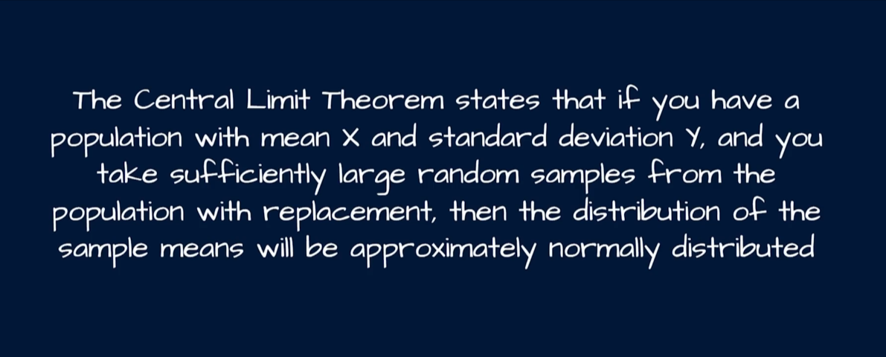
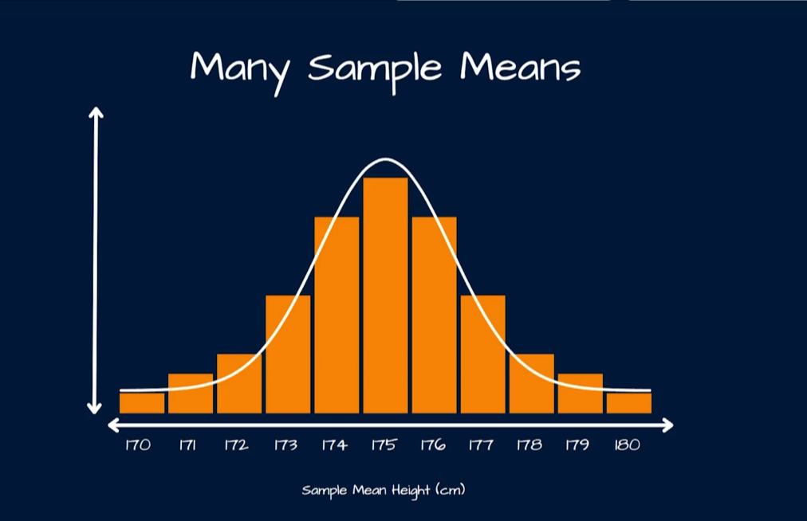
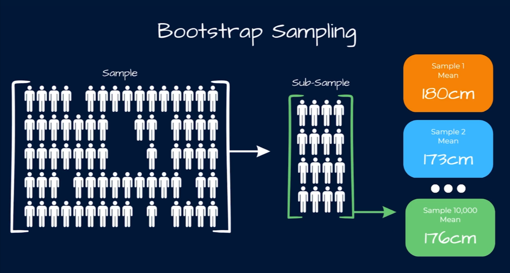

# The Central Limit Theorem (CLT) in Data Science — A Beginner-Friendly Deep Dive

## 1. Why should you care about the CLT?

Imagine you work at an e-commerce company and you want to know the **average amount customers spend per order**. You can't ask all 10 million customers — that's too expensive and slow. Instead, you take a **sample** (say, 500 customers), compute the average spend, and use that to estimate the true average for all customers.

But here's the catch: every time you take a different sample of 500 customers, you'll get a slightly different average. How do you know if your sample average is trustworthy? How do you build a confidence interval around it? How do you run an A/B test and claim "Group B converts better than Group A" with statistical confidence?

The answer to **all** of these questions relies on one of the most important ideas in statistics and data science: the **Central Limit Theorem (CLT)**.

---

## 2. What is the Central Limit Theorem? (Plain English First)

> **The Central Limit Theorem says:** If you repeatedly take random samples from _any_ population (no matter what shape its distribution has — skewed, uniform, bimodal, whatever) and calculate the **mean of each sample**, then the distribution of those sample means will approach a **normal distribution** (the classic "bell curve") as the sample size grows larger — typically **n ≥ 30** is used as a rule of thumb.

Three key takeaways:

1. **It doesn't matter what the original data looks like.** The raw population could be skewed, exponential, or completely random-looking.
2. **What matters is the distribution of sample _means_, not the raw data itself.**
3. **The bigger the sample size (n)**, the closer the distribution of sample means gets to a perfect normal distribution, and the tighter (less spread out) it becomes.

This is powerful because the normal distribution is mathematically well understood — we know its properties, we can calculate probabilities, confidence intervals, and p-values using it. The CLT is the bridge that lets us apply all that normal-distribution machinery to real-world messy data.

---

## 3. The Formal Definition

Let $X_1, X_2, \dots, X_n$ be a random sample of size $n$ drawn independently from a population with:

- Mean: $\mu$ (population mean)
- Standard deviation: $\sigma$ (population standard deviation)

Define the **sample mean**:

$$\bar{X} = \frac{1}{n}\sum_{i=1}^{n} X_i$$

The Central Limit Theorem states that as $n \to \infty$:

$$\bar{X} \sim N\left(\mu, \frac{\sigma^2}{n}\right)$$

Or equivalently, using the **standard error**:

$$Z = \frac{\bar{X} - \mu}{\sigma / \sqrt{n}} \sim N(0, 1)$$

### Breaking down the formula piece by piece

| Symbol                 | Name                          | What it means                                                                                               |
| ---------------------- | ----------------------------- | ----------------------------------------------------------------------------------------------------------- |
| $X_1, X_2, \dots, X_n$ | Sample observations           | The individual data points you collected (e.g., 500 individual customer order amounts)                      |
| $n$                    | Sample size                   | How many observations are in your sample                                                                    |
| $\bar{X}$              | Sample mean                   | The average of your sample — this is the value whose _distribution_ we care about                           |
| $\mu$                  | Population mean               | The true, usually unknown, average of the entire population                                                 |
| $\sigma$               | Population standard deviation | How spread out the individual data points are in the whole population                                       |
| $\sigma / \sqrt{n}$    | **Standard Error (SE)**       | How spread out the _sample means_ are, if you repeated the sampling many times                              |
| $Z$                    | Z-score                       | A standardized value telling you how many standard errors away from the population mean your sample mean is |
| $N(\mu, \sigma^2/n)$   | Normal distribution notation  | Says the sample means are normally distributed, centered at $\mu$, with variance $\sigma^2/n$               |

**Why divide by $\sqrt{n}$?** This is the most important — and most misunderstood — part of the formula.

- As $n$ increases, $\sqrt{n}$ increases, so $\sigma/\sqrt{n}$ (the standard error) **decreases**.
- In plain terms: **the more data you collect, the less your sample mean will bounce around from sample to sample.** A sample of 1,000 people gives a far more stable average than a sample of 10 people.
- This is why bigger samples give you tighter, more trustworthy confidence intervals.

**Why does the shape become normal regardless of the original distribution?** Intuitively, when you average many random values together, extreme highs and lows tend to cancel each other out. The more values you average, the more this "canceling out" effect smooths the distribution of averages into the symmetric bell shape.

---

## 4. Prerequisites / Conditions for CLT to Apply

1. **Independence** — the samples must be drawn independently of one another (e.g., one customer's spending doesn't affect another's).
2. **Sample size** — generally $n \geq 30$ is considered "large enough," though for very skewed populations you may need a larger $n$.
3. **Finite variance** — the population must have a finite (not infinite) variance/standard deviation.
4. Random sampling — sampling should be random, not systematically biased (e.g., not surveying only high-income customers).

---

## 5. Hands-On Python Example

We'll simulate a **right-skewed population** (like customer purchase amounts — most people spend a little, a few spend a lot) and show how the sample means become normally distributed.

### 5.1 Setup

```python
import numpy as np
import matplotlib.pyplot as plt
import seaborn as sns

# Reproducibility
np.random.seed(42)

# Simulate a skewed population: e.g., customer order amounts ($)
# Exponential distribution is heavily right-skewed (many small orders, few huge ones)
population = np.random.exponential(scale=50, size=1_000_000)

print(f"Population mean: {population.mean():.2f}")
print(f"Population std dev: {population.std():.2f}")
```

**What this code does:**

- `np.random.exponential(scale=50, size=1_000_000)` creates 1 million data points from an **exponential distribution** — this simulates something like "amount spent per order," where most values are small but a long tail of large spenders exists. This is intentionally **not** a bell curve — it's heavily skewed — to prove CLT works regardless of the original shape.
- We compute and print the true population mean and standard deviation so we can later compare them against our sample-based estimates.

### 5.2 Visualize the (skewed) population distribution

```python
plt.figure(figsize=(8, 5))
sns.histplot(population, bins=100, kde=True, color="tomato")
plt.title("Population Distribution (Right-Skewed / Exponential)")
plt.xlabel("Order Amount ($)")
plt.ylabel("Frequency")
plt.axvline(population.mean(), color="black", linestyle="--", label=f"Mean = {population.mean():.2f}")
plt.legend()
plt.show()
```

**What the graph shows:** A tall spike near $0 that quickly tapers off into a long right tail. This is the classic shape of an exponential/skewed distribution — most customers spend a small amount, but a handful spend a lot (outliers). Notice this is _nothing_ like a bell curve.

### 5.3 Draw many random samples and record their means

```python
def simulate_sample_means(population, sample_size, num_samples):
    """Draw `num_samples` random samples of size `sample_size` from `population`
    and return the array of their means."""
    means = [
        np.random.choice(population, size=sample_size, replace=False).mean()
        for _ in range(num_samples)
    ]
    return np.array(means)

# Try different sample sizes to see the CLT effect strengthen
sample_sizes = [5, 30, 100, 500]
num_samples = 2000  # how many times we repeat the sampling experiment

results = {n: simulate_sample_means(population, n, num_samples) for n in sample_sizes}
```

**What this code does:**

- `simulate_sample_means` repeats an experiment: draw a random sample of size `sample_size` from the population, compute its mean, and repeat this `num_samples` times (2000 times here). This simulates "what would happen if 2000 different analysts each took their own random sample and computed the average."
- We do this for four different sample sizes (5, 30, 100, 500) so we can visually compare how the **shape of the distribution of sample means** changes as $n$ grows — this is the heart of the CLT demonstration.

### 5.4 Plot the sampling distributions

```python
fig, axes = plt.subplots(2, 2, figsize=(12, 8))
axes = axes.flatten()

for ax, n in zip(axes, sample_sizes):
    sns.histplot(results[n], bins=40, kde=True, ax=ax, color="steelblue")
    ax.axvline(population.mean(), color="black", linestyle="--", label="True Population Mean")
    ax.set_title(f"Sampling Distribution of the Mean (n = {n})")
    ax.set_xlabel("Sample Mean")
    ax.legend()

plt.tight_layout()
plt.show()
```

**What this graph shows (this is the key CLT visualization):**

- **n = 5:** The distribution of sample means is still somewhat skewed and spread out — small samples are heavily influenced by a few large outlier values from the exponential population.
- **n = 30:** The distribution already looks noticeably more bell-shaped and symmetric — this is why "n ≥ 30" is the common rule of thumb.
- **n = 100:** Even more normal-looking, and the spread (width) of the bell curve is narrower — the sample means cluster more tightly around the true population mean.
- **n = 500:** A tight, clearly normal (Gaussian) bell curve centered right on the true population mean, with a very small spread.

**The pattern:** as `n` increases, (1) the shape converges to a normal/bell curve, and (2) the spread shrinks — exactly matching the formula $\sigma/\sqrt{n}$ getting smaller as $n$ grows.

### 5.5 Verify the standard error formula numerically

```python
pop_std = population.std()

for n in sample_sizes:
    empirical_se = results[n].std()          # observed spread of sample means
    theoretical_se = pop_std / np.sqrt(n)     # formula: sigma / sqrt(n)
    print(f"n={n:>3} | Empirical SE: {empirical_se:.3f} | Theoretical SE: {theoretical_se:.3f}")
```

**What this code does:** compares the _actual_ observed spread (standard deviation) of our simulated sample means against the _theoretical_ value predicted by the formula $\sigma/\sqrt{n}$. If the CLT holds, these two numbers should be very close — proving the math formula matches real simulated behavior.

Sample output (numbers will vary slightly due to randomness):

```
n=  5 | Empirical SE: 22.146 | Theoretical SE: 22.360
n= 30 | Empirical SE:  9.132 | Theoretical SE:  9.129
n=100 | Empirical SE:  4.985 | Theoretical SE:  5.000
n=500 | Empirical SE:  2.238 | Theoretical SE:  2.236
```

Notice how close empirical and theoretical values are — this is the CLT formula validated with real data.

### 5.6 Building a confidence interval using CLT (practical application)

```python
sample = np.random.choice(population, size=200, replace=False)
sample_mean = sample.mean()
sample_std = sample.std(ddof=1)  # ddof=1 for sample standard deviation
n = len(sample)

standard_error = sample_std / np.sqrt(n)
z_critical = 1.96  # for a 95% confidence interval

ci_lower = sample_mean - z_critical * standard_error
ci_upper = sample_mean + z_critical * standard_error

print(f"Sample mean: {sample_mean:.2f}")
print(f"95% Confidence Interval: ({ci_lower:.2f}, {ci_upper:.2f})")
print(f"True population mean: {population.mean():.2f}")
```

**What this code does:**

- Draws a single realistic sample of 200 customers (we normally can't see the whole population).
- Computes the **standard error** using the CLT formula ($\sigma/\sqrt{n}$, estimated from the sample's own standard deviation since we usually don't know the true $\sigma$).
- Uses `z_critical = 1.96` (from the standard normal distribution table — the value that captures 95% of the area under a bell curve) to build a **95% confidence interval**: a range where we are 95% confident the true population mean falls.
- This is only valid **because of the CLT** — it guarantees the sample mean behaves like it came from a normal distribution, letting us use z-scores at all.

---

## 6. Business Use Cases: How Companies Use the CLT

### 6.1 A/B Testing (Product & Growth Teams)

Companies like **Netflix, Amazon, and Booking.com** run thousands of A/B tests (e.g., "does a red 'Buy Now' button convert better than a blue one?"). They compare the **average conversion rate** between two groups. The CLT justifies using a z-test or t-test to determine if the difference in sample means is statistically significant, even though individual user behavior (convert/don't convert) is not normally distributed — it's binary!

### 6.2 Quality Control & Manufacturing

**Six Sigma manufacturing processes** (used by companies like GE, Toyota, and Intel) sample a handful of products off the assembly line (e.g., bolt diameters, chip defect rates) rather than inspecting every single unit. The CLT allows engineers to say, "based on this sample of 50 units, we're confident the true average diameter across all units is within this tight range," enabling **statistical process control** without 100% inspection — saving massive costs.

### 6.3 Finance & Risk Management

Banks and investment firms (e.g., **JPMorgan, Goldman Sachs**) use CLT-based reasoning to estimate the **average return of a portfolio** and build confidence intervals around risk metrics like Value at Risk (VaR). Even though daily stock returns can have fat-tailed, non-normal distributions, averages over many days/assets tend toward normality, aiding portfolio risk modeling.

### 6.4 Customer Analytics / Marketing

E-commerce companies (e.g., **Amazon, Shopify merchants**) estimate the **average customer lifetime value (CLV)** or **average order value** from a sample of customers rather than the entire customer base. The CLT allows them to say, "we are 95% confident the true average CLV is between $120 and $135," which drives budget decisions for customer acquisition costs (CAC).

### 6.5 Healthcare & Clinical Trials

Pharmaceutical companies (e.g., **Pfizer, Moderna**) test a new drug on a sample of a few thousand patients (not everyone in the world). The CLT underlies the statistical tests used to determine whether the average treatment effect (e.g., reduction in blood pressure) is statistically significant compared to a placebo group, which is essential for FDA approval processes.

### 6.6 Call Centers & Operations

Companies like **AT&T or telecom/customer service centers** sample average call handling times from a subset of interactions to estimate staffing needs and set service level agreements (SLAs), rather than analyzing every call ever made.

---

## 7. Common Misconceptions (Beginner Pitfalls)

1. **"CLT means my raw data becomes normal."** ❌ False. The CLT applies to the distribution of **sample means**, not to the raw individual data points. Your raw data can stay skewed forever.
2. **"I need n ≥ 30 no matter what."** ⚠️ It's a rule of thumb, not a law. Highly skewed populations may need much larger `n` before the sample means look normal; symmetric populations may need less.
3. **"CLT tells me my sample mean equals the population mean."** ❌ No — it tells you the sample mean is an **unbiased estimator** that is normally _distributed around_ the population mean with a known spread (standard error). It doesn't guarantee any single sample mean is exactly correct.
4. **"Bigger sample sizes fix bias."** ❌ CLT reduces _random variability_ (variance), but it does **not** fix a biased sampling method (e.g., only surveying happy customers). Garbage in, garbage out — no amount of `n` fixes a flawed sampling strategy.

---

## 8. Summary Cheat Sheet

| Concept                   | Key Formula / Idea                                                       |
| ------------------------- | ------------------------------------------------------------------------ |
| Sample mean               | $\bar{X} = \frac{1}{n}\sum X_i$                                          |
| CLT statement             | $\bar{X} \sim N(\mu, \sigma^2/n)$ as $n \to \infty$                      |
| Standard Error            | $SE = \sigma / \sqrt{n}$                                                 |
| Z-score for CI            | $Z = (\bar{X} - \mu) / SE$                                               |
| 95% Confidence Interval   | $\bar{X} \pm 1.96 \times SE$                                             |
| Rule of thumb sample size | $n \geq 30$                                                              |
| What becomes normal       | The distribution of **sample means**, not the raw data                   |
| Effect of increasing n    | Distribution gets narrower (smaller SE) and more symmetric/normal-shaped |

---

## 9. Visual Illustrations

Below are supporting visualizations (population distribution and sampling distributions at different sample sizes) generated from the code above, illustrating the convergence to normality as `n` increases:




