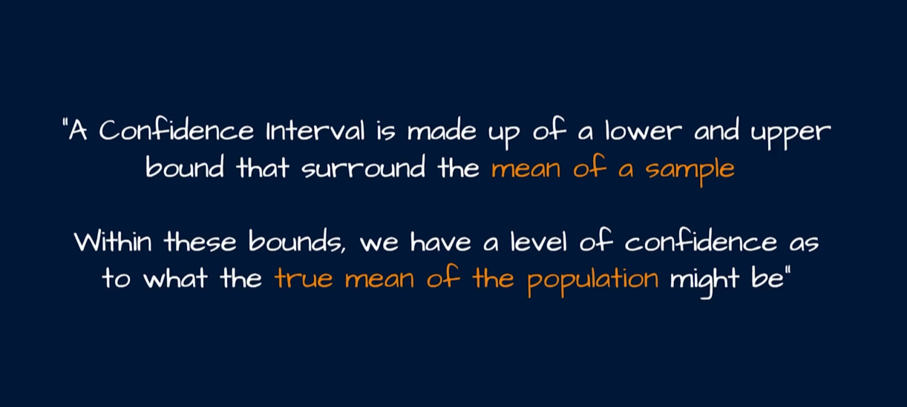
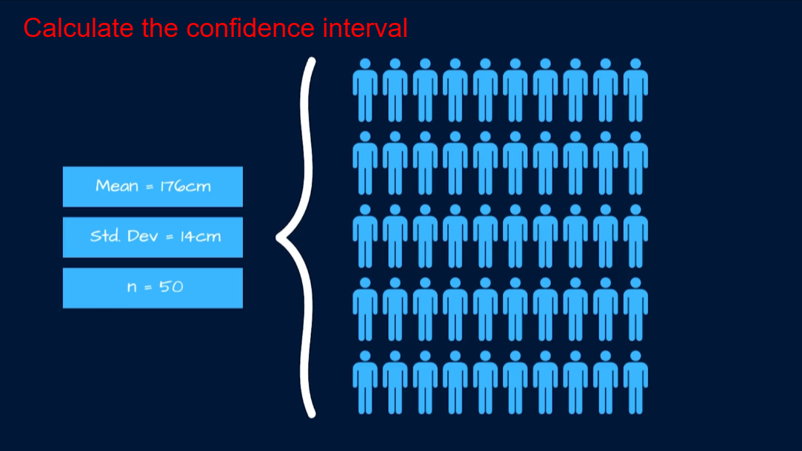
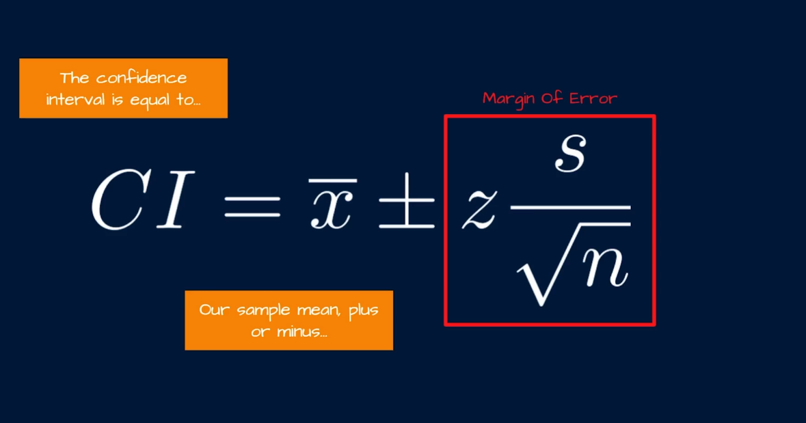
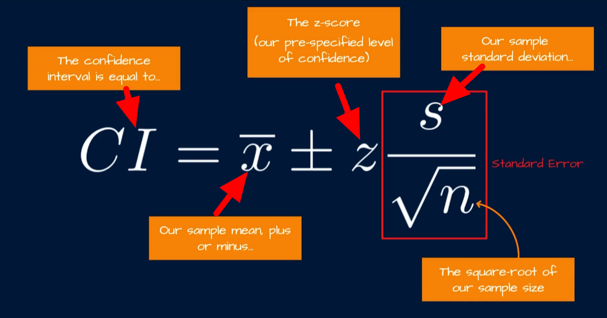
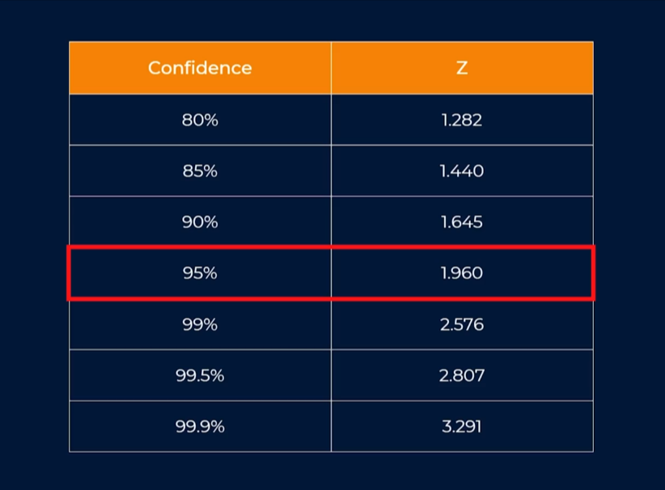
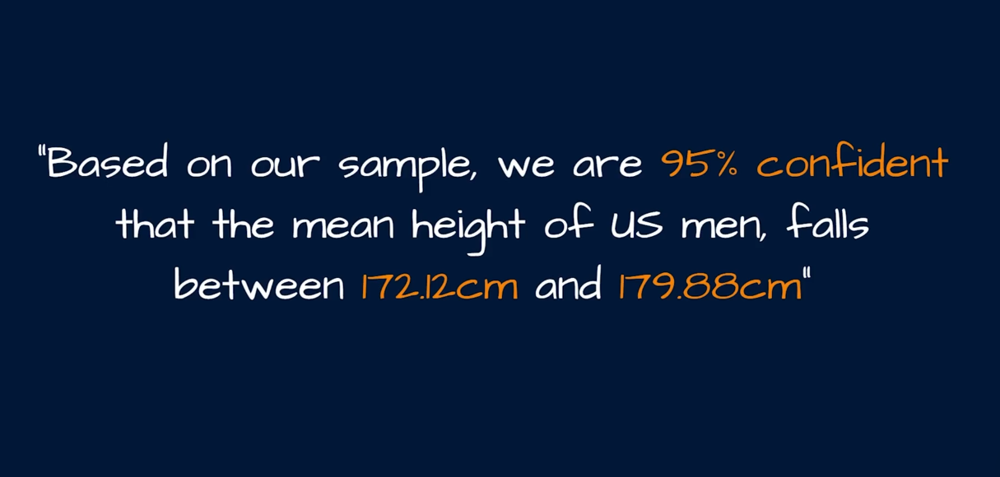

# Confidence Intervals in Data Science — A Beginner's Guide with Python

> **How to use this file:** run the code blocks in order. Each figure is saved as a PNG in the same
> folder and linked below, so opening this file in a markdown viewer shows the graphs after you run
> the code once.

---

## 1. The business problem behind confidence intervals

Imagine you manage an online store and want to know the **average order value (AOV)** of all your
customers this month. You obviously can't sum millions of orders by hand, so you take a sample of
200 orders and compute the sample mean: **$64.50**.

Questions immediately arise:

- If I take a _different_ sample of 200 orders, will I get exactly $64.50 again? _(Almost certainly not.)_
- How far off could my sample mean be from the _true_ population mean?
- Is the true AOV $63 or $66 — or could it be $70?

A **confidence interval (CI)** answers this by reporting a _range of plausible values_ for the true
population parameter, together with a **confidence level** (e.g., 95%) that describes how reliable
that range is.

**Key vocabulary:**
| Term | Meaning | Example |
|---|---|---|
| Population | Everyone/everything you care about | All orders this month |
| Sample | The subset you actually measure | 200 sampled orders |
| Parameter | A number describing the _population_ (usually unknown) | True mean AOV μ |
| Statistic / point estimate | A number computed from the _sample_ | Sample mean x̄ = $64.50 |
| Confidence interval | The point estimate ± margin of error | ($61.2, $67.8) |
| Confidence level | How often the method works in the long run | 95% |

---

## 2. The main formula — broken down piece by piece

For a population mean (when σ is known, or when the sample is large enough — see Section 3):

```
CI  =  x̄  ±  z_{α/2} · (σ / √n)
```

| Part             | Symbol           | What it is                                                                                                                                                                |
| ---------------- | ---------------- | ------------------------------------------------------------------------------------------------------------------------------------------------------------------------- |
| Point estimate   | `x̄`              | The sample mean — our best single guess at μ                                                                                                                              |
| Confidence level | `1 − α`          | e.g., 95% means α = 0.05                                                                                                                                                  |
| Alpha            | `α`              | The probability of _missing_ the true mean (5% = 1 in 20 chance of being wrong)                                                                                           |
| Critical value   | `z_{α/2}`        | How many standard errors we must go out to capture the middle `1 − α` of the normal curve. α/2 because the missed 5% is split between the two tails (2.5% low, 2.5% high) |
| Standard error   | `σ / √n`         | The standard deviation of _sample means_ — how much x̄ wobbles from sample to sample                                                                                       |
| Margin of error  | `z_{α/2} · σ/√n` | Half the width of the interval                                                                                                                                            |

**Critical values to memorize:**

| Confidence level | α    | z\_{α/2} |
| ---------------- | ---- | -------- |
| 90%              | 0.10 | 1.645    |
| 95%              | 0.05 | **1.96** |
| 99%              | 0.01 | 2.576    |

Where does 1.96 come from? It is `stats.norm.ppf(0.975)` — the point on the standard normal that
leaves 2.5% in the right tail (and 2.5% in the left), so the middle holds exactly 95%.

**Why divide by √n?** Individual customer orders are very spread out (σ is large), but _averages of
many orders_ are much more stable — extreme high orders cancel extreme low ones. Mathematically, if
you repeatedly draw samples of size n and plot their means, you get a normal curve centered on the
true mean with standard deviation σ/√n. That quantity is the **standard error (SE)**. Because of the
√n, quadrupling your sample size only _halves_ the interval width — that's the law of diminishing
returns in sampling.

### The correct interpretation (important!)

✅ **Correct:** "If I repeated this sampling procedure many, many times, then about 95% of the
confidence intervals I build would contain the true population mean."

❌ **Wrong:** "There is a 95% probability that the true mean lies inside _this particular_ interval."
(After you compute it, the interval is fixed — the true mean is either in it or not. The 95% refers
to the _method_, not to any single interval. In everyday business language people blur this, but it
matters in interviews and in rigorous reporting.)

---

## 3. The t-distribution version (what you'll actually use)

In real life you almost never know the population σ — you only have the sample standard deviation `s`.
Estimating σ with s adds uncertainty, so we widen the interval slightly using the **t-distribution**
(Student's t), which has fatter tails than the normal for small samples.

```
CI  =  x̄  ±  t_{α/2, n−1} · (s / √n)
```

- `s` — sample standard deviation (with `ddof=1`), an estimate of σ.
- `t_{α/2, n−1}` — the critical value from the t-distribution with **n − 1 degrees of freedom (df)**.
  The df = n − 1 because we already "used up" one piece of information to estimate the mean, leaving
  n − 1 independent pieces to estimate the spread.
- As n grows, t\_{α/2, n−1} approaches 1.96 — the t-distribution converges to the normal. With n = 30
  the difference is already tiny; with n = 10 it matters a lot.

**Rule of thumb:** use the t-based interval whenever σ is unknown (i.e., almost always in business
analytics). Use the z-based version when n is large (the two nearly agree) or when σ is somehow known.

---

## 4. Confidence interval for a proportion

The same logic applies to percentages — conversion rates, satisfaction shares, defect rates:

```
                ┌───────────────┐
CI  =  p̂  ±  z │ √(p̂(1 − p̂)/n) │
                └───────────────┘
```

- `p̂` — sample proportion (e.g., 64% of surveyed customers are satisfied = 0.64).
- `p̂(1 − p̂)` — the variance of a single yes/no observation (Bernoulli). It's biggest at p̂ = 0.5 and
  shrinks toward the extremes — that's why polls near 50/50 have the largest margin of error.
- Divide by n and take the square root → the **standard error of a proportion**.
- Valid when you have at least ~10 "yes" and ~10 "no" observations (`n·p̂ ≥ 10` and `n·(1−p̂) ≥ 10`).

_Example:_ 400 customers surveyed, 64% satisfied.
SE = √(0.64 · 0.36 / 400) = 0.024. Margin = 1.96 · 0.024 ≈ 0.047.
**95% CI ≈ (0.593, 0.687)** — we estimate true satisfaction between 59.3% and 68.7%.

---

## 5. Python walkthrough #1 — one confidence interval, fully explained

Scenario: a food-delivery company wants to estimate the mean delivery time of all orders in a city.
We (the all-knowing tutorial authors) secretly know the full population is N(32, 9²) minutes — but the
company only gets one sample of 60 orders.

```python
import numpy as np
from scipy import stats
import matplotlib.pyplot as plt

rng = np.random.default_rng(7)

# --- Build the "full population" (100,000 deliveries) ----------------------
pop = rng.normal(loc=32, scale=9, size=100_000)
true_mean = pop.mean()
print(f"True population mean (unknown to the company): {true_mean:.2f} min")

# --- The company takes ONE sample of n = 60 -------------------------------
n = 60
sample = rng.choice(pop, size=n, replace=False)

xbar = sample.mean()                 # point estimate
s = sample.std(ddof=1)               # sample std dev (ddof=1 -> divides by n-1)

alpha = 0.05                         # 1 - 0.95 confidence
t_crit = stats.t.ppf(1 - alpha/2, df=n-1)   # two-tailed critical value
margin = t_crit * s / np.sqrt(n)     # margin of error
ci = (xbar - margin, xbar + margin)  # the 95% confidence interval

print(f"Sample mean x̄ = {xbar:.2f} min")
print(f"Sample std  s = {s:.2f} min")
print(f"t critical value (df={n-1}) = {t_crit:.3f}")
print(f"Standard error s/√n = {s/np.sqrt(n):.3f} min")
print(f"95% CI = ({ci[0]:.2f}, {ci[1]:.2f}) min")

# --- Figure 1: population, our sample, and the interval --------------------
fig, ax = plt.subplots(figsize=(10, 6))
ax.hist(pop, bins=80, density=True, alpha=0.35, color="gray",
        label="Population (all 100k deliveries)")
ax.hist(sample, bins=25, density=True, alpha=0.6, color="#4C72B0",
        label=f"Our sample (n = {n})")
ax.axvline(true_mean, color="green", lw=2, ls="--",
           label=f"True population mean = {true_mean:.2f}")
ax.axvline(xbar, color="#C44E52", lw=2,
           label=f"Sample mean = {xbar:.2f}")
ax.axvspan(ci[0], ci[1], color="#C44E52", alpha=0.15,
           label=f"95% CI = ({ci[0]:.2f}, {ci[1]:.2f})")
ax.set_xlabel("Delivery time (minutes)")
ax.set_ylabel("Density")
ax.set_title("One sample, one 95% confidence interval")
ax.legend()
plt.savefig("confidence_interval_one_sample.png", dpi=150, bbox_inches="tight")
plt.show()
```


**What the code does, line by line:**

- `rng.choice(pop, size=60, replace=False)` grabs 60 real orders from the population — exactly what a company does when it samples order logs.
- `sample.mean()` is the point estimate x̄; `sample.std(ddof=1)` gives s (the `ddof=1` is crucial — dividing by n−1 makes s an _unbiased_ estimate of σ).
- `stats.t.ppf(1 − α/2, df=59)` returns the t critical value ≈ **2.001** (slightly wider than 1.96 because we had to estimate σ).
- `margin = t_crit · s/√n` ≈ 2.3 minutes — the "±" part.
- The interval is printed and drawn as the red shaded band.

**What the graph shows you:**

- The **gray histogram** is the entire population — what the company can never see.
- The **blue histogram** is the single sample of 60 — it's centered near the population but shifted a little (that's sampling error).
- The **green dashed line** is the true mean (32.0). The **red band** is our 95% CI, which happens to contain 32.0 — as it should about 95% of the time. In this lucky draw, the sample mean and interval are quite representative.
- Notice the CI is much narrower than the population spread (σ = 9): averaging 60 orders shrinks the uncertainty by a factor of √60 ≈ 7.7.

---

## 6. Python walkthrough #2 — what "95% confidence" actually means

The single interval above is just one roll of the dice. The real meaning of 95% only appears when we
repeat the experiment many times. Let's simulate 100 companies, each sampling 50 orders and building
their own 95% CI:

```python
n_sim, size = 100, 50
captured = 0

fig, ax = plt.subplots(figsize=(12, 6))

for i in range(n_sim):
    # Each "company" takes its own random sample of 50 deliveries
    samp = rng.choice(pop, size=size, replace=False)
    xbar = samp.mean()
    s = samp.std(ddof=1)
    t_crit = stats.t.ppf(0.975, df=size - 1)
    lo = xbar - t_crit * s / np.sqrt(size)
    hi = xbar + t_crit * s / np.sqrt(size)

    hit = (lo <= true_mean <= hi)          # does this interval contain the truth?
    captured += int(hit)

    # Draw the interval as a vertical line; red = missed the true mean
    ax.vlines(i, lo, hi, color="#4C72B0" if hit else "#C44E52", lw=1.5)
    ax.plot(i, xbar, "ko", ms=2.5)         # black dot = that sample's mean

ax.axhline(true_mean, color="black", ls="--", lw=1.5,
           label=f"True population mean = {true_mean:.2f}")
ax.set_xlabel("Simulation run (each = one company's 95% CI)")
ax.set_ylabel("Delivery time (minutes)")
ax.set_title(f"{captured} of {n_sim} confidence intervals contain the true mean "
             f"(expect ≈ {0.95*n_sim:.0f})")
ax.set_xlim(-2, n_sim + 2)
ax.legend()
plt.savefig("confidence_interval_simulation.png", dpi=150, bbox_inches="tight")
plt.show()
print(f"Intervals capturing the true mean: {captured}/100")
```


**What the code does, line by line:**

- The loop runs 100 independent experiments. Each iteration: draw a fresh sample of 50, compute x̄, s, the t critical value, and the interval — the exact same recipe as Section 5.
- `hit = lo <= true_mean <= hi` checks whether the interval brackets the true mean (we can check because we simulated the population; a real company never knows this!).
- Blue vertical lines = intervals that captured the truth; red vertical lines = the rare misses.
- Black dots are each sample's mean — note they scatter around the true mean with spread ≈ σ/√50 (the standard error!).

**What the graph shows you:**

- Each **vertical line is one complete 95% confidence interval** — its top and bottom are the interval's endpoints, its black dot is that sample's mean.
- The **horizontal dashed line** is the true population mean (32.0).
- The **red lines** are the ~5 experiments (out of 100) where the sample was unlucky enough that the interval _missed_ the truth — exactly the 5% that α = 0.05 allows.
- This is the _definition_ of confidence: **the method is right 95% of the time in the long run.** It never promises that any specific interval is correct — and in real life you can't tell whether your one red or blue line.

---

## 7. What changes the width? (and how to choose sample size)

Three forces control the interval width:

| Factor                             | Effect on the CI             | Intuition                                                                |
| ---------------------------------- | ---------------------------- | ------------------------------------------------------------------------ |
| Higher confidence (90% → 99%)      | **Wider**                    | To be more sure you're right, you must hedge with a bigger range         |
| Larger sample size n               | **Narrower**, but only by √n | More data → more precise estimate; but 4× the data only halves the width |
| More variable data (larger σ or s) | **Wider**                    | Noisy data → less certain averages                                       |

**Choosing a sample size** to hit a target margin of error E:

```
n  ≥  ( z_{α/2} · s / E )²
```

```python
z = stats.norm.ppf(0.975)      # 1.96
s = 9.0                        # rough guess of the std dev (from past data/pilot)
E = 2.0                        # we want the margin of error <= ±2 minutes
n_needed = np.ceil((z * s / E) ** 2)
print(f"Need at least n = {int(n_needed):.0f} orders to get ±{E} min at 95% confidence")

# Show how width shrinks with n (1/sqrt(n) law)
ns = np.arange(10, 1001, 10)
widths = 2 * z * s / np.sqrt(ns)
plt.figure(figsize=(8, 5))
plt.plot(ns, widths, color="#4C72B0", lw=2)
plt.xlabel("Sample size n"); plt.ylabel("Interval width (minutes)")
plt.title("Wider n → narrower CI (diminishing returns)")
plt.axhline(2 * E, color="#C44E52", ls="--", label=f"Target width ±{E} min")
plt.legend()
plt.savefig("confidence_interval_width_vs_n.png", dpi=150, bbox_inches="tight")
plt.show()
```

**Takeaway from the graph:** the curve drops steeply at first, then flattens. Going from n = 10 to
n = 100 buys you a huge gain in precision; going from n = 10,000 to n = 100,000 buys almost nothing
for a lot of cost. That's why polls use ~1,000 respondents and why you should compute n _before_
running an expensive experiment.

---

## 8. Company use cases

### 🛍️ E-commerce — A/B testing (Amazon, Booking.com style)

- **Problem:** does the new checkout page lift the conversion rate above the old one?
- **Approach:** run both versions, then compute a CI for the _difference_ in conversion rates (proportion formula on each arm, or a two-sample CI).
- **Decision:** if the 95% CI for the difference excludes 0 → the change is statistically real, ship it. If the CI includes 0 (e.g., −0.3% to +1.1%) → the data can't distinguish the versions yet; run longer or test something else. Guardrail metrics (cart size, support tickets) get the same treatment.

### 📰 Public polling (Gallup, NYT/Siena style)

- **Problem:** report "candidate A leads 52% to 48%" without misleading readers.
- **Approach:** n ≈ 1,000 respondents → margin of error ≈ ±3 points at 95% confidence (1.96 · √(0.5·0.5/1000) ≈ 0.031).
- **Decision:** a 52–48 lead is _within the margin of error_ — so responsible outlets report "statistical tie." Publishing the CI is both honest and legally safer for election coverage.

### ⭐ Customer experience — NPS / satisfaction tracking

- **Problem:** after a pricing change, did customer satisfaction (1–10 scale or NPS) actually drop?
- **Approach:** survey a sample each week, compute the mean rating and its t-based 95% CI each week.
- **Decision:** compare this week's CI to last week's: if they barely overlap, the drop is likely real and warrants action; if they overlap heavily, you're seeing noise — don't over-react to random weekly wobble.

### 🚚 Logistics — SLA compliance

- **Problem:** management wants ≥ 95% of deliveries within 24 hours; you can't track every package manually.
- **Approach:** sample package tracking records, estimate the on-time proportion p̂ with its CI. If the CI lower bound is above 95%, you're compliant with statistical evidence; if the CI upper bound is below 95%, you have a problem.
- **Decision:** triggers courier contract renegotiation or staffing changes — defensible numbers in a business review.

### 💊 Healthcare — clinical trials (pharma style)

- **Problem:** does the new drug lower blood pressure more than placebo?
- **Approach:** report the CI of the mean treatment effect (not just a p-value): e.g., "effect = −8.2 mmHg, 95% CI (−11.4, −5.0)".
- **Decision:** regulators (FDA) and doctors care that the _whole_ interval is clinically meaningful — a CI that includes 0 says "we can't rule out no effect," no matter how tempting the point estimate looks.

### 🏭 Manufacturing — process monitoring

- **Problem:** bottles must contain ≥ 495 ml; how confident are we in the mean fill volume of today's production run?
- **Approach:** take 30 bottles per hour, build a CI for the mean fill volume and compare it to the spec.
- **Decision:** if the CI lower bound is safely above the spec, keep running; if it creeps close, adjust the filler before you produce a batch of under-filled (fineable) product.

---

## 9. Pitfalls & practical tips

1. **Don't say "95% chance the mean is in my interval."** Say: "Intervals built this way contain the true mean 95% of the time." (Fine for informal chat; wrong for reports and interviews.)
2. **Garbage in, garbage out:** the CI only accounts for _random sampling_ error. If your sample is biased (only surveyed app users, not phone customers), the interval is meaningless no matter how narrow.
3. **Check the conditions:** for t-intervals on means, data should not be extremely skewed when n is small. For proportions, need ≥ ~10 successes and failures. When in doubt, use larger samples or bootstrapping.
4. **Always report the recipe:** n, the method (z or t), and the confidence level. A "95% CI (61.2, 67.8)" without n or method can't be audited.
5. **Narrow ≠ correct:** a tiny CI from a biased or tiny-but-unrepresentative sample is confidently wrong. Width only measures sampling precision, not truthfulness.
6. **More confidence = wider interval:** choosing 99% over 95% makes you "safer" but vaguer; businesses usually standardize on 95% so decisions stay consistent.

---

## 10. Practice exercises

1. Take n = 100 from any column of a real dataset, compute the 95% t-interval for its mean by hand with the formula, then verify with `scipy.stats.t.interval(0.95, df=n-1, loc=xbar, scale=s/np.sqrt(n))`.
2. Repeat the Section 6 simulation with 1,000 intervals and confidence 90% — confirm ≈ 900 capture the truth and the lines get shorter.
3. A survey of 800 users shows 55% would recommend the product. Compute the 95% CI for the proportion. Would you call that a majority? (Hint: check the lower bound.)
4. Your pilot data has s = 12. How many samples do you need for a ±3 margin at 95% confidence?

---

## Recap

- A **confidence interval** reports the range of plausible values for an unknown population number, based on one sample: `estimate ± margin of error`.
- The **standard error** σ/√n (or s/√n) measures how much sample means wobble; bigger n → smaller wobble, but only by √n.
- Use **z** critical values when σ is known or n is large; use **t** with n − 1 degrees of freedom when you estimate σ from the sample.
- "95% confidence" is a property of the _procedure_: repeat sampling → ~95% of intervals capture the truth.
- Companies use CIs everywhere: A/B tests, polls, NPS tracking, SLA audits, clinical trials, and process control — because **a number without an interval is a number without a measure of trust**.












