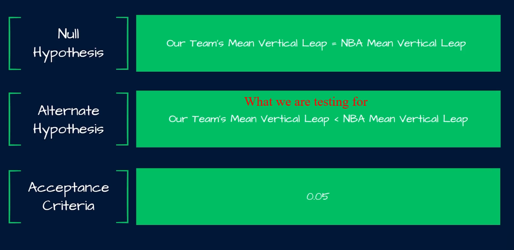
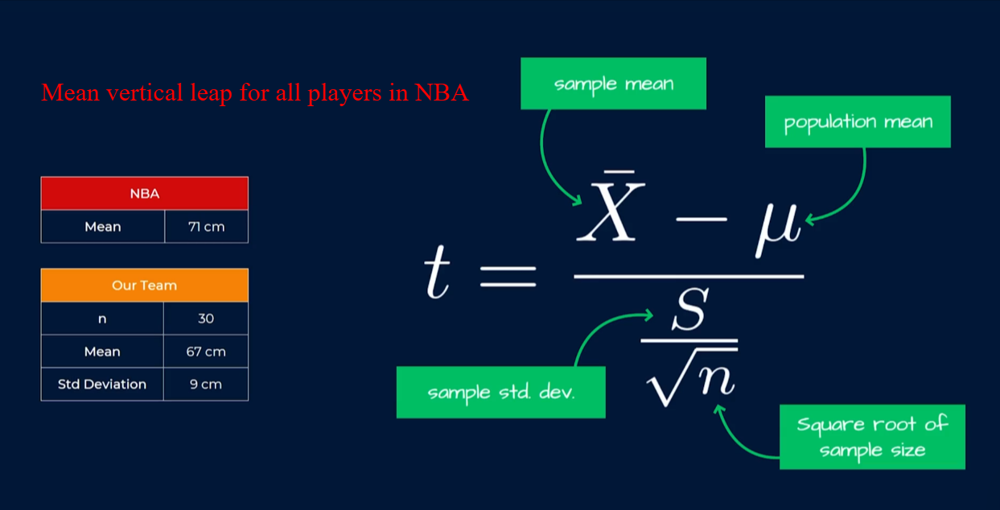
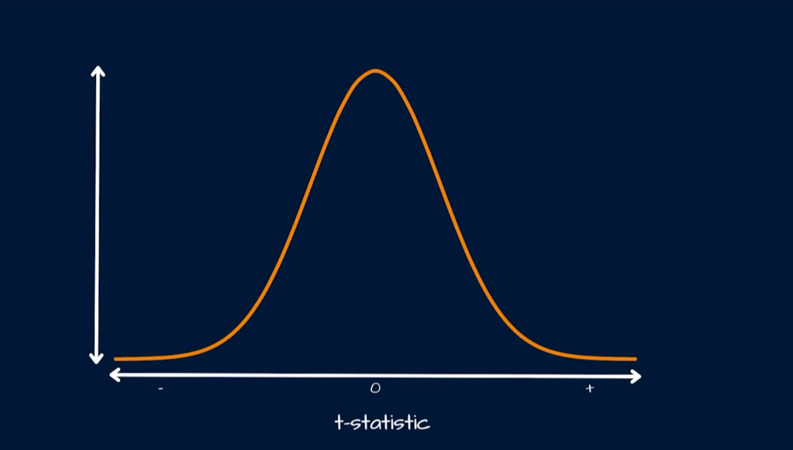
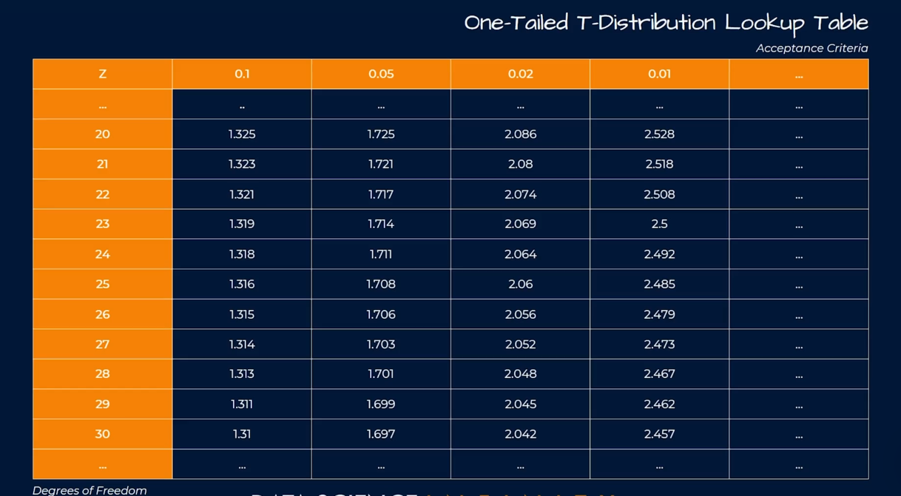
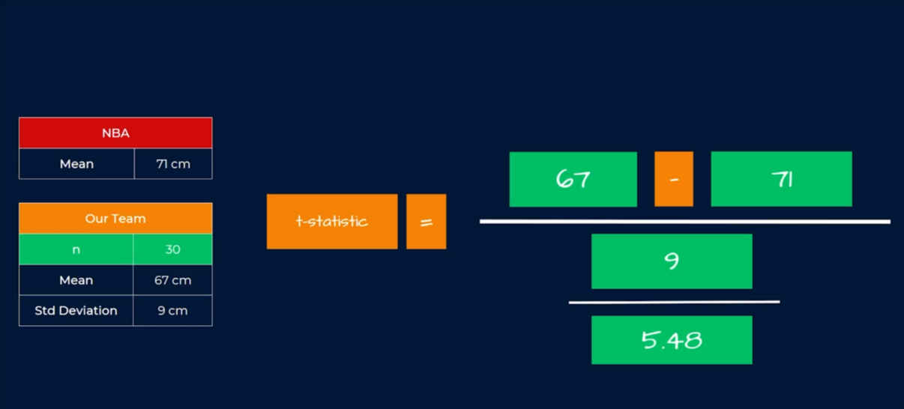
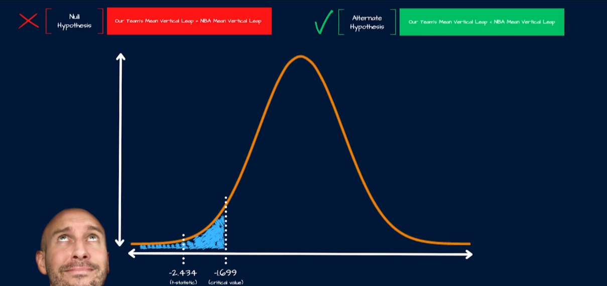

# Hypothesis Testing: The One-Sample t-Test in Python

The **one-sample t-test** is used when we have one sample of numerical data and want to compare its mean with a known, claimed, or target value.

For example:

> A company promises that its average delivery time is 30 minutes. We collect a sample of delivery times. Is the sample evidence that the true average delivery time is different from 30 minutes?

This file explains the idea from the beginning, derives the formula, implements it in Python, creates graphs, and connects the result to business decisions.




The `acceptance criteria` is the `benchmark` or conclusion around which `hypothesis` we think is more likely. In modern statistical language, we usually say **decision rule** rather than acceptance criteria: we either reject the null hypothesis or fail to reject it.







## 1. What problem does the test solve?

There are two different things we might want to know:

1. **Descriptive question:** What was the average in the sample?
2. **Inferential question:** Is the sample average far enough from a benchmark that the difference is unlikely to be explained by random sampling variation?

The first question only needs `mean()`. The second question needs a hypothesis test.

### Population, sample, and benchmark

| Term                 | Meaning                                | Delivery example                   |
| -------------------- | -------------------------------------- | ---------------------------------- |
| Population           | Every observation we care about        | Every delivery made by the company |
| Sample               | A manageable subset of the population  | 20 randomly selected deliveries    |
| Population mean, `μ` | The true average, usually unknown      | The true average delivery time     |
| Sample mean, `x̄`     | The average calculated from the sample | 32.1 minutes                       |
| Benchmark, `μ₀`      | The value being tested                 | The advertised 30 minutes          |

The test helps us decide whether the evidence supports a difference between `μ` and `μ₀`.

## 2. Hypotheses: the claim and the challenge

Before looking at the result, write two competing statements.

### Null hypothesis, `H₀`

The null hypothesis is the default position. It normally says that there is no meaningful difference:

$$H_0: \mu = \mu_0$$

For this example:

$$H_0: \mu = 30$$

The true average delivery time is 30 minutes.

### Alternative hypothesis, `H₁` or `Hₐ`

The alternative hypothesis describes the difference we are investigating:

$$H_1: \mu \neq 30$$

The true average delivery time is not 30 minutes.

This is a **two-tailed test** because a value below 30 and a value above 30 are both considered evidence of a difference.

### One-tailed alternatives

The alternative hypothesis must match the business question:

| Question                                    | Alternative | Test         |
| ------------------------------------------- | ----------- | ------------ |
| Is delivery time different from 30 minutes? | `μ ≠ 30`    | Two-tailed   |
| Is delivery time slower than 30 minutes?    | `μ > 30`    | Right-tailed |
| Is a new process faster than 30 minutes?    | `μ < 30`    | Left-tailed  |

Choose the direction **before** looking at the data. Changing from two-tailed to one-tailed after seeing a favorable result artificially makes significance easier to obtain.

## 3. Why is it called a t-test?

The population standard deviation `σ` is usually unknown. We estimate the spread using the sample standard deviation `s`. That extra uncertainty is handled by the **Student's t-distribution**.

The t-distribution looks like a normal bell curve, but it has heavier tails for small samples. Heavier tails mean that extreme results are treated more cautiously. As the sample size grows, the t-distribution becomes increasingly similar to the standard normal distribution.

## 4. The one-sample t-test formula

The test statistic is:

$$t = \frac{\bar{x} - \mu_0}{s / \sqrt{n}}$$

The degrees of freedom are:

$$df = n - 1$$

### Formula, piece by piece

| Formula part | Name                       | Meaning in plain English                                             |
| ------------ | -------------------------- | -------------------------------------------------------------------- |
| `x̄`          | Sample mean                | The average observed in our sample                                   |
| `μ₀`         | Hypothesised mean          | The benchmark assumed by `H₀`                                        |
| `x̄ − μ₀`     | Difference or signal       | How far the sample mean is from the benchmark                        |
| `s`          | Sample standard deviation  | How spread out the individual observations are                       |
| `n`          | Sample size                | How many observations were measured                                  |
| `√n`         | Square root of sample size | The amount by which averaging reduces noise                          |
| `s / √n`     | Standard error             | The expected sampling variation of the mean                          |
| `t`          | t-statistic                | The difference measured in standard-error units                      |
| `df`         | Degrees of freedom         | The amount of independent information left after estimating the mean |

### Why divide by the standard error?

The numerator tells us the size of the difference, but a difference of 2 minutes can mean very different things:

- If deliveries vary by only 1 minute, a 2-minute difference is large.
- If deliveries vary by 20 minutes, a 2-minute difference is small.

The denominator adjusts the difference for noise. Therefore, `t` answers:

> How many standard errors away from the benchmark is the sample mean?

### Manual calculation with a small example

Suppose:

- `x̄ = 32.1`
- `μ₀ = 30`
- `s = 4.5`
- `n = 20`

First calculate the standard error:

$$SE = \frac{s}{\sqrt{n}} = \frac{4.5}{\sqrt{20}} \approx 1.006$$

Then calculate the t-statistic:

$$t = \frac{32.1 - 30}{1.006} \approx 2.09$$

The sample mean is approximately 2.09 standard errors above the benchmark. The t-statistic alone is not the final decision; we also need the degrees of freedom and p-value.

## 5. The p-value and significance level

The **p-value** is the probability of observing a result at least as extreme as ours, assuming `H₀` is true.

It does **not** mean:

- the probability that `H₀` is true;
- the probability that the result happened only by chance;
- the size or business value of the effect.

Choose a significance level, called `α`, before running the test. A common choice is:

$$\alpha = 0.05$$

Decision rule for a two-tailed test:

| Result  | Statistical decision | Meaning                                           |
| ------- | -------------------- | ------------------------------------------------- |
| `p ≤ α` | Reject `H₀`          | Evidence supports a difference from the benchmark |
| `p > α` | Fail to reject `H₀`  | Not enough evidence to claim a difference         |

Say **fail to reject**, not **accept the null**. A non-significant result may mean there is no effect, or that the sample is too small or noisy to detect it.

## 6. Assumptions and when to use the test

The one-sample t-test is appropriate when:

1. The outcome is numerical, such as revenue, delivery time, response time, or weight.
2. The observations are reasonably independent.
3. The sample is randomly selected or is representative of the population.
4. The population is approximately normal, especially when the sample is small.
5. There are no extreme outliers that dominate the mean.

The t-test is fairly robust for moderate or large samples, but a large sample does not repair biased sampling or dependent observations.

For strongly skewed data, severe outliers, or ordinal data, consider a transformation, a robust method, a bootstrap confidence interval, or a non-parametric alternative such as the Wilcoxon signed-rank test.

## 7. Complete Python example

### Install the libraries

Run this in the environment used by the project:

```bash
pip install numpy scipy matplotlib
```

The example uses a fixed list rather than randomly generating observations, so every reader gets the same result.

```python
import numpy as np
import matplotlib.pyplot as plt
from scipy import stats

delivery_times = np.array([
    24, 27, 28, 29, 29, 30, 30, 31, 31, 31,
    32, 32, 33, 33, 34, 35, 36, 37, 38, 40
])

benchmark = 30
alpha = 0.05

sample_size = len(delivery_times)
sample_mean = delivery_times.mean()
sample_std = delivery_times.std(ddof=1)
standard_error = sample_std / np.sqrt(sample_size)
degrees_of_freedom = sample_size - 1

result = stats.ttest_1samp(delivery_times, popmean=benchmark)

print(f"Sample size: {sample_size}")
print(f"Sample mean: {sample_mean:.2f} minutes")
print(f"Sample standard deviation: {sample_std:.2f} minutes")
print(f"Standard error: {standard_error:.2f} minutes")
print(f"t-statistic: {result.statistic:.3f}")
print(f"Degrees of freedom: {degrees_of_freedom}")
print(f"Two-tailed p-value: {result.pvalue:.4f}")

if result.pvalue <= alpha:
    print("Reject H0: the average delivery time differs from 30 minutes.")
else:
    print("Fail to reject H0: there is not enough evidence of a difference.")
```

### What each part of the code does

- `np.array(...)` stores the 20 observations in a numerical structure.
- `benchmark = 30` stores `μ₀`, the value specified by the null hypothesis.
- `ddof=1` calculates the **sample** standard deviation. This is important because the population standard deviation is unknown.
- `standard_error` measures how much the sample mean is expected to vary across repeated samples.
- `stats.ttest_1samp(...)` calculates the t-statistic and the two-tailed p-value.
- `result.statistic` is the calculated `t` in the formula.
- `result.pvalue` is the probability used in the decision rule.
- The final `if` statement compares the p-value with `α = 0.05`.

For these data, the mean is higher than 30 minutes. The exact p-value is calculated by SciPy, so the conclusion should be based on the printed output rather than on the direction of the mean alone.

## 8. Graph 1: The observed delivery times

This graph shows the actual data points. The red dashed line is the 30-minute benchmark. Each dot represents one delivery, and the black line is the sample mean.

```python
plt.figure(figsize=(10, 3.5))

y_values = np.zeros_like(delivery_times)
plt.scatter(delivery_times, y_values, color="steelblue", s=80, label="Individual deliveries")
plt.axvline(benchmark, color="crimson", linestyle="--", linewidth=2, label="Benchmark: 30 minutes")
plt.axvline(sample_mean, color="black", linewidth=2, label=f"Sample mean: {sample_mean:.2f} minutes")

plt.yticks([])
plt.xlabel("Delivery time (minutes)")
plt.title("Observed delivery times compared with the company benchmark")
plt.legend(loc="upper left", bbox_to_anchor=(1, 1))
plt.tight_layout()
plt.show()
```

### How to read this graph

- Each blue dot is one observation, not one customer average.
- Dots spread widely around the benchmark indicate more variation and a larger `s`.
- The black line shows `x̄`, the evidence from the sample.
- The distance between the black and red lines is the numerator, `x̄ − μ₀`.
- This graph does not by itself show statistical significance. The t-test also considers the spread and sample size.

## 9. Graph 2: The t-distribution and the p-value

The next graph places our t-statistic on the distribution expected if the benchmark were actually true. The shaded tails represent results at least as extreme as the observed t-statistic.

```python
t_observed = result.statistic
t_axis = np.linspace(-4.5, 4.5, 1000)
t_density = stats.t.pdf(t_axis, df=degrees_of_freedom)

critical_value = stats.t.ppf(1 - alpha / 2, df=degrees_of_freedom)
extreme_values = np.abs(t_axis) >= abs(t_observed)

plt.figure(figsize=(10, 5))
plt.plot(t_axis, t_density, color="navy", linewidth=2, label="t-distribution under H0")
plt.fill_between(
    t_axis,
    t_density,
    where=extreme_values,
    color="tomato",
    alpha=0.55,
    label=f"Two-tailed p-value = {result.pvalue:.4f}"
)
plt.axvline(t_observed, color="black", linestyle="--", linewidth=2, label=f"Observed t = {t_observed:.2f}")
plt.axvline(-t_observed, color="black", linestyle="--", linewidth=1)
plt.axvline(critical_value, color="darkgreen", linestyle=":", label=f"Critical values: ±{critical_value:.2f}")
plt.axvline(-critical_value, color="darkgreen", linestyle=":")
plt.xlabel("t-statistic")
plt.ylabel("Density")
plt.title("One-sample t-test: observed statistic and extreme tail area")
plt.legend()
plt.tight_layout()
plt.show()
```

### How the data become the graph

1. `t_observed` comes from the 20 delivery times and measures their distance from 30 in standard-error units.
2. `stats.t.pdf(...)` computes the height of the t-distribution for many possible t-values, assuming `H₀` is true.
3. `extreme_values` identifies points at least as far from zero as the observed statistic.
4. `fill_between(...)` shades the probability area in both tails. The total shaded area is the two-tailed p-value.
5. The green dotted lines are the 5% rejection boundaries. If the black observed line lies beyond either boundary, we reject `H₀` at the 5% level.

The center of the curve represents results close to the benchmark. The tails represent unusual results under the assumption that the average really is 30 minutes.

## 10. Confidence interval and effect size

A p-value gives a decision, but a business leader also needs the likely size of the difference.

```python
confidence_level = 0.95
confidence_interval = result.confidence_interval(confidence_level=confidence_level)
mean_difference = sample_mean - benchmark

print(f"Mean difference from benchmark: {mean_difference:.2f} minutes")
print(
    f"95% confidence interval for the true mean: "
    f"({confidence_interval.low:.2f}, {confidence_interval.high:.2f}) minutes"
)
```

The mean difference is:

$$\text{effect} = \bar{x} - \mu_0$$

The confidence interval gives plausible values for the true population mean. If a two-tailed 95% interval does not contain 30, the corresponding p-value is below 0.05. This is another way to communicate the same inferential result, while also showing uncertainty.

For this business question, also ask whether the difference is practically important. A statistically significant delay of 0.2 minutes may not justify an expensive operational change; a 3-minute delay might.

## 11. Company use cases

### Delivery and logistics

**Question:** Is the average delivery time different from the promised 30 minutes?

- Metric: delivery time in minutes.
- Benchmark: 30 minutes.
- Action: investigate staffing, routing, or warehouse capacity if the mean is materially higher.

### Customer support

**Question:** Is the average first-response time above the service-level target of 10 minutes?

- `H₀: μ = 10`
- `H₁: μ > 10`
- Action: add agents or revise scheduling if the evidence supports a sustained breach.

### Manufacturing quality

**Question:** Is the mean weight of packaged product different from the 500-gram target?

- Metric: package weight.
- Benchmark: 500 grams.
- Action: recalibrate the filling machine if the difference is statistically and operationally important.

### Marketing and advertising

**Question:** Is the average cost per acquired customer above the budget target of $40?

- Metric: customer acquisition cost.
- Benchmark: $40.
- Action: adjust targeting or creative when the estimated cost exceeds the acceptable threshold.

### Software performance

**Question:** Is the average API response time different from the 200-millisecond objective?

- Metric: response time in milliseconds.
- Benchmark: 200 ms.
- Action: investigate database queries, caching, or infrastructure if latency is materially above target.

### Healthcare and product research

**Question:** Does the average change in a measured outcome differ from zero after an intervention?

- Metric: change per participant.
- Benchmark: 0, meaning no average change.
- Action: combine the statistical result with safety, effect size, and domain requirements before making a decision.

## 12. Common mistakes

1. **Testing after choosing the hypothesis.** Define the benchmark, direction, and `α` before viewing the result.
2. **Treating p < 0.05 as proof.** It is evidence against `H₀`, not proof that the business explanation is true.
3. **Ignoring effect size.** Statistical significance does not guarantee business significance.
4. **Using dependent observations.** Ten measurements from one customer are not automatically ten independent customers.
5. **Keeping outliers without investigation.** An incorrect timestamp or unusual incident can pull the mean strongly.
6. **Using the test on categories.** A t-test is for a numerical mean, not for counts such as yes/no or product categories.
7. **Confusing a sample mean with a population mean.** The test estimates uncertainty; it does not give direct access to every population observation.
8. **Running many tests and reporting only the smallest p-value.** Multiple testing increases false positives and may require correction.

## 13. A practical reporting template

Use this structure when communicating results:

> A one-sample, two-tailed t-test compared the mean **[metric]** with the benchmark **[μ₀]** using **[n]** independent observations. The sample mean was **[x̄]**, giving **t([df]) = [t]**, **p = [p]**, with a 95% confidence interval of **[lower, upper]**. We therefore **[reject/fail to reject] `H₀`** at `α = 0.05`. The estimated difference was **[effect]**, which is **[practically important/not practically important]** for **[business reason]**.

This format reports the sample size, direction, uncertainty, statistical decision, and business meaning instead of reporting a p-value by itself.

## 14. Final checklist

- [ ] Is the outcome numerical?
- [ ] Is there one sample and one benchmark mean?
- [ ] Were `H₀`, `H₁`, the tail direction, and `α` defined before testing?
- [ ] Are observations reasonably independent and representative?
- [ ] Were outliers and the distribution checked?
- [ ] Did you calculate the mean, standard deviation, standard error, t-statistic, degrees of freedom, and p-value?
- [ ] Did you report a confidence interval and effect size?
- [ ] Is the result practically important for the company, not merely statistically significant?




