## The question

> The key principles are the:

1. The `Acceptance Criteria` (AC)
2. The `Critical Value` (CV)
3. The `T-Statistics`

> Assuming we choose an `AC` of `0.05` which is equivalent to `5%`, This implies that we have `5%` lies to the left of the `Normal Distribution` and `95%` lies to the Right.
> If the `t-statistics` is less than the AC or lies to the left, we say it is just `5%` chance that our hypothesis is likely correct, so we reject the `NH` and accepts the `AH`, otherwise if it is greater than the `AC`,i.e lies to the right, we say we have `95%` chance of being true, we accept the `NH`.

> 

> Our `Alternate Hypothesis` is what we're testing for or what we're interested in.

> Acceptance criteria = 0.05

> The `AC` will act as a line in the sand around which we make our conclusions of which hypothesis (Null or Alternate) we think is more likely.
> 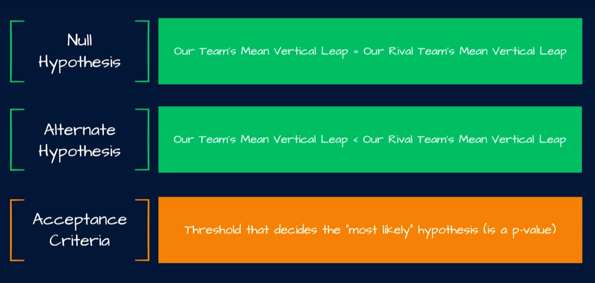

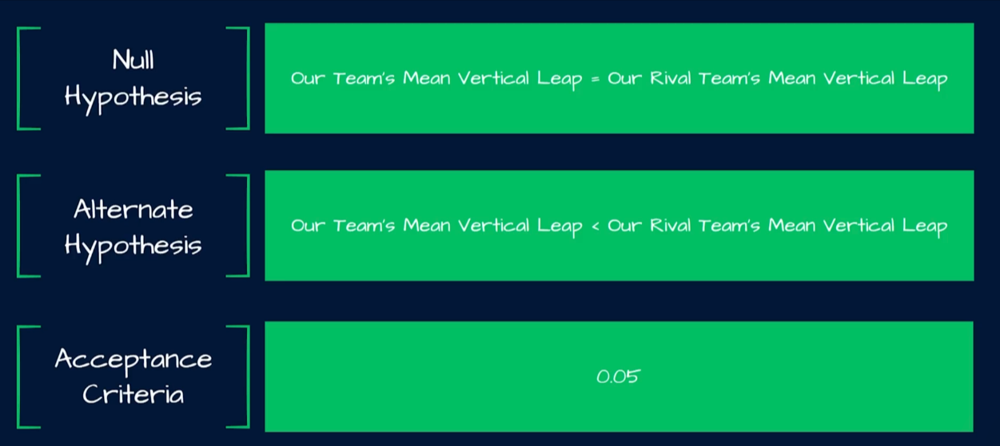

> Stats to use
>
> 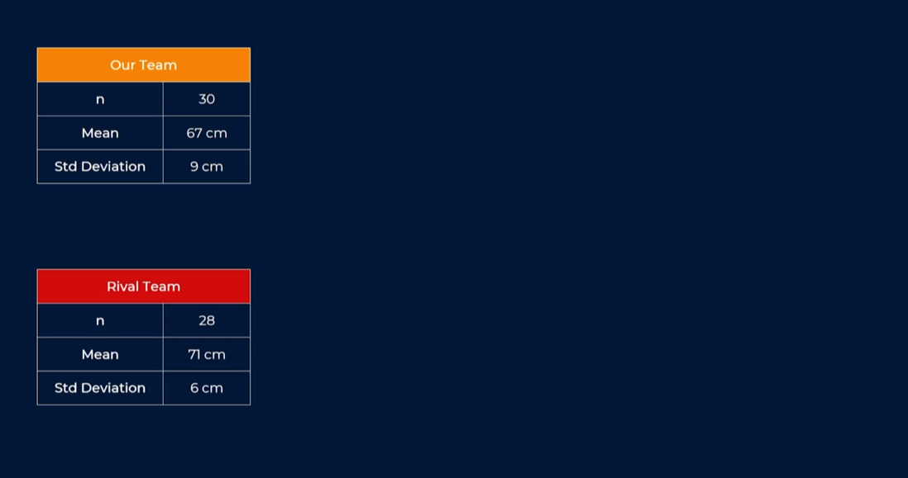

> Formula - Welch's T-Test
>
> 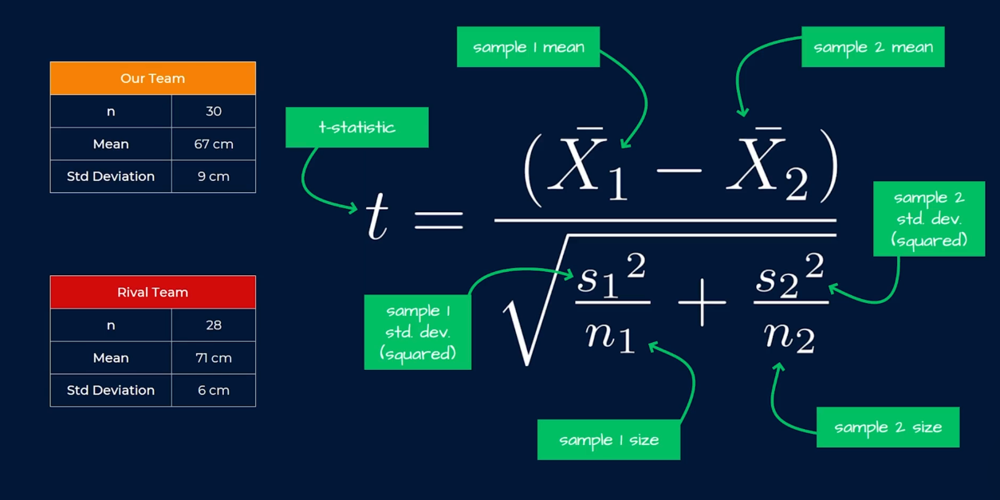

> The `t-statistics` tells us where on the T-Distribution the difference in the two means lies and more specifically it helps us figure out how likely we are to see this difference in the `Means` if our `NH` (Null Hypo.) that the means are not different was true and from there based on our `AC` (Acceptance Criteria) we can come to some form of conclusions around whether we think there actually is a difference or if the difference we're seeing is down to noise or down to random chance.
>
> We're interested in whether our teams mean vertical leap is lower than that of rival team. We are running a `1-tailed-test` and thus we are concerned with the with the split on the left hand side of the distribution and the split point in dotted white line is known as the `critical value` where it splits the area under the distribution curve by our AC.
> If we get a `t-statistics` that is less than the `CV` (critical value), we are going to reject the NP. We are going to reject the idea that there is no difference between the means of our team ans our rival team in terms of the `vertical leap`.
> 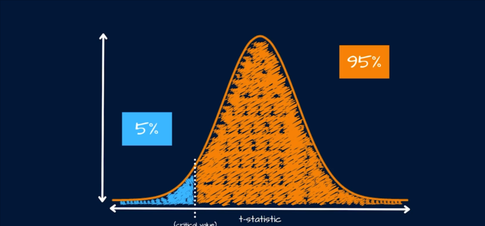
> The vertical line Is known as the Critical Value where it splits the area under the distribution curve by our Acceptance Criteria, since we're using a value of 0.05, this splits the area with 5% on one side and 95% on the other side.

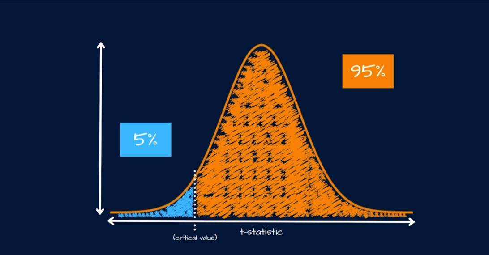

> If NP = True
>
> 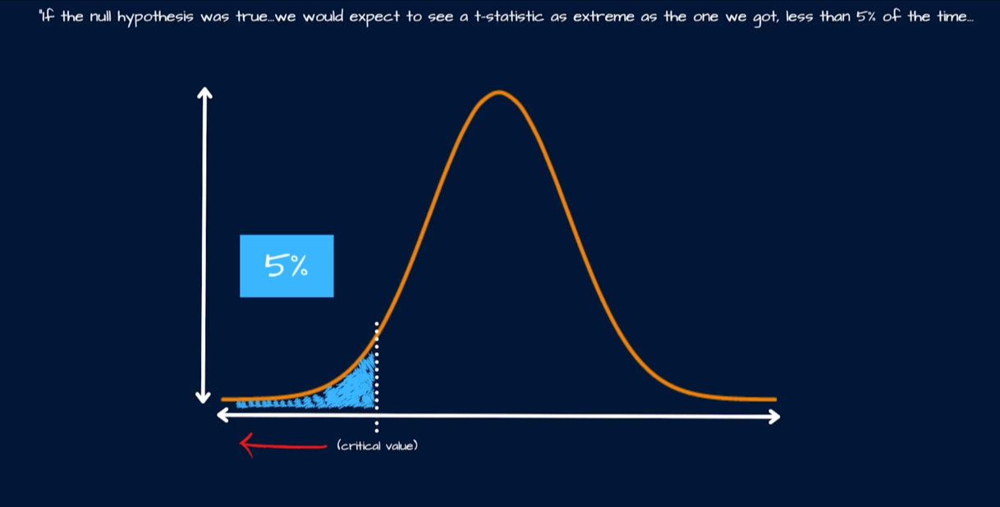

> If it's less likely than our `AC`, then maybe it's not actually the case now conversely if we're using the formula and we obtain a `t-statistics` that was above the CV, we would fail to reject the NH. A `t-statistics` such as the the NH that there is no difference between the means is actually quite plausible or quite likely to be true.
>
> What the graph tells us if NH=True
>
> Essentially, er're saying if the NH is true we would expect to see `t-statistics` such as the one in the graph, one that falls within this range of values at least 95% of the time and because of that fact we might say it seems quite likely that the NH is actually true and because of that we would see no reason to reject that notion. Otherwise, we reject it and conclude that the differences between the two means was just down to noise or down to random chance.

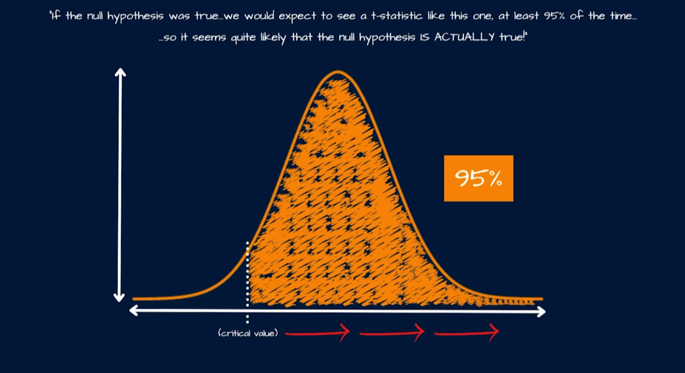

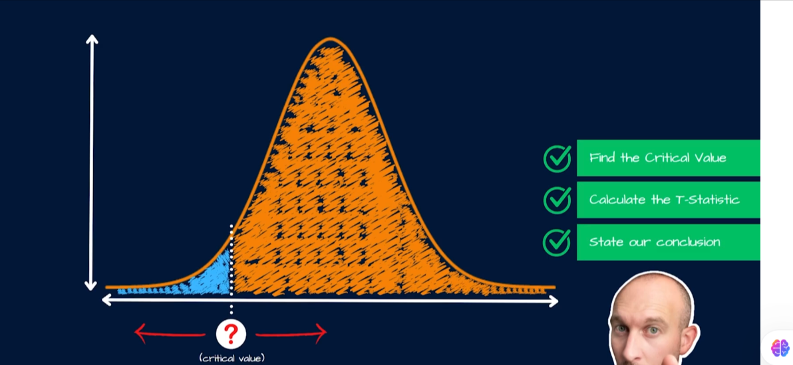

> Find the degree of freedom
>
> 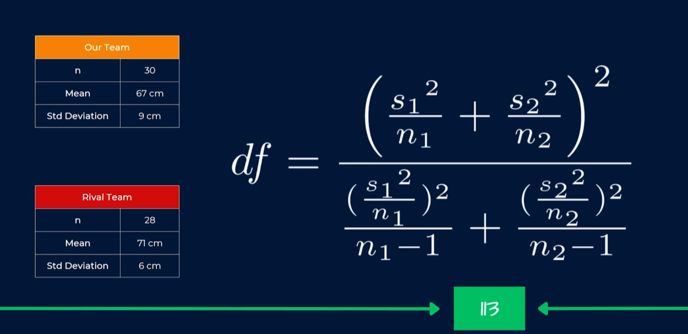

> Find the Critical value
> Find the intersection between the AC and DF to get the CV.
> 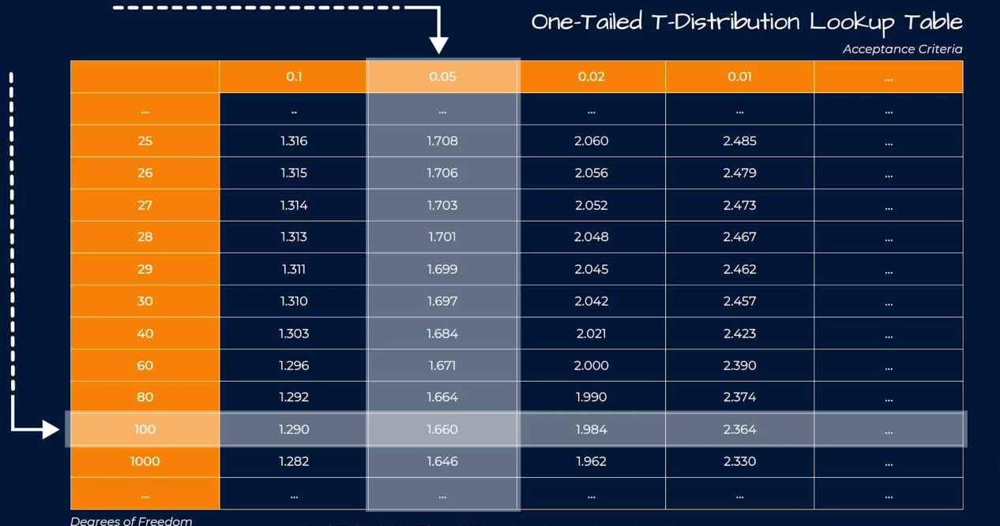

> Find the T-Statistic

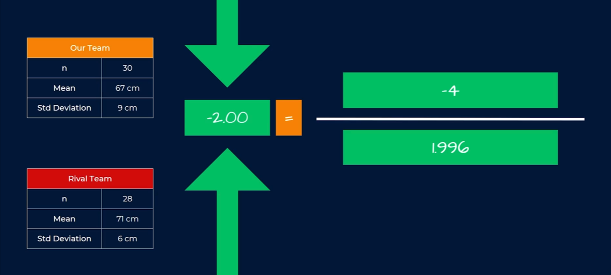

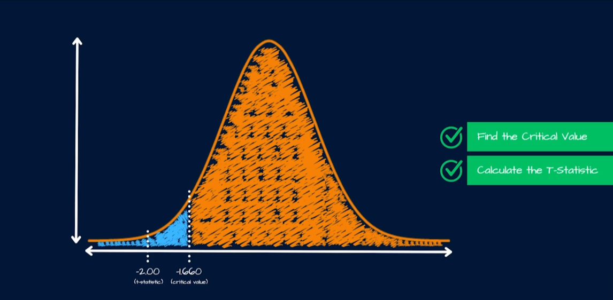

The `t-statistic` value lands us in the 5% area under the distribution.

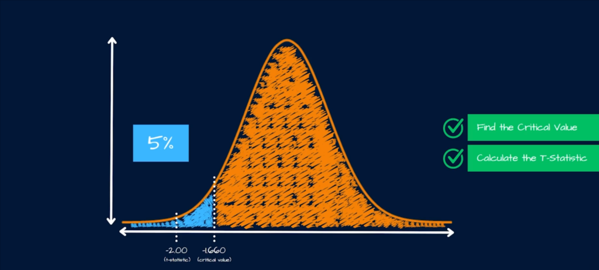

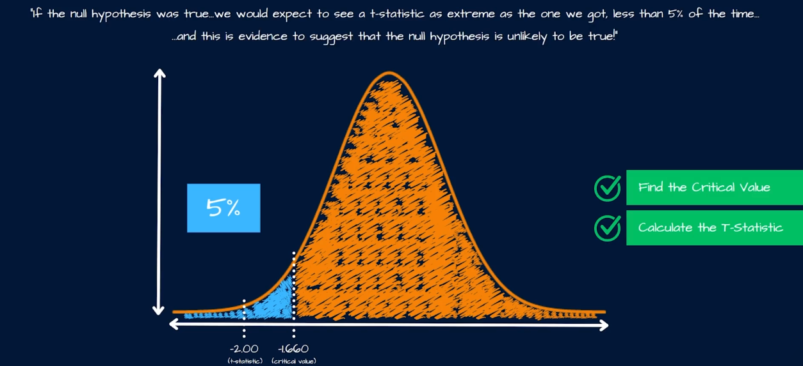

Conclusions

Formally, based on all of this, we reject the NH. And we would say something along the lines of an AC or significance level of 0.05 we reject the NH in favour of the AH. Which essentially translate to our team's, we have some confidence in the notion that our team's mean vertical leap is indeed significantly lower than that of our rival team!
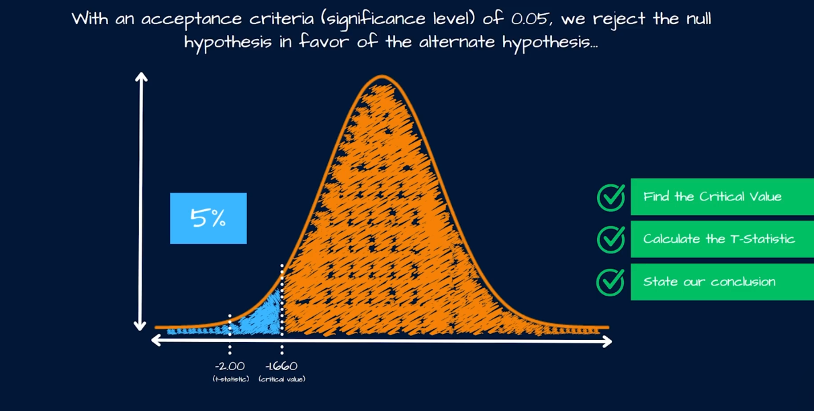

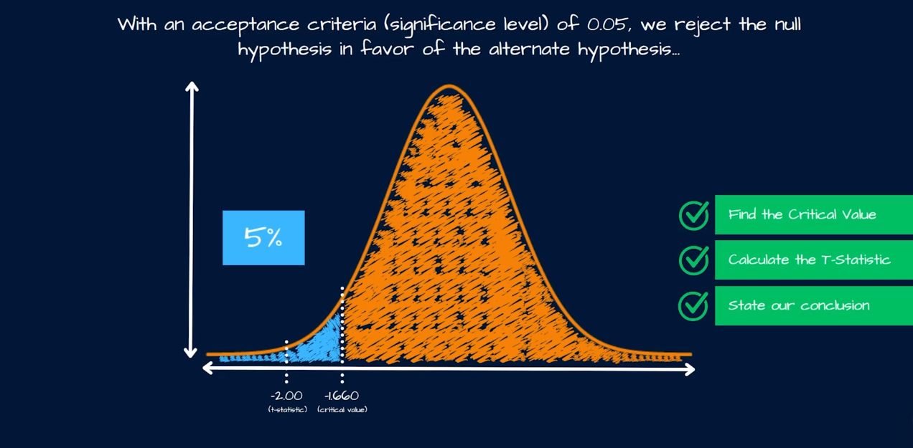

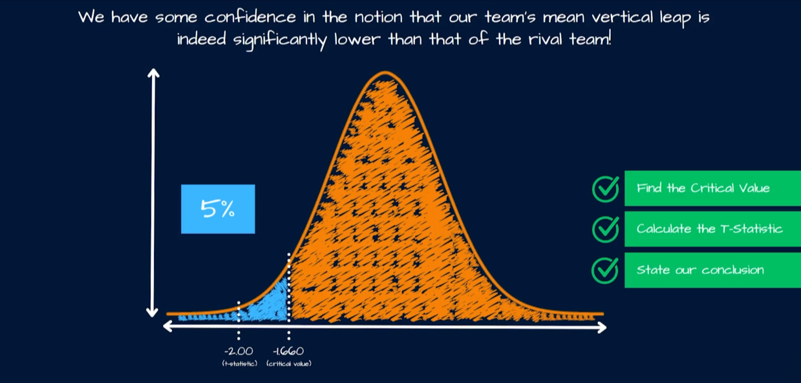
