**The Question**

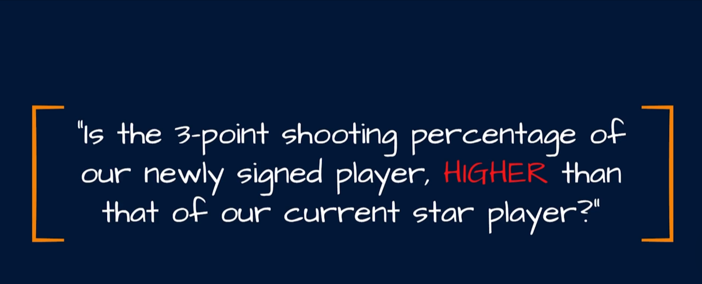

> New Vs Star Player Stats.

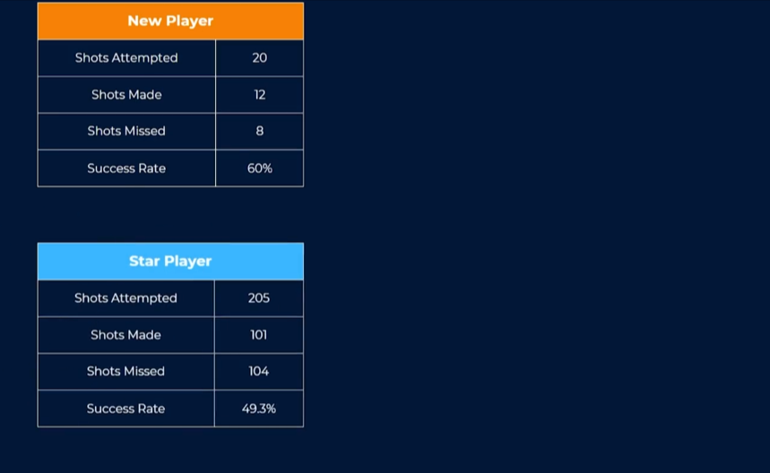

> Chi Square Test is down to matrix

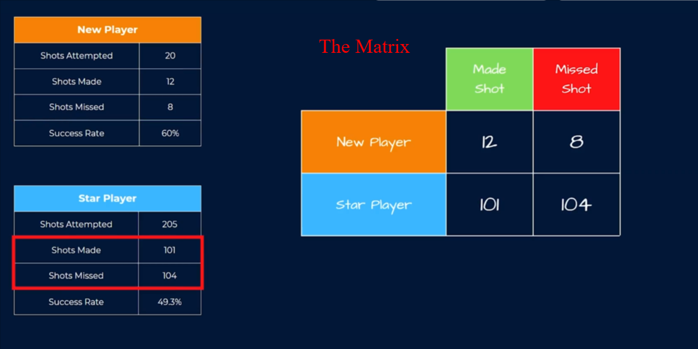

> Our Hypothesis

`AC` = 0.05

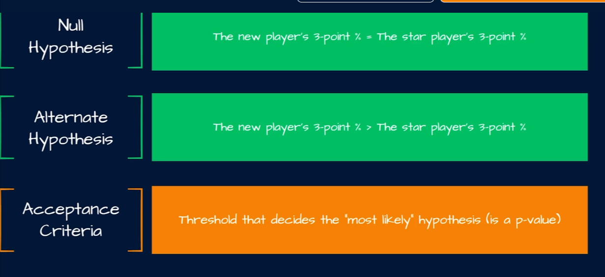

Calculate the `chi-square statistics` similar to the `t-statistics`.

> First find the DF

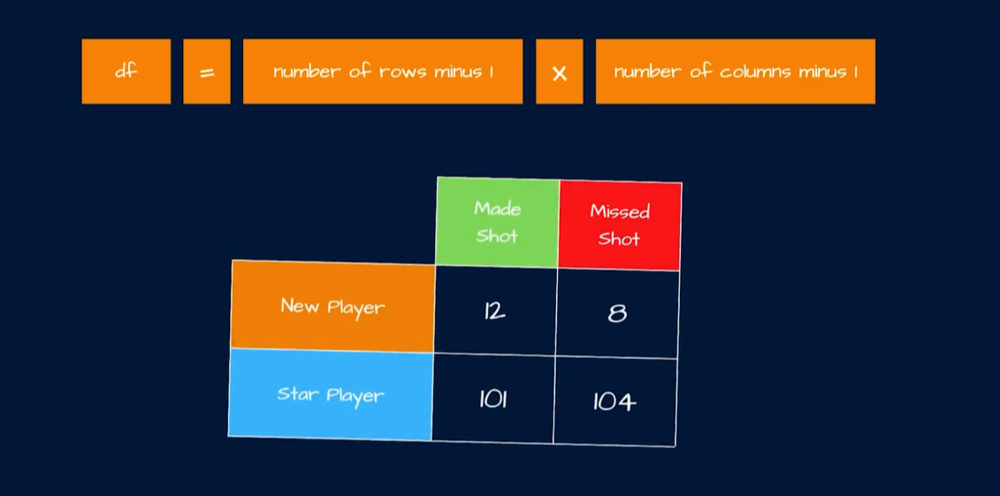

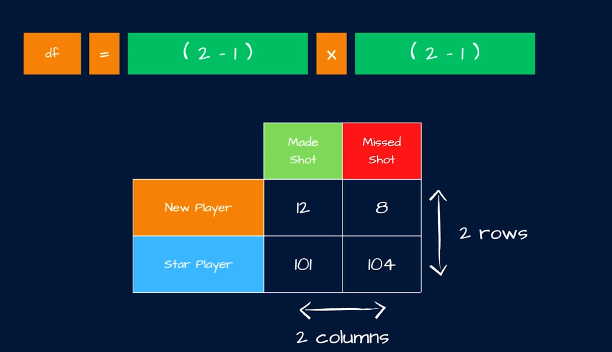

> Find the CV = 3.841

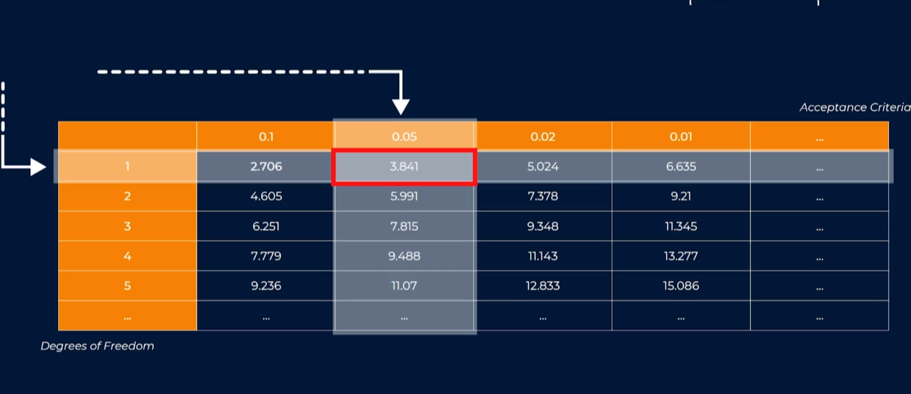

If the `chi-square statistics` is greater than the `CV`, we will reject the `NH` since our `CV` is based on our AC of 0.05 which will fall in the region of the `5%` (less likelihood).

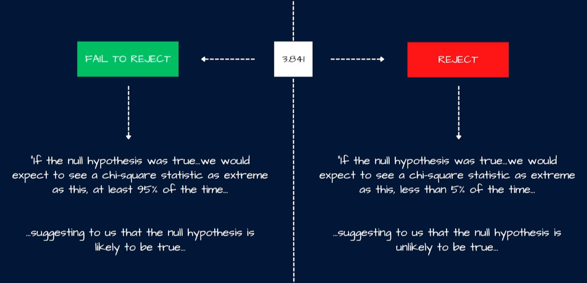

Calculating the `chi-square statistics`

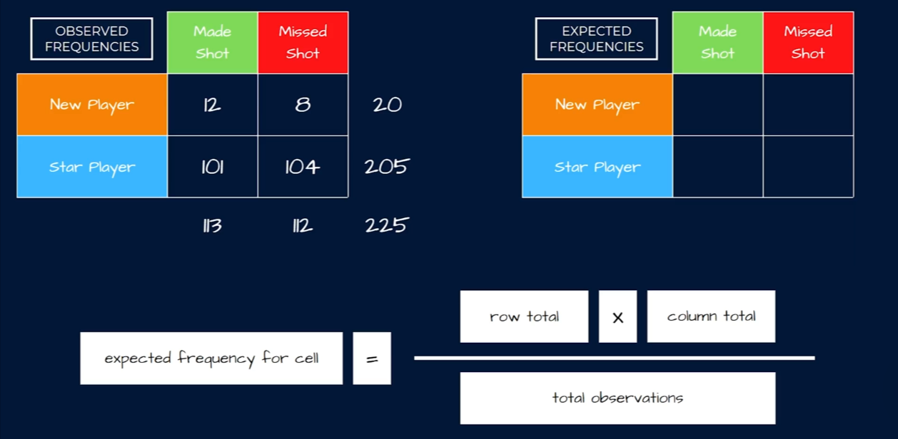

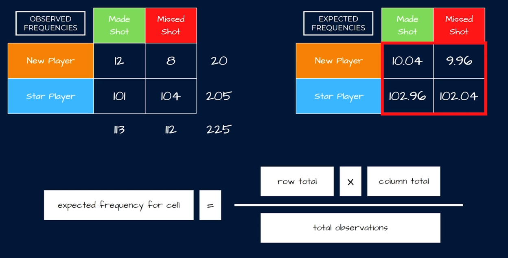

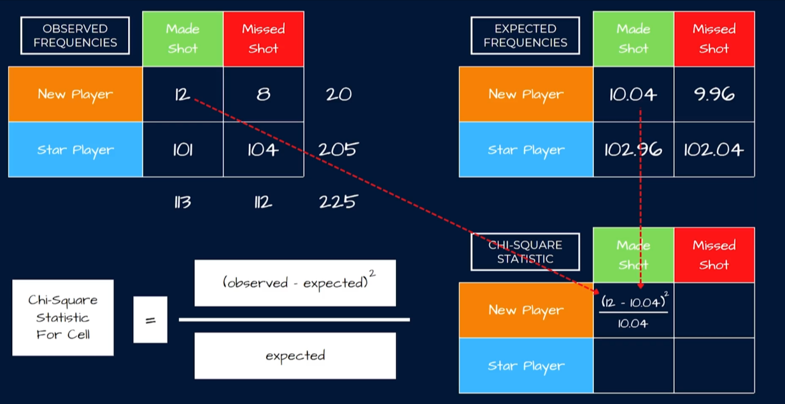

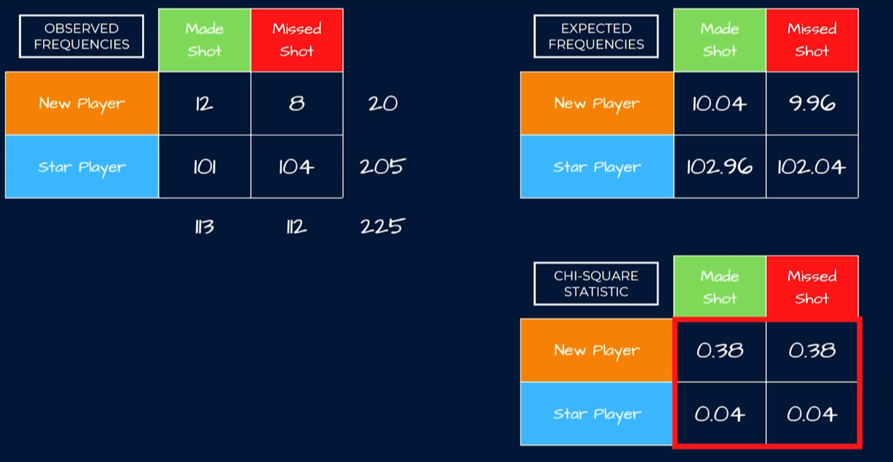

`chi-square statistics` = 0.84
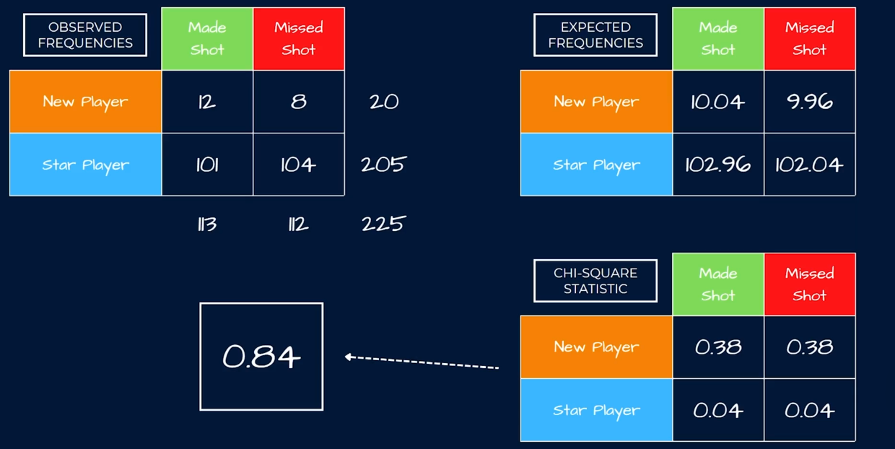

Conclusions

since 0.84 < 3.841, we `Fail to Reject` the NH because it falls to 95% region.

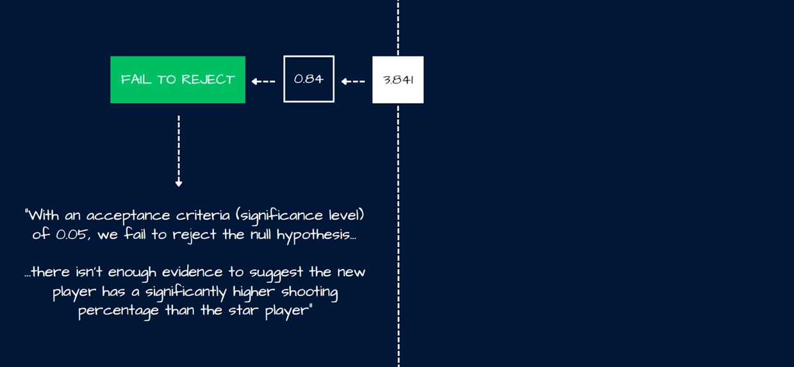
