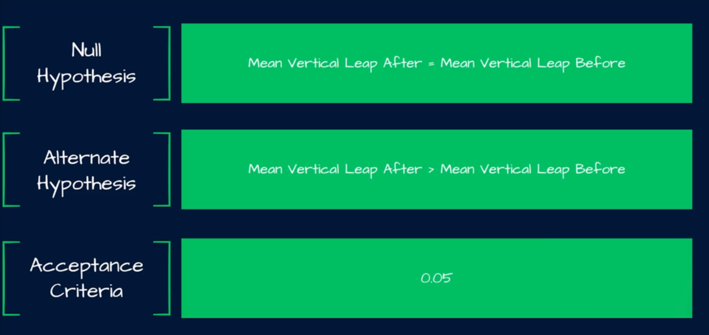
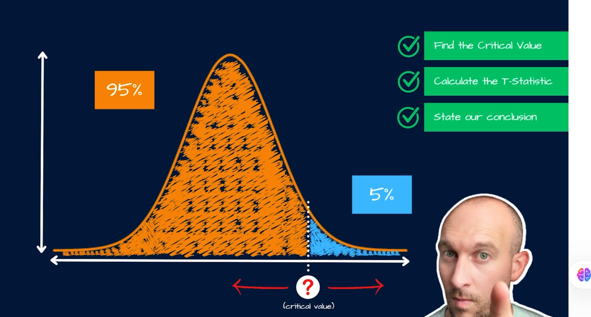
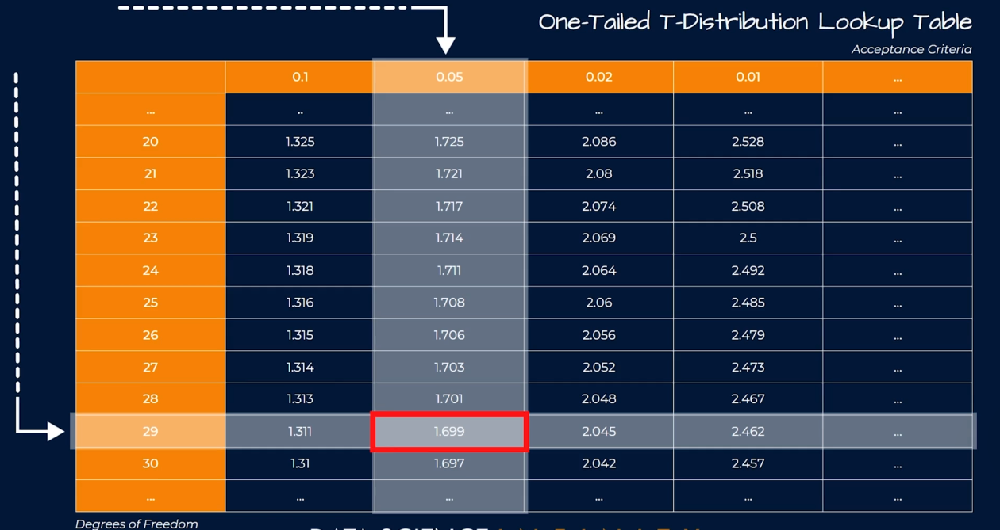
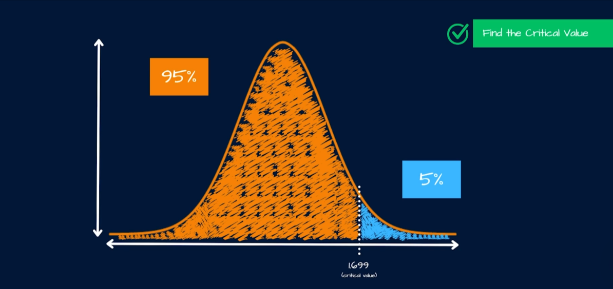
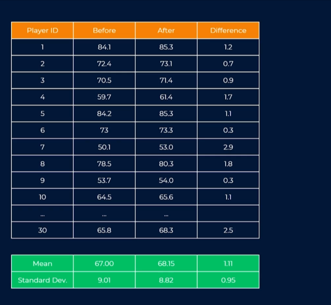
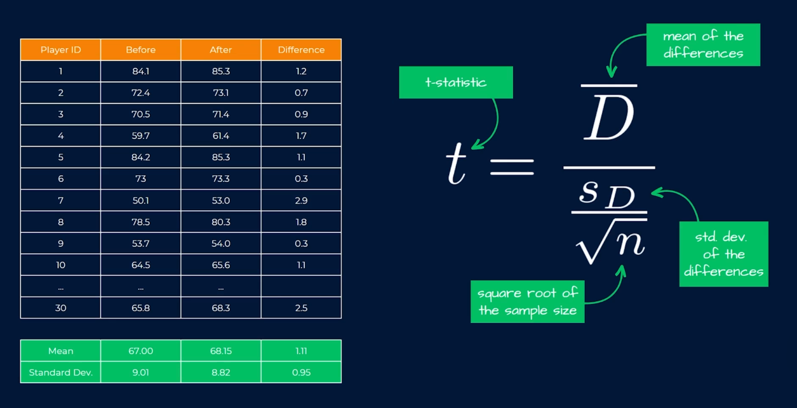
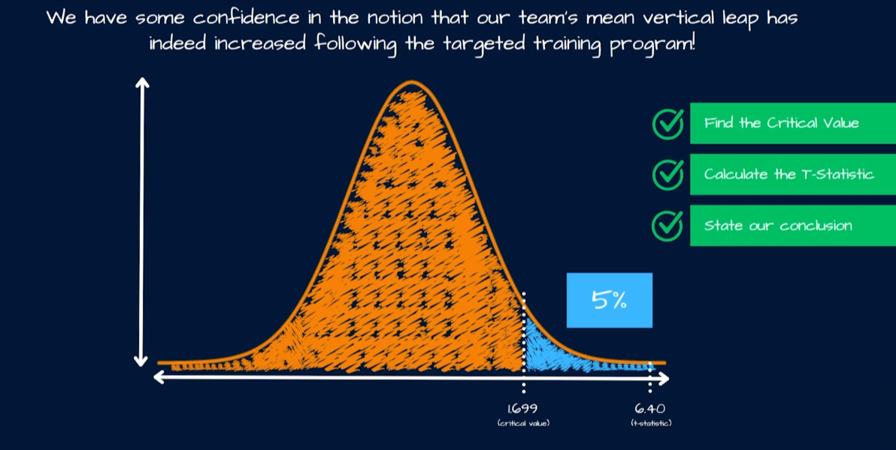

**The Question**

> Our Hypothesis
>
> 

> First, find the `CV` based on our `AC` of `0.05`

> Find `CV` via the intersection between the Degree of Freedom (30-1) and `AC` (0.05)

> Player stats before and after the training program
>
> 

Find the `t-statistics`

`t-statistics` = 6.40 (calculated)

> Conclusions

The `t-statistics` lies to the 5% portion of the distribution, hence we reject the NH.

