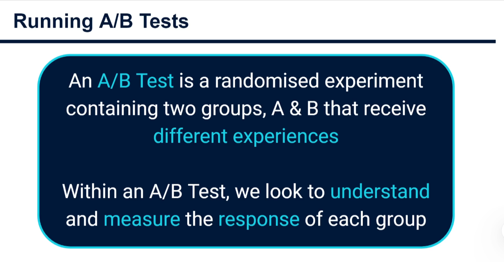

# A/B Testing in Data Science with Python



## What is A/B testing?

An **A/B test** is a controlled experiment used to compare two versions of an experience.

- **Version A** is the _control_: the current experience or baseline.
- **Version B** is the _variant_: the proposed new experience.
- Users are assigned to one version at random.
- We measure the same outcome for both groups and use statistics to decide whether the observed difference is likely real or could be random chance.

For example, an online shop may show its current green "Buy now" button to group A and a new orange button to group B. If group B completes more purchases, the business needs to know whether the new button caused the improvement, rather than concluding from a lucky day of traffic.

Random assignment is the vital ingredient. It helps make the groups comparable in ways we did not explicitly measure, such as device type, shopping intent, or familiarity with the brand.

## The language of an A/B test

| Term                     | Beginner-friendly meaning                                                    | Example                              |
| ------------------------ | ---------------------------------------------------------------------------- | ------------------------------------ |
| Population               | Everyone to whom we want to generalize the result                            | All website visitors                 |
| Sample                   | The visitors actually included in the experiment                             | 20,000 visitors this week            |
| Control (A)              | The existing version used as the comparison point                            | Current checkout page                |
| Treatment / variant (B)  | The changed version being evaluated                                          | Checkout page with fewer form fields |
| Metric                   | The number used to judge success                                             | Purchase conversion rate             |
| Conversion               | The desired user action                                                      | Completing a purchase                |
| Experiment unit          | The thing randomly assigned to a group                                       | Usually a user, not a page view      |
| Statistical significance | Evidence that the measured difference is unlikely under "no real difference" | A small p-value                      |

## A practical example

Suppose a streaming company wants more visitors to start a free trial.

| Group                   | Visitors | Trial starts | Conversion rate |
| ----------------------- | -------: | -----------: | --------------: |
| A: current sign-up page |   10,000 |          820 |           8.20% |
| B: shorter sign-up page |   10,000 |          930 |           9.30% |

At first glance, B looks better: its conversion rate is $9.30\% - 8.20\% = 1.10$ percentage points higher. But a single sample can vary naturally. A/B testing quantifies whether this increase is convincing enough to act on.

## Step 1: Ask a focused business question

Do not begin with "Which page is better?" Define a decision and one primary metric first.

**Business question:** Does removing two optional sign-up fields increase free-trial starts?

**Primary metric:**

$$
\operatorname{ConversionRate} = \frac{\text{number of conversions}}{\text{number of eligible users}}
$$

For version B, the formula is:

$$
\frac{930}{10{,}000} = 0.093 = 9.3\%
$$

Formula components:

- **Numerator (930):** visitors who started a trial.
- **Denominator (10,000):** visitors who were shown B and were eligible to start one.
- **Result (0.093):** a proportion between 0 and 1; multiplying by 100 turns it into a percentage.

Also choose **guardrail metrics**. These prevent a local win from damaging the wider business. This company might require that cancellation rate, payment failures, and customer-support contacts do not become worse for B.

## Step 2: Write the hypotheses

A hypothesis is a testable statement about the population, not only the visitors in this sample.

For conversion rates $p_A$ and $p_B$:

$$
H_0: p_A = p_B
$$

$$
H_1: p_A \ne p_B
$$

The symbols mean:

- $H_0$, the **null hypothesis**, says that the new page has no real effect; any sample difference is noise.
- $H_1$, the **alternative hypothesis**, says there is a real difference.
- $p_A$ is the true conversion probability if a user sees A.
- $p_B$ is the true conversion probability if a user sees B.

This is a **two-sided test**, because it detects either an increase or decrease. When business rules genuinely say that only an improvement matters and a worse outcome would never be shipped, a one-sided test can be appropriate, but it must be chosen before seeing the data.

## Step 3: Collect trustworthy data

Each row below represents one visitor. `converted` is `1` when the visitor starts a trial and `0` otherwise.

```python
import numpy as np
import pandas as pd

rng = np.random.default_rng(seed=42)

# A small, reproducible example: 10,000 visitors per version.
visitors_per_group = 10_000
control = pd.DataFrame({
    "group": "A",
    "converted": rng.binomial(n=1, p=0.082, size=visitors_per_group),
})
variant = pd.DataFrame({
    "group": "B",
    "converted": rng.binomial(n=1, p=0.093, size=visitors_per_group),
})

experiment = pd.concat([control, variant], ignore_index=True)
print(experiment.head())
print(experiment.groupby("group")["converted"].agg(["count", "sum", "mean"]))
```

What the code does:

- `default_rng(seed=42)` creates a random-number generator. The seed makes this lesson reproducible: running it again produces the same example data.
- `rng.binomial(n=1, p=0.082, ...)` simulates a yes/no event. With `n=1`, each value is either 0 or 1. The probability of `1` is the conversion rate.
- The control group is simulated with an $8.2\%$ conversion probability and B with $9.3\%$.
- `pd.concat` combines both groups into one table, as a real analytics export commonly does.
- `count` is visitors, `sum` is conversions because converted rows equal 1, and `mean` is the conversion rate because the average of zeros and ones equals the proportion of ones.

In a real experiment, do not generate the values. Export them from product analytics or a database, and validate the data before analysis:

```python
# Useful checks for a real dataframe named experiment
print(experiment["group"].value_counts())        # Is traffic split as expected?
print(experiment["converted"].value_counts())    # Only 0 and 1 should appear
print(experiment.isna().sum())                    # Missing values can bias results
```

Check that one person is not included in both groups, the randomization ratio is close to the intended ratio, and the experiment ran for a whole business cycle (often at least one full week). Stopping the test every time B looks good inflates false positives.

## Step 4: Calculate the lift

```python
summary = experiment.groupby("group")["converted"].agg(
    visitors="count",
    conversions="sum",
    conversion_rate="mean",
)

rate_a = summary.loc["A", "conversion_rate"]
rate_b = summary.loc["B", "conversion_rate"]
absolute_lift = rate_b - rate_a
relative_lift = absolute_lift / rate_a

print(summary)
print(f"Absolute lift: {absolute_lift:.2%} points")
print(f"Relative lift: {relative_lift:.2%}")
```

There are two useful ways to describe the change:

$$
\operatorname{AbsoluteLift} = \hat{p}_B - \hat{p}_A
$$

$$
\operatorname{RelativeLift} = \frac{\hat{p}_B - \hat{p}_A}{\hat{p}_A}
$$

Formula components:

- The hat in $\hat{p}$ means an **estimate from the sample**. It is not guaranteed to be the exact population rate.
- $\hat{p}_A$ is A conversions divided by A visitors.
- $\hat{p}_B$ is B conversions divided by B visitors.
- Absolute lift reports percentage points. For $8.2\%$ to $9.3\%$, it is $1.1$ percentage points.
- Relative lift divides that change by the starting rate: $1.1\% / 8.2\% \approx 13.4\%$. B converts about 13.4% more often relative to A.

Always report the baseline and absolute lift along with relative lift. Calling a move from $0.10\%$ to $0.11\%$ a "10% lift" can sound much larger than the practical change of $0.01$ percentage points.

## Graph 1: Compare conversion rates

Run the following code after the previous cells. It turns the summary table into a bar chart.

```python
import matplotlib.pyplot as plt

labels = ["A\nCurrent page", "B\nShorter page"]
rates = [rate_a, rate_b]
colors = ["#5B6C8F", "#1B9E77"]

fig, ax = plt.subplots(figsize=(8, 5))
bars = ax.bar(labels, rates, color=colors, width=0.55)
ax.set_title("Free-trial conversion rate by sign-up page")
ax.set_ylabel("Conversion rate")
ax.set_ylim(0, max(rates) * 1.35)
ax.yaxis.set_major_formatter("{x:.0%}")

for bar, rate in zip(bars, rates):
    ax.text(
        bar.get_x() + bar.get_width() / 2,
        rate + 0.002,
        f"{rate:.2%}",
        ha="center",
        va="bottom",
        fontweight="bold",
    )

plt.tight_layout()
plt.show()
```

How to read the graph:

- The **x-axis** names the versions a user could see.
- The **y-axis** is conversion rate, formatted as percentages.
- Each bar's height is its group's observed conversion rate from `summary`.
- The labels on top show the exact values, so a reader does not need to estimate from the axis.
- The green B bar is expected to be taller by roughly $1.1$ percentage points. This graph is descriptive: it shows what happened in this sample, but it does not yet show how certain we are.

## Step 5: Test whether the difference is statistically significant

For a conversion metric, a two-proportion z-test is common. It asks: assuming A and B truly have the same conversion rate, how surprising is the observed gap?

```python
from statsmodels.stats.proportion import proportions_ztest

conversions = np.array([
    summary.loc["A", "conversions"],
    summary.loc["B", "conversions"],
])
visitors = np.array([
    summary.loc["A", "visitors"],
    summary.loc["B", "visitors"],
])

z_statistic, p_value = proportions_ztest(
    count=conversions,
    nobs=visitors,
    alternative="two-sided",
)

alpha = 0.05
print(f"z-statistic: {z_statistic:.3f}")
print(f"p-value: {p_value:.4f}")
print("Decision:", "Reject H0" if p_value < alpha else "Do not reject H0")
```

The z-test calculates this statistic:

$$
z = \frac{\hat{p}_B - \hat{p}_A}{\sqrt{\hat{p}(1-\hat{p})\left(\frac{1}{n_A} + \frac{1}{n_B}\right)}}
$$

Breakdown of the formula:

- **Top of the fraction**, $\hat{p}_B - \hat{p}_A$: the observed conversion-rate difference.
- **$n_A$ and $n_B$**: number of visitors in groups A and B. Larger samples make the denominator smaller, making it easier to distinguish a real small effect from noise.
- **$\hat{p}$**: the pooled conversion rate under the null hypothesis:

$$
\hat{p} = \frac{x_A + x_B}{n_A + n_B}
$$

Here, $x_A$ and $x_B$ are conversion counts. Pooling reflects the null-hypothesis assumption that both groups come from one shared conversion rate.

- **Denominator:** the _standard error_, an estimate of how much the observed difference would bounce around from repeated random samples.
- **$z$:** the number of standard errors the observed difference is from zero. A large absolute $z$ means the gap is hard to explain as random variation.

The **p-value** is the probability of getting a result at least this extreme _if the null hypothesis were true_. With a conventional threshold of $\alpha = 0.05$, a p-value below 0.05 is evidence against $H_0$.

Important: a p-value is **not** the probability that B is better, and $p < 0.05$ does not prove that B will always win. It is evidence assessed under a model and a chosen threshold.

## Graph 2: See uncertainty with simulated repeated experiments

The next graph uses a bootstrap. It repeatedly resamples observed users from each group, calculates the lift, and shows the resulting distribution. This makes uncertainty tangible.

```python
bootstrap_runs = 10_000
bootstrap_lifts = np.empty(bootstrap_runs)

converted_a = control["converted"].to_numpy()
converted_b = variant["converted"].to_numpy()

for run in range(bootstrap_runs):
    sample_a = rng.choice(converted_a, size=len(converted_a), replace=True)
    sample_b = rng.choice(converted_b, size=len(converted_b), replace=True)
    bootstrap_lifts[run] = sample_b.mean() - sample_a.mean()

lower_bound, upper_bound = np.percentile(bootstrap_lifts, [2.5, 97.5])

fig, ax = plt.subplots(figsize=(9, 5))
ax.hist(bootstrap_lifts, bins=45, color="#4C78A8", edgecolor="white")
ax.axvline(0, color="#C0392B", linewidth=2, label="No difference")
ax.axvline(absolute_lift, color="#1B9E77", linewidth=2, label="Observed lift")
ax.axvspan(lower_bound, upper_bound, color="#1B9E77", alpha=0.18,
           label="Approx. 95% interval")
ax.set_title("Bootstrap distribution of conversion-rate lift (B - A)")
ax.set_xlabel("Absolute lift in conversion rate")
ax.set_ylabel("Number of resamples")
ax.xaxis.set_major_formatter("{x:.1%}")
ax.legend()
plt.tight_layout()
plt.show()

print(f"Approximate 95% interval: {lower_bound:.2%} to {upper_bound:.2%}")
```

What each part does:

- `rng.choice(..., replace=True)` samples users _with replacement_. One observed user can appear more than once in a resample, which imitates the variation across many plausible samples.
- The loop creates 10,000 possible estimates of B minus A.
- `bootstrap_lifts` stores one absolute lift per simulated experiment.
- `np.percentile(..., [2.5, 97.5])` finds the central 95% of those estimates, forming an approximate 95% confidence interval.
- The histogram's **x-axis** is possible lifts and its **y-axis** is how often each lift appeared among resamples.
- The red line at $0$ means no conversion-rate difference. When the shaded 95% interval stays completely to the right of that line, the data supports a positive lift at roughly the 5% significance level.
- The green line is the single lift calculated from the actual sample. The spread around it shows that another similar experiment would not return exactly the same value.

## Statistical significance versus business significance

Statistical significance answers: "Is this result unlikely to be sampling noise?" Business significance asks: "Is the expected value worth the implementation cost and risk?"

Suppose B has a statistically significant lift of $0.15$ percentage points. With 2 million eligible visitors and a $30$ contribution margin per conversion, an approximate annual value is:

$$
2{,}000{,}000 \times 0.0015 \times \$30 = \$90{,}000
$$

Formula components:

- $2{,}000{,}000$: eligible visitors in the planning period.
- $0.0015$: $0.15\%$ written as a decimal.
- $\$30$: money retained per additional conversion, not necessarily total revenue.
- $\$90{,}000$: estimated incremental contribution before implementation and operating costs.

A tiny statistically significant change can be valuable at large scale. Conversely, a large-looking percentage lift may not matter when the baseline volume is small or when B increases returns, fraud, or support costs.

## How long should an A/B test run?

Decide sample size before launching. The required size grows when:

- the baseline conversion rate is low;
- the smallest worthwhile effect is small;
- you want higher confidence (a lower $\alpha$);
- you want higher statistical power.

**Power** is the probability that a test detects a real effect of the chosen size. Teams often plan for 80% or 90% power. Planning for a minimum detectable effect (MDE) helps avoid tests too small to answer a useful question.

```python
from statsmodels.stats.power import NormalIndPower
from statsmodels.stats.proportion import proportion_effectsize

baseline_rate = 0.082
minimum_worthwhile_rate = 0.093
effect_size = proportion_effectsize(minimum_worthwhile_rate, baseline_rate)

analysis = NormalIndPower()
required_per_group = analysis.solve_power(
    effect_size=effect_size,
    alpha=0.05,
    power=0.80,
    ratio=1.0,  # equal traffic in A and B
)

print(f"Visitors needed per group: {np.ceil(required_per_group):,.0f}")
```

`proportion_effectsize` converts the two rates into the standardized effect expected by the power calculation. `solve_power` then estimates the number of users needed in each group to have an 80% chance of detecting that improvement, assuming it is real.

## Common mistakes to avoid

1. **Peeking and stopping early:** Decide the sample size and end date in advance. Repeatedly checking ordinary p-values and stopping on a good-looking result changes their meaning.
2. **Testing too many metrics:** Choose one primary metric before launch. Looking across many metrics produces false wins unless you adjust for multiple comparisons.
3. **Changing several things at once:** If B changes headline, price, layout, and onboarding, you cannot know which change mattered. This can be acceptable for choosing a whole experience, but document the trade-off.
4. **Ignoring the randomization unit:** Assign at the user level when a person's repeated sessions should see one consistent experience. Randomizing page views can put the same user in both groups.
5. **Calling non-significant results "equal":** "Do not reject $H_0$" means insufficient evidence of a difference, not proof that the versions are identical.
6. **Ignoring segments:** Check important pre-planned segments such as mobile versus desktop. Treat exploratory segment discoveries as new hypotheses to retest, because many slices can create accidental patterns.
7. **Forgetting guardrails:** More clicks or trial starts are not a win if refunds, churn, latency, or customer trust worsen.

## Company use cases and business impact

| Company type              | Test idea                                  | Primary metric                     | Guardrails                           | Business decision                                               |
| ------------------------- | ------------------------------------------ | ---------------------------------- | ------------------------------------ | --------------------------------------------------------------- |
| E-commerce retailer       | Test product-page delivery messaging       | Add-to-cart or purchase conversion | Return rate, average order value     | Roll out wording that adds profitable orders                    |
| Subscription service      | Test annual-plan offer placement           | Paid subscription rate             | Early cancellation, support contacts | Improve recurring revenue without attracting poor-fit customers |
| Fintech app               | Test identity-verification progress screen | Completed verification rate        | Fraud rate, compliance failures      | Reduce onboarding abandonment while staying compliant           |
| Food delivery marketplace | Test restaurant ranking logic              | Completed orders per session       | Delivery time, customer refunds      | Increase orders without reducing service quality                |
| Media publisher           | Test newsletter sign-up prompt timing      | Qualified newsletter subscriptions | Article engagement, unsubscribe rate | Build an audience without harming reading experience            |
| B2B software company      | Test trial onboarding checklist            | Activation rate                    | Product latency, support tickets     | Increase the number of trials that become paid accounts         |

### Example: e-commerce checkout

An online retailer suspects that surprise shipping costs cause checkout abandonment. It tests a product-page message showing estimated delivery and shipping earlier.

- **A:** Current product page; shipping appears late in checkout.
- **B:** Product page displays estimated shipping before "Add to cart."
- **Primary metric:** completed purchases per product-page visitor.
- **Guardrails:** gross margin, return rate, delivery complaints.
- **Business translation:** If B adds $0.6$ percentage points of purchase conversion for 500,000 monthly visitors, that is roughly 3,000 extra orders per month. Finance can multiply those orders by contribution margin to decide whether the change is worth shipping.

### Example: B2B SaaS onboarding

A project-management company wants trial users to create their first project sooner.

- **A:** A dashboard with many features visible immediately.
- **B:** A focused checklist that guides users to create a project and invite a teammate.
- **Primary metric:** activation within seven days.
- **Secondary metrics:** team invites and paid conversion after 30 days.
- **Guardrails:** support-ticket volume and time-to-page-load.
- **Business translation:** Activation is useful only if it later improves retention or paid conversion. The team should follow experiment cohorts long enough to verify that the initial lift creates durable customer value.

## A simple decision framework

At the end of a planned experiment, document the result clearly:

1. Did the data pass quality checks and follow the planned duration?
2. What were the sample sizes, conversion rates, absolute lift, and confidence interval?
3. Is the p-value below the pre-chosen threshold?
4. Are guardrail metrics acceptable?
5. Is the estimated business value larger than the cost, risk, and engineering effort?
6. Should the team ship B, keep A, run a larger test, or run a follow-up experiment?

A concise stakeholder conclusion might read:

> The shorter sign-up page increased trial conversion from 8.20% to 9.30%, an absolute lift of 1.10 percentage points. The two-sided proportion test met the pre-defined 5% threshold, and no guardrail regression was detected. Subject to confirming the planned sample and business-value estimate, roll out B gradually and continue monitoring trial quality.

## Packages used in the examples

```bash
python -m venv .venv
.venv\Scripts\python -m pip install numpy pandas matplotlib statsmodels
```

These libraries serve distinct roles: NumPy handles numeric arrays and simulation, pandas handles tables, Matplotlib draws graphs, and statsmodels supplies the proportion test and power calculation.
