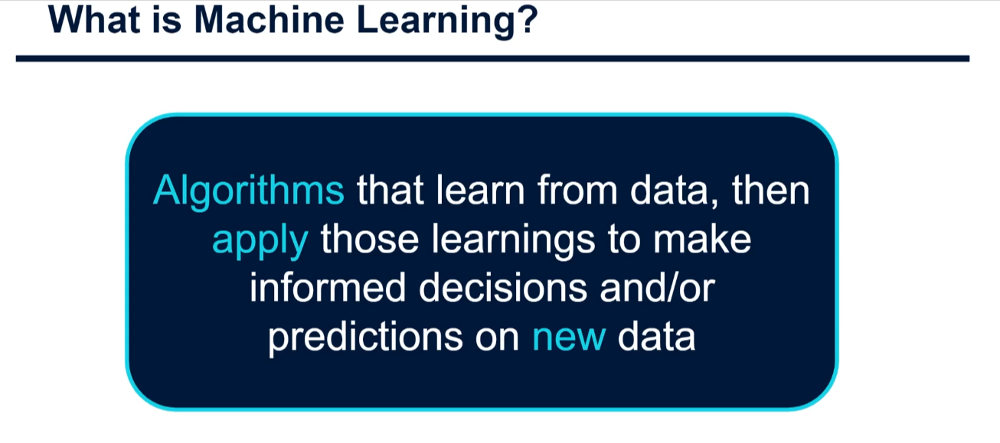
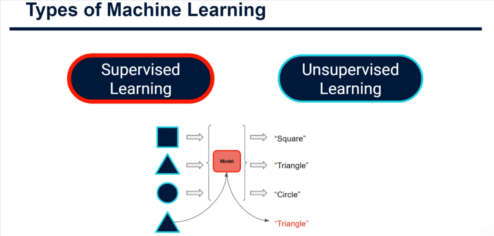
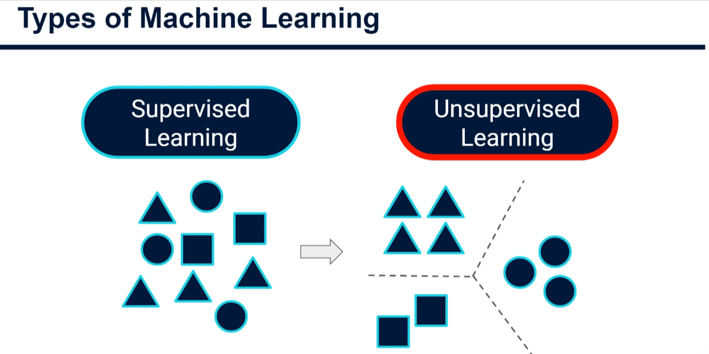
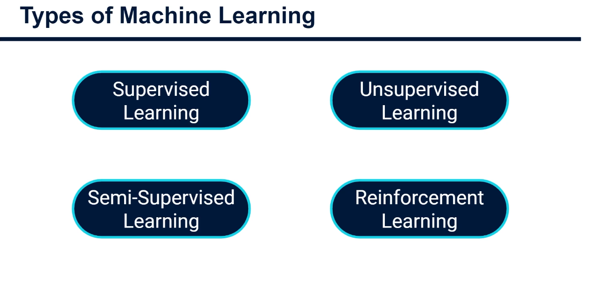
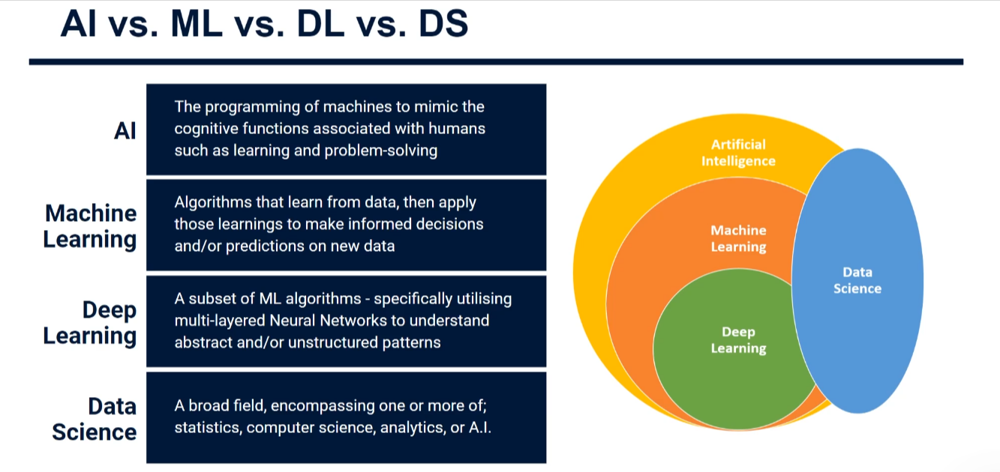

## What machine learning actually is



> There's a part where learning occurs, and this is where algorithms will learn relationships or patterns within our data. There's also a second part, which is the application of those learnings. Primarily, this will be to make predictions for new data or for the new data or for the future.
>
> ML is finding relationships in data and then generalising or deducing these findings into some rules that can applied to new data on the assumption that the new data is similar enough to the data on which that rule was created.

Traditional programming: you write the rules, the computer follows them.

```
rules + data → answers
```

Machine learning flips it. You show the computer lots of examples, and it _figures out the rules itself_:

```
data + answers → rules (a "model")
```

Then you use those learned rules on new data it has never seen. That's the whole idea — **learning patterns from data instead of being told the pattern**.

## WE HAVE TWO TYPES OF ML



`Supervised Learning`: Is where we have both `Input` and `Outputs`. Or often known as `labels` (Output). And we ask the machine to learn a `mapping` between the two(Input & Output).
This means that when we get new `unlabelled data` (such as the triangle in the fig. above), we can apply this mapping and get a `prediction` for the `output`.

`UnSupervised Learning`: The data is essentially unlabelled. This means we only just have the input data, we don't have some other output variable that we're looking to predict or classify our data. Instead, the goal in unsupervised learning is to find structure and patterns within our data.



**Other Types Of Learning**



## Supervised learning — "learning with an answer key"

You give the model input **and** the correct output, and it learns the mapping.

- **Classification** → the output is a category. _"Is this email spam or not?"_, _"Is this tumor benign or malignant?"_
- **Regression** → the output is a number. _"What will this house sell for?"_, _"How many units will we sell next month?"_

A tiny example — predicting house prices:

```python
from sklearn.linear_model import LinearRegression

# Features: [size in m², number of rooms]
X = [[50, 2], [80, 3], [120, 4], [150, 5]]
# Target: price in thousands
y = [200, 320, 470, 590]

model = LinearRegression()
model.fit(X, y)                      # <-- this is the "learning" step

print(model.predict([[90, 3]]))      # predict a house it never saw
```

The mental model: **exam prep with a practice book that has all the answers.** Test day = new, unseen data.

## Unsupervised learning — "no answer key, just structure"

You give the model only inputs. Nobody tells it what's "right." It hunts for hidden structure.

- **Clustering** → group similar things together. _"Find customer segments for marketing."_ Nobody labeled those segments — the algorithm discovered them.
- **Dimensionality reduction** → squeeze many columns into a few meaningful ones, so you can visualize data or speed up other models.

Same data, but you only pass `X`:

```python
from sklearn.cluster import KMeans

kmeans = KMeans(n_clusters=3, n_init=10)
kmeans.fit(X)                        # no y given at all

print(kmeans.labels_)                # each house assigned to a group
print(kmeans.cluster_centers_)       # what each group looks like
```

The mental model: **sorting a pile of loose photos into stacks** that seem to belong together — no one told you the categories in advance.

## Quick comparison

|               | Supervised                       | Unsupervised                         |
| ------------- | -------------------------------- | ------------------------------------ |
| Data needed   | Inputs **+** labels              | Inputs only                          |
| Goal          | Predict a known label            | Discover hidden structure            |
| Typical tasks | Classification, regression       | Clustering, dimensionality reduction |
| Example       | Predicting churn                 | Segmenting customers                 |
| Cost of data  | Expensive (humans must label it) | Cheap (labels not needed)            |

_(There's a third family — **reinforcement learning** — where an agent learns by trial, error, and rewards, like a dog earning treats. Different story for another day.)_

**Rule of thumb:** if you have labels and a specific thing to predict → supervised. If you're exploring and just want to see what's in the data → unsupervised.

Want me to turn this into a full beginner `.md` tutorial with runnable code, saved plots, and a business use case?


