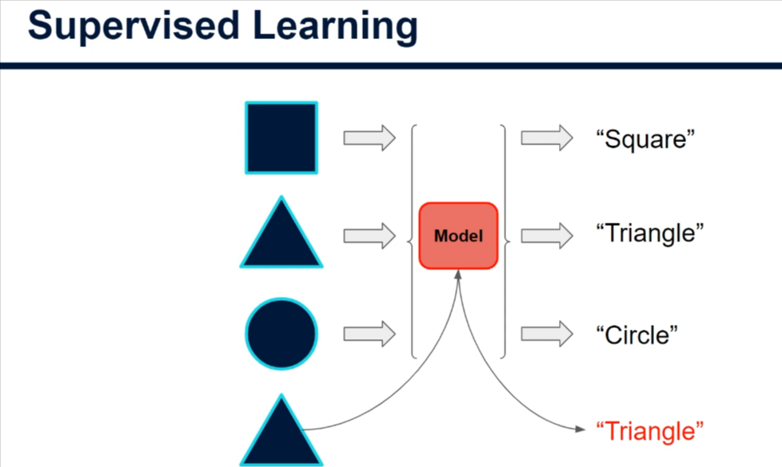
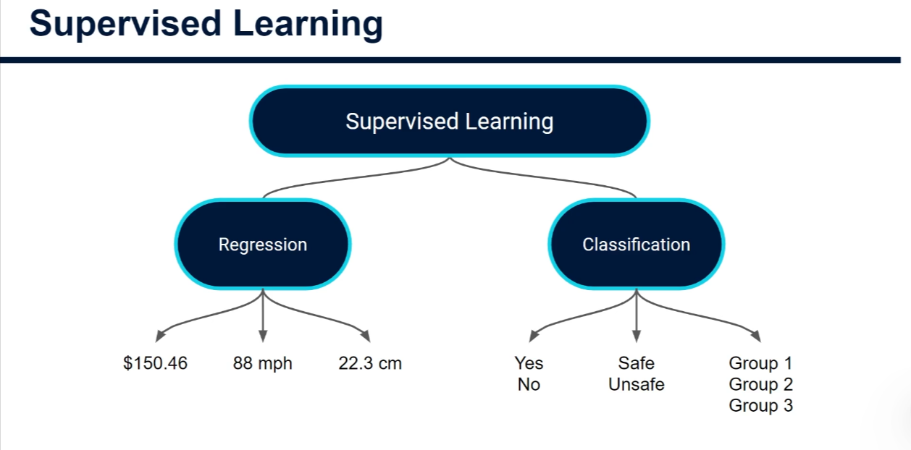
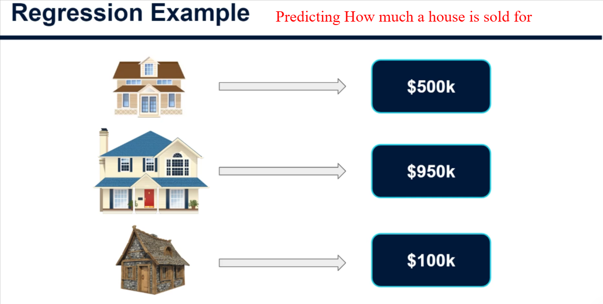
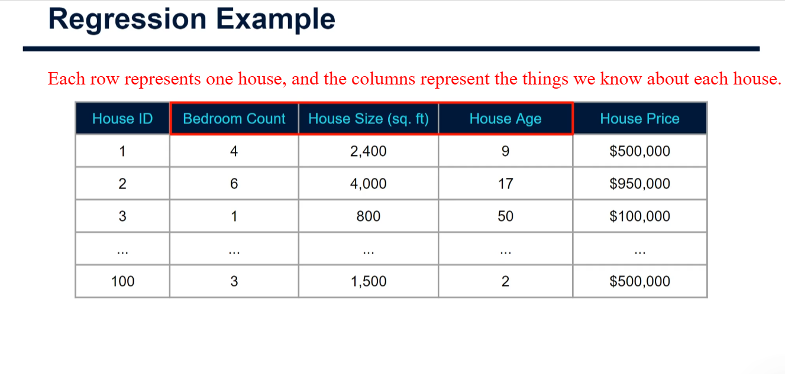
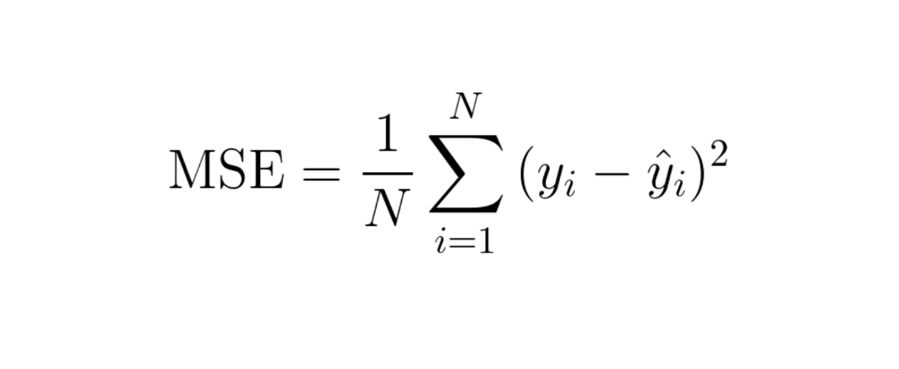
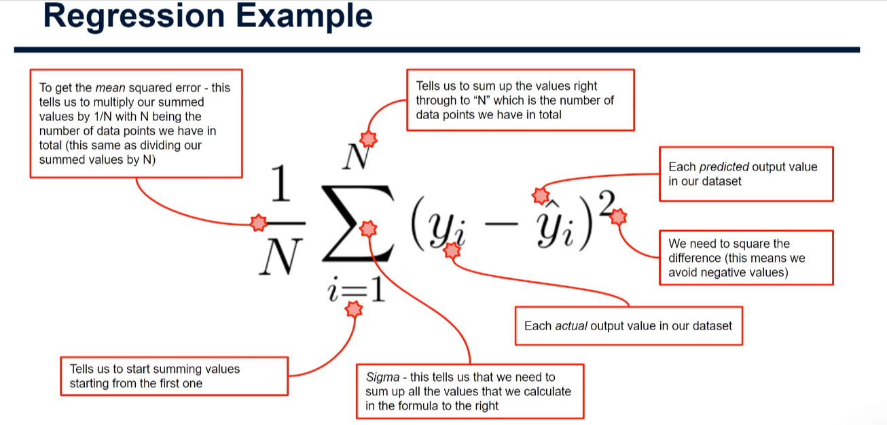
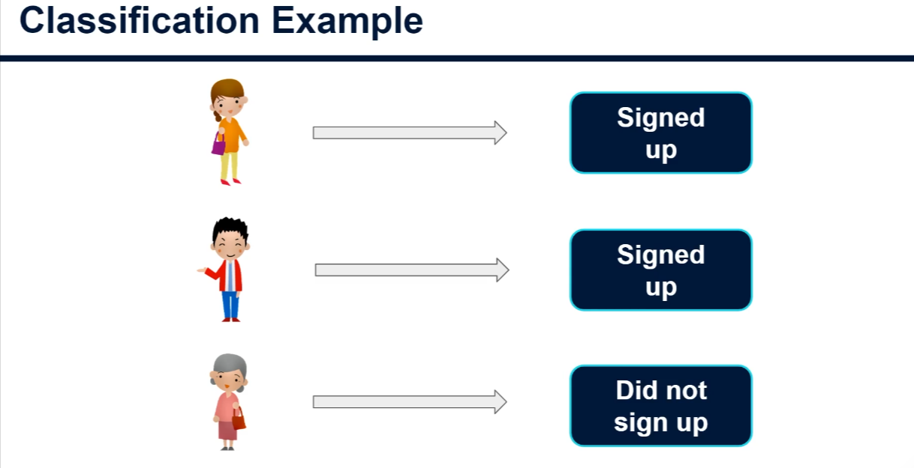
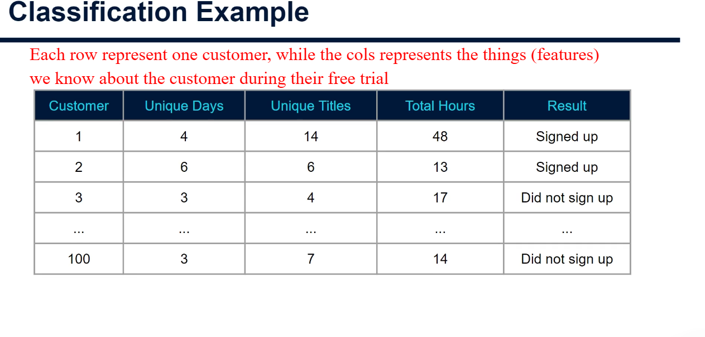
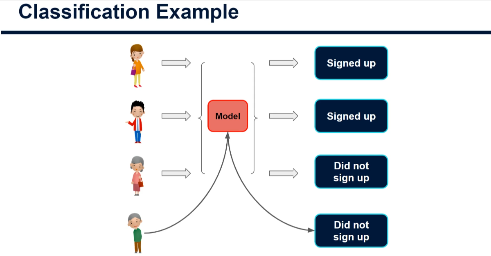
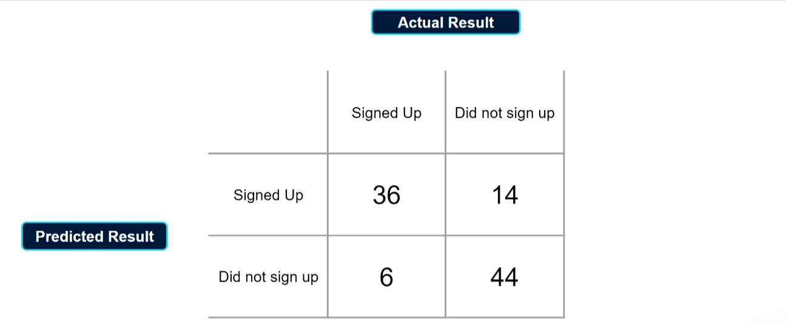

`Supervised Learning` is the most commonly utilised in business application.

In `SL` both the `Inputs` & `Outputs` are known. These inputs are often referred to as `Labels`.

## How `SL` is used.

The `ML` is to find relationships and patterns that links the input data to the output or labels. So that when given an unlabelled example in the future, we can apply the learnings and mappings and be provided with a prediction of what the output is most likely to be.

## Forms Of `SL`

`SL` can take 2 forms, and these define the 2 types of problems that are solved in this area:

1. `Regression`: This is where the output or label is a numerical value. e.g. dollar values such as sales or distances. It's essentially anything of which the output is a single numerical value. We are asking the Model to predict these values as accurately as possible.

## How Do We define what an accurate model is versus an inaccurate model

> There are some common metrics used to access accuracy.

A. `R^2`: This is a metric that shows the percentage of variance in our output variable that is being explained by our input variables. In other words, how much benefit are we getting in terms of prediction accuracy by using these input variables in our model.

B. `Mean Square Error`

1. `Classification` : This is all about predicting which group,or class a data point will be in. E.g. A simple Yes or No or predicting whether a customer will sign up or if a customer will churn, predicting whether an email is spam or not, and we can even predict into multiple groups. Or predicting or classifying images of animals is either dogs, lions, cats or rabbits.

Or predicting whether a customer will sign up to a paid film streaming app based on their behaviour during a seven day free trial. In this case, we would have some historical data about our customers through out the free trial period.

The input features would be things such as the number of days they engage with the service in that 7 day period, The number of unique movies and shows that they viewed and the total viewing hours.

In this classification example, the output values would be in the form of a class. Here it would simply be 2 classes of either did not sign up to the paid version or did sign up to the paid version.

In the distinction between supervised & unsupervised learning. We have these labels from historical customer data and we want to understand how to predict them based only on the inputs. This means that as a future customer move through their free trial, we can keep an eye on their predicted likelihood of moving to the paid plan and as a business we can put in place different marketing strategy for those who might be more or less likely to sign up.

Each of these input features would have varying levels of impact on the output variable. And again that is exactly what we're asking the `model` to learn for us.

So the next step again will be to train a model will take the input features and tell us how to best predict whether the customer will sign up or not. We can then apply these learnings to any customer currently in their free trial period.

## Test Of Accuracy

