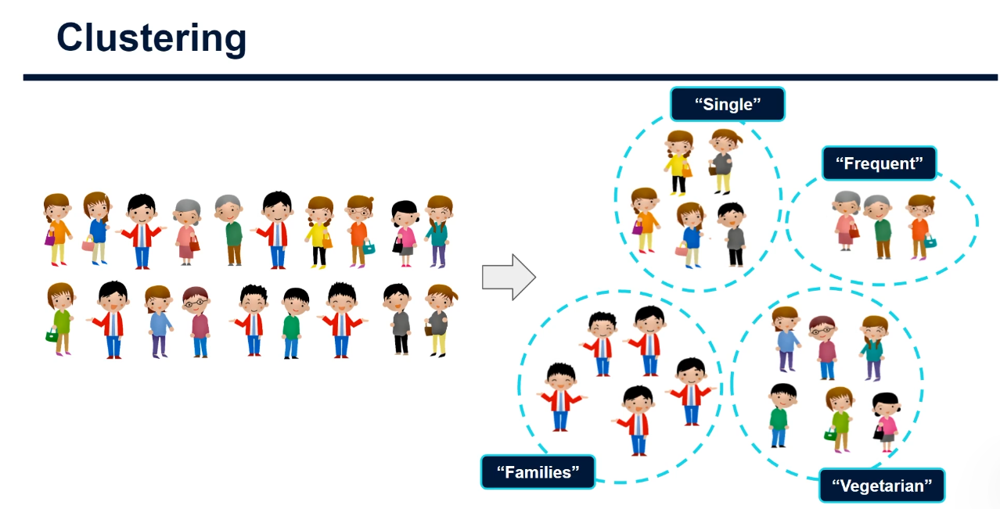
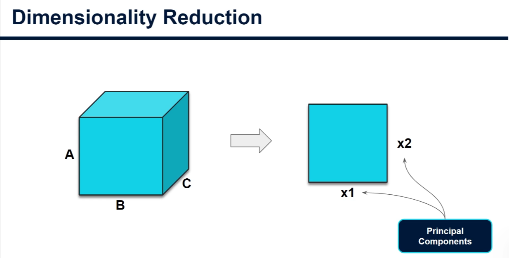
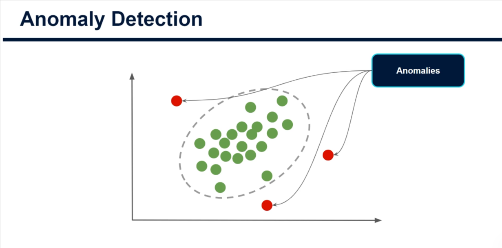
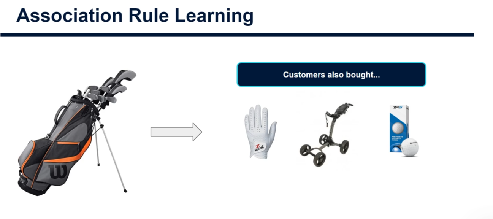
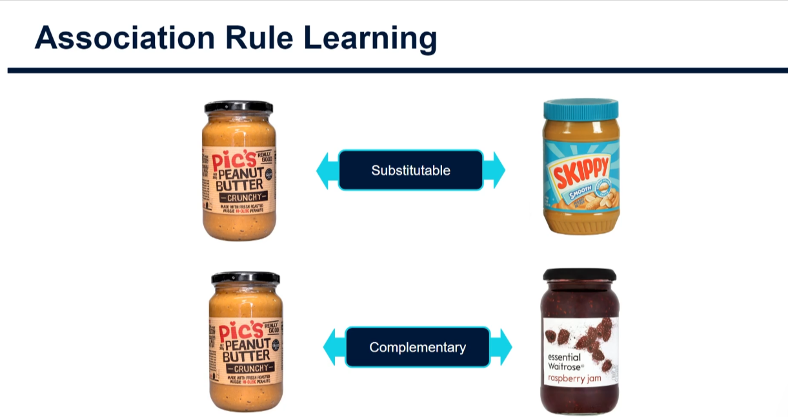

## UNSUPERVISED LEARNING

In `Unsupervised Learning`, the data is essentially unlabelled.

This means that we really just have an input data, we don't have some other output variable that we're looking to predict or classify instead.

The goal is in `Unsupervised Learning` is to find structure and patterns within our data.

## Unsupervised Learning Techniques

1. `Clustering`: This is where an algorithm looks to separate all of our data points according to how similar or dissimilar they are to each other, ending up with distinct groups of data points or what is known as `clusters`.

> Example
>
> A good example would be supermarket customers, a clustering algorithm could take in data around all their shopping behaviours, things like types of product they purchase, their demography, how often they're coming to the store, perhaps even the time of day that they most often shop.

And the algorithm will create a number of clusters, each of which will denote a distinct shopper type that the supermarket can then track over time and target specific marketing strategies towards as they know all customers in each cluster are similar to each other, but different from those in other clusters.

2. `Dimensionality Reduction`: In this case, we look to summarise our data into a smaller number of features.
   One common technique for this is known as `Principle Component Analysis` or `PCA`.

`Principle Component Analysis` essentially takes a high number of dimensions or features.

In reality, think of these dimensions as simply the features of a data set. e.g. if we have data on houses, it might be the house age, the size, the number of bedrooms etc. `PCA` takes these features and boils them down into a vastly smaller number of new features, each of which is called a `principal component`.

For instance, you might reduce 100 features into 10 new features. These new features are quite abstract and are a blend of some of the original features where the algorithm found that they correlated by blending the original variables rather than just removing some of them. The hope is that we still keep much of the key information that is held in the original feature set without having to deal with and process so many variables.

Dimensionality reduction technique are mainly used to simplify the space in which we're operating. Attempting to apply a `clustering algorithm`, for example, across hundreds or thousands of features can be computationally expensive. PCA reduces this vastly while maintaining much of the key information obtained within the data. The way that PCA works means each principal component is essentially independent from other components. In other words, they are formed in such a way that means they have very weak correlations with each other. And this can be a requirement for some ML algorithm to work well.

3. `Anomaly Detection`: Here, we isolate data points that are very different from the rest of data and class them as `anomalies`. This technique has been used successfully for detecting fraud and financial crimes, as well as detecting abnormal activity in electrical systems.

4. `Association Rule Learning` : Is an example of cross cell marketing, whwre companies can infer based on a lot of historical customer behaviour, that if you buy `product A`, then you're quite likely to also buy `product B`, And thus recommend you these products to tempt you to part way with a little bit more of your cash.
   

Another similar application of the `Association Rule Learning` is called `Basket analysis`, where supermarkets and the likes will to understand which items are often bought together within the same basket. This helps understand which goods are substitutable. E.g. `Brand A peanut butter` and `Brand B peanut butter`, these would rarely be bought together as they serve the same purpose. or complementary products such as butter and bread, where goods will often be purchased together because of some underlying relationship.

This analysis is frequently used to optimised inventory as well as to enhance the placement of products on shelves so it has a powerful applications in business.
