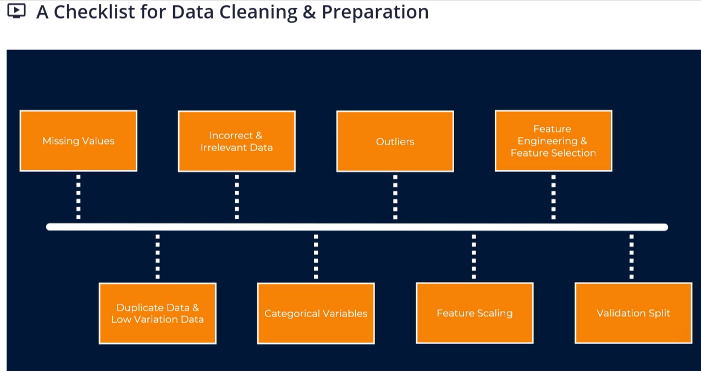

# Preparing and Cleaning Data for Machine Learning

## What Does Data Preparation Mean?

Machine learning (ML) models learn patterns from examples. If the examples contain missing values, inconsistent labels, impossible measurements, or information that would not be available when making a real prediction, the model can learn misleading patterns.

**Data preparation** is the process of understanding a dataset and making it suitable for a particular ML task. **Data cleaning** is one part of preparation: it finds and handles mistakes, gaps, duplicates, and inconsistencies. Preparation can also include transforming columns into a form a model can use, such as converting categories to numbers or scaling measurements.

Cleaning does not mean making every column look perfect or deleting every unusual row. A value that looks unusual may be a real and important event. Use what the data represents and the goal of the project to decide what to do.

### A simple example

Suppose we want to predict whether a customer will renew a subscription. Our table might contain:

| Column        | Example      | Meaning                                                 |
| ------------- | ------------ | ------------------------------------------------------- |
| `age`         | `34`         | Customer's age in years                                 |
| `monthly_fee` | `29.99`      | Current monthly subscription price                      |
| `city`        | `New York`   | Customer's city                                         |
| `signup_date` | `2025-03-12` | Date the customer signed up                             |
| `renewed`     | `1`          | The outcome we want to predict; 1 means yes, 0 means no |

The columns used to make a prediction are called **features**. The outcome we want the model to predict is the **target** (also called the label). Here, `age`, `monthly_fee`, `city`, and possibly information derived from `signup_date` are features; `renewed` is the target.

## Data-Cleaning Checklist

Work through the checks in order. Record what you find and why you chose each treatment. A decision that makes sense for one dataset may be wrong for another.

### 1. Understand the goal, rows, and columns

First learn what one row represents, what each column means, its units, and when each value becomes available. Check the data source and the intended prediction. This helps distinguish an error from a valid but surprising observation.

**Example:** If one row represents one customer, `age = 34` likely means 34 years. If one row represents one monthly customer account, the same customer may correctly appear in several rows.

**Check:** Compare column names, types, ranges, and definitions with a data dictionary or the system that produced the data. Do not assume that a column called `date` or `status` has an obvious meaning.

### 2. Check the shape and data types

Count rows and columns, then inspect a few records and each column's type. A number saved as text (for example, `"29.99"`) may need conversion. A numeric code such as `1`, `2`, and `3` might actually represent categories, not amounts.

**Example:** `"1,250"` is text because of its comma. It should be parsed carefully before numerical calculations. Do not turn an identifier such as a customer ID into a measurement just because it contains digits.

```python
print(df.shape)          # Show the number of rows and columns in the table.
print(df.dtypes)         # Show the data type pandas currently uses for each column.
print(df.head())         # Display the first few rows so we can inspect example values.
print(df.describe())     # Summarize numeric columns, including their ranges and averages.
```

### 3. Find missing values

A missing value means the dataset does not contain a value for that cell. In pandas it is commonly shown as `NaN`, `None`, or `NaT` (for a missing date). Some datasets use text such as `"unknown"`, `"N/A"`, or an empty string instead; those placeholders need to be identified too.

**Count missing values:**

```python
missing_counts = df.isna().sum()                 # Count missing cells separately in each column.
missing_percent = df.isna().mean() * 100         # Calculate the percentage missing in each column.
print(missing_counts)                            # Display each column's missing-value count.
print(missing_percent.round(1))                 # Display each column's missing percentage to one decimal place.
```

**Choose a treatment based on what is missing and why:**

| Situation                                                                     | Possible treatment                                                      | Example and caution                                                                                                                  |
| ----------------------------------------------------------------------------- | ----------------------------------------------------------------------- | ------------------------------------------------------------------------------------------------------------------------------------ |
| A feature has a small number of missing rows and those rows are not important | Remove those rows                                                       | `df.dropna(subset=["age"])` removes rows without an age. This can waste data or bias the dataset if the missing rows have a pattern. |
| A numeric feature is missing                                                  | Impute (fill in) with a statistic such as the median                    | The median income is less affected by very high incomes than the mean. Calculate the median from training data only.                 |
| A category is missing                                                         | Fill with the most common category or a clear value such as `"Unknown"` | `Unknown` can preserve the fact that no city was supplied. It should not be used if it incorrectly implies a real city.              |
| Missingness itself may carry information                                      | Add a missing-value indicator                                           | A missing medical test may mean the test was not ordered; that fact might matter. The reason must be valid at prediction time.       |
| The target is missing                                                         | Usually exclude those rows from supervised training                     | A model cannot learn the correct answer for a row whose answer is unknown. The row may still be useful for later prediction.         |
| A required field is missing for a small, clearly unusable set of records      | Consider dropping those records                                         | For example, a row without a target or a usable record identifier may not be trainable. Confirm the row is truly unusable first.     |

**Do not automatically replace every missing number with zero.** Zero means a real value of zero (for example, zero purchases), while missing means “not known” or “not recorded.” Those meanings are different.

In the code later in this guide, a median imputer fills numeric gaps, and a most-frequent imputer fills category gaps. The pipeline learns those fill values from the training portion only.

### 4. Check duplicate records

Exact duplicates are rows whose values match in every column. They can accidentally give repeated examples extra influence. But repeated customer IDs or repeated dates are not automatically duplicates: they may represent legitimate events over time.

**Example:** Two identical copies of the same transaction may be an ingestion error. Two different transactions from the same customer are usually not duplicates.

```python
duplicate_count = df.duplicated().sum()           # Count rows that exactly repeat an earlier row.
print(duplicate_count)                            # Display the number of exact duplicate rows.
df = df.drop_duplicates()                         # Remove exact duplicate rows after confirming this is appropriate.
```

For duplicates defined by only a few identifying columns, inspect those columns and the business rules before using `drop_duplicates(subset=[...])`. Decide which record to keep rather than deleting one arbitrarily.

### 5. Fix inconsistent formats and labels

The same value may be written in more than one way. Inconsistent text creates separate categories that should have been one category.

**Example:** `"New York"`, `"new york "`, and `"NEW YORK"` might refer to the same city. Extra spaces and capitalization can be normalized. However, spelling changes should be mapped only when you know the intended value.

```python
df["city"] = df["city"].str.strip()             # Remove spaces at the start and end of each city name.
df["city"] = df["city"].str.title()             # Apply consistent capitalization, such as "new york" to "New York".
df["city"] = df["city"].replace({"N.Y.": "New York"})  # Map a known abbreviation to the correct city label.
```

The `.str` operations preserve missing values. Standardize units too: do not mix kilograms and pounds, or dollars and cents, in one numeric column without conversion.

### 6. Find invalid values and impossible records

Use domain knowledge and documented rules to identify values that cannot be true or do not fit the agreed schema. A value outside an expected range is a prompt to investigate, not automatic proof of an error.

**Examples:** A person's age of `-4` is likely invalid. A temperature of `-4` degrees may be perfectly valid. A subscription end date before its start date may indicate a data-entry or processing issue.

Possible treatments include correcting a value from a trusted source, marking an invalid value as missing and then imputing it, removing a record that cannot be repaired, or keeping it if investigation shows it is valid. Document the rule and how many rows it affects.

```python
invalid_age_count = (~df["age"].between(0, 120)).sum()  # Count ages outside this example's plausible range.
print(invalid_age_count)                                # Review how many ages need investigation.
df.loc[~df["age"].between(0, 120), "age"] = pd.NA     # Mark invalid ages as missing instead of inventing a replacement.
```

The range `0` to `120` is an example rule, not a universal rule. Choose limits appropriate to the data and task.

### 7. Investigate outliers

An **outlier** is a value far from most other values. It can be an error, a rare but real case, or an important event. Look at the original record and the feature's meaning before deciding.

**Example:** An annual income of `$6,000,000` may be real. An income of `-6000000` may be a sign error, or it could be a valid loss in a dataset where losses are possible.

Possible treatments:

- Correct a confirmed data-entry error using a trusted source.
- Keep a valid unusual value; tree-based models often handle different scales and extreme values without standardization.
- Cap extreme values at a chosen percentile when there is a defensible reason and the cap is learned from training data.
- Use a transformation such as a logarithm for positive, strongly skewed values, while handling zero and negative values deliberately.
- Remove a record only if it is confirmed to be erroneous or outside the intended population.

Use plots, summaries, and domain rules together. A common statistical flag such as the interquartile range (IQR) can identify candidates for review; it does not prove the values are mistakes.

### 8. Prepare categorical columns

Categories are labels, such as city, plan type, or payment method. Many ML algorithms need categories converted to numbers first.

- **Nominal categories** have no natural order. Examples: city or color. One-hot encoding creates a separate yes/no column for each category.
- **Ordinal categories** have a meaningful order. Examples: `small < medium < large`. Encode them in that known order; arbitrary alphabetic numbering would imply the wrong order.
- **High-cardinality categories** have many distinct values, such as thousands of product IDs. One-hot encoding all of them can create too many columns. Consider whether the identifier is useful, group rare values when justified, or use a suitable alternative.
- **Unknown categories** can appear later in new data. Configure the encoder to handle them rather than failing during prediction.

Do not one-hot encode a number that is already a valid numeric measurement. Conversely, do not treat category codes as quantities unless their numeric meaning is real.

### 9. Prepare dates and times

Dates often need to be parsed and converted into useful features. Depending on the task, useful features might include the month, day of week, or elapsed time since an event.

**Example:** To predict subscription renewal at the end of March, a `signup_date` can be useful. A cancellation date that happens after renewal, however, would reveal the answer and cause leakage (see item 11).

```python
df["signup_date"] = pd.to_datetime(df["signup_date"], errors="coerce")  # Parse dates; invalid date text becomes a missing date.
df["signup_month"] = df["signup_date"].dt.month                        # Extract the month number as a feature.
df["signup_weekday"] = df["signup_date"].dt.dayofweek                   # Extract the weekday, where Monday is 0.
```

For a forecasting problem, keep the time order intact when splitting data. Randomly shuffling past and future observations can make the model appear better than it will be when predicting genuinely future values.

### 10. Scale numeric features when the model needs it

Features can use very different units: age may be around 40 while income may be around 80,000. Some algorithms, such as k-nearest neighbors, support-vector machines, and many linear models, can be sensitive to those differences. Scaling puts numeric features on more comparable ranges.

- **Standardization** subtracts the training mean and divides by the training standard deviation.
- **Min-max scaling** maps values to a selected range, commonly 0 to 1; extreme values can strongly affect it.
- **Tree-based models** such as decision trees and random forests usually do not require scaling.

Fit the scaler on training data only. Applying a scaler before the train/test split lets information from the test set influence the training process.

### 11. Prevent target leakage

**Leakage** happens when a feature gives the model information it would not have at the real moment of prediction. A model with leakage can score impressively in testing and fail in real use.

**Example:** If the goal is to predict whether a customer will renew next month, a column recording whether they actually renewed next month is the target, not a feature. A cancellation reason recorded after the renewal decision is also unavailable at prediction time.

For each feature ask: “Would we know this value when the model needs to make its prediction?” Remove post-outcome fields, copied target fields, and aggregates that accidentally include future information. For repeated people, devices, households, or other groups, consider a group-based split so the same entity does not appear in both training and test sets.

### 12. Split data before learning preprocessing values

For supervised learning, separate features (`X`) and target (`y`), then create training and test sets **before fitting** imputers, encoders, scalers, or other transformations. The training set is used to learn preprocessing and model patterns; the test set is held aside for a final, fair check.

The example below uses a scikit-learn `Pipeline` and `ColumnTransformer`. The pipeline fits the imputer, encoder, and scaler using training rows only, then applies those learned transformations to test rows. This ordering helps prevent data leakage.

### 13. Check the target and class balance

For classification, inspect how many examples belong to each class. If 98% of examples are `not renewed`, a model that always predicts `not renewed` gets 98% accuracy but never identifies a renewal. Consider metrics such as recall, precision, F1, or area under the precision-recall curve, based on the costs of each kind of mistake.

For regression, inspect the target's range and distribution. A target value that is missing usually cannot be used to teach a supervised model. Avoid balancing or resampling before splitting; resampling the full dataset can leak information into the test set.

## Worked Python Example

This small example predicts whether a customer renewed (`renewed`). It demonstrates checks and transformations, not a recipe to apply unchanged to every dataset. Each code line has a comment explaining what it does.

```python
import pandas as pd  # Import pandas for working with table-shaped data.
from sklearn.compose import ColumnTransformer  # Import a tool for applying different preparation to different columns.
from sklearn.impute import SimpleImputer  # Import a tool for filling in missing values.
from sklearn.model_selection import train_test_split  # Import a function for separating training and test rows.
from sklearn.pipeline import Pipeline  # Import a tool for chaining preparation steps and a model.
from sklearn.preprocessing import OneHotEncoder, StandardScaler  # Import tools for encoding categories and scaling numbers.
from sklearn.linear_model import LogisticRegression  # Import a simple classification model for this example.

df = pd.DataFrame({  # Create a small example table; in a real project, load your own verified dataset.
	"age": [25, 34, None, 200, 42, 29, 51, 37, 23, 46, 32, 58],  # Customer age in years; None represents a missing age, and 200 is implausible.
	"monthly_fee": [20.0, 35.0, 29.0, 45.0, None, 25.0, 60.0, 30.0, 22.0, 40.0, 28.0, 55.0],  # Monthly fee; None represents a missing fee.
	"city": ["New York", "new york ", "Boston", "Boston", None, "Chicago", "Chicago", "Boston", "New York", "Chicago", "Boston", "New York"],  # City labels include spacing/capitalization differences and one gap.
	"renewed": [1, 1, 0, 0, 1, 0, 1, 0, 1, 1, 0, 0],  # Target label: 1 means renewed and 0 means did not renew.
})  # Finish constructing the DataFrame.

print(df.isna().sum())  # Count missing values in each column before choosing how to handle them.
print(df.duplicated().sum())  # Count exact duplicate rows so they can be investigated.
df = df.drop_duplicates()  # Remove exact duplicate rows only after confirming they are accidental copies.
df["city"] = df["city"].str.strip().str.title()  # Remove extra spaces and standardize capitalization in city names.
df.loc[~df["age"].between(0, 120), "age"] = pd.NA  # Treat ages outside this example's plausible range as missing, not as true ages.

X = df.drop(columns="renewed")  # Keep the input features separate from the answer the model should learn.
y = df["renewed"]  # Store the target labels separately.
X_train, X_test, y_train, y_test = train_test_split(  # Split before fitting any imputer, encoder, scaler, or model.
	X, y, test_size=0.25, random_state=42, stratify=y  # Reserve 25% for testing, make the split repeatable, and preserve class proportions.
)  # Finish making the training and test sets.

numeric_features = ["age", "monthly_fee"]  # Name the numeric feature columns that need missing-value filling and scaling.
categorical_features = ["city"]  # Name the category column that needs missing-value filling and encoding.

numeric_pipeline = Pipeline([  # Create the steps for numeric columns in the order they should run.
	("imputer", SimpleImputer(strategy="median", add_indicator=True)),  # Fill numeric gaps with training medians and add indicators for missingness.
	("scaler", StandardScaler()),  # Standardize numeric values using statistics learned from the training rows.
])  # Finish the numeric preparation pipeline.

categorical_pipeline = Pipeline([  # Create the steps for category columns in the order they should run.
	("imputer", SimpleImputer(strategy="most_frequent")),  # Fill a missing category with the most common training category.
	("encoder", OneHotEncoder(handle_unknown="ignore")),  # Create numeric indicator columns and safely ignore new categories at prediction time.
])  # Finish the category preparation pipeline.

preprocessor = ColumnTransformer([  # Route each named group of features through its matching preparation pipeline.
	("numbers", numeric_pipeline, numeric_features),  # Apply numeric imputation and scaling to age and monthly fee.
	("categories", categorical_pipeline, categorical_features),  # Apply categorical imputation and encoding to city.
])  # Finish combining the column-specific preparation steps.

model = Pipeline([  # Bundle all preparation and prediction steps into one reusable object.
	("preparation", preprocessor),  # Learn and apply preprocessing as part of model training and prediction.
	("classifier", LogisticRegression(max_iter=1000)),  # Fit logistic regression, allowing enough iterations to converge.
])  # Finish the complete model pipeline.

model.fit(X_train, y_train)  # Learn fill values, category mappings, scaling values, and model parameters from training rows only.
predictions = model.predict(X_test)  # Predict renewal labels for test rows using the already-fitted training pipeline.
print(predictions)  # Display example predictions; evaluate them with suitable metrics before judging model quality.
```

In this example, the implausible age is changed to a missing value and then filled by the numeric imputer. That is one defensible choice, not a universal rule. If the original age can be corrected from a reliable source, correcting it is better. The example standardizes numbers because logistic regression can be sensitive to feature scale, and one-hot encodes the city because city names have no natural numeric order.

The test set is not used to choose the median, most common city, scale, or category mapping. `model.fit(...)` learns those from `X_train`; `model.predict(...)` then applies the same learned steps to `X_test`. Keep a final test set untouched until decisions about the model are complete. Use a validation set or cross-validation for choices such as comparing models or tuning settings.

## Final Review Before Modeling

- Can you explain what a row and each feature mean?
- Did you inspect missing values, placeholders, duplicates, formats, invalid values, and unusual values?
- Is every cleaning decision appropriate for the real-world meaning of the data?
- Did you separate features from the target and remove information unavailable at prediction time?
- Did you split the data before fitting any preprocessing steps?
- Are category encoding and numeric scaling appropriate for the chosen model?
- Does the split reflect the problem (for example, chronological for forecasting or grouped for repeated entities)?
- Are your evaluation measures useful for the real cost of prediction errors?
- Can another person reproduce and understand your cleaning decisions?

Good preparation preserves useful information, makes assumptions explicit, and ensures that the model is evaluated on data that preprocessing and training did not learn from.
