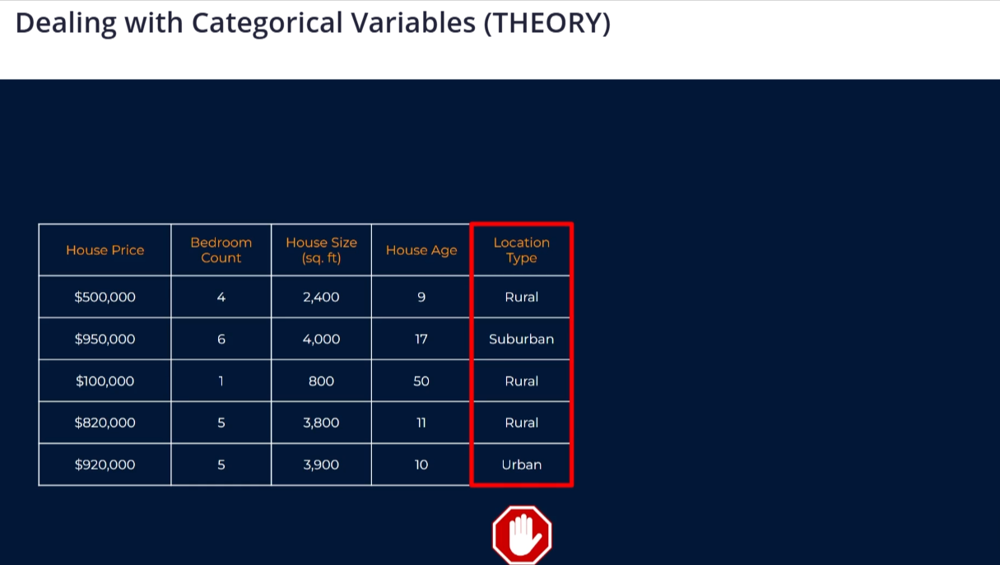
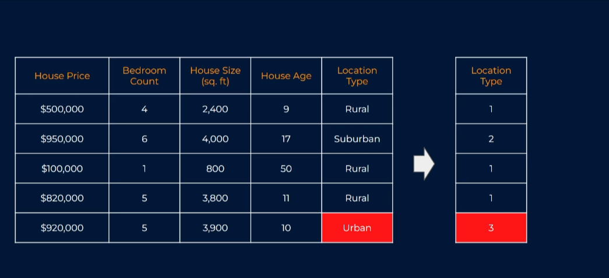
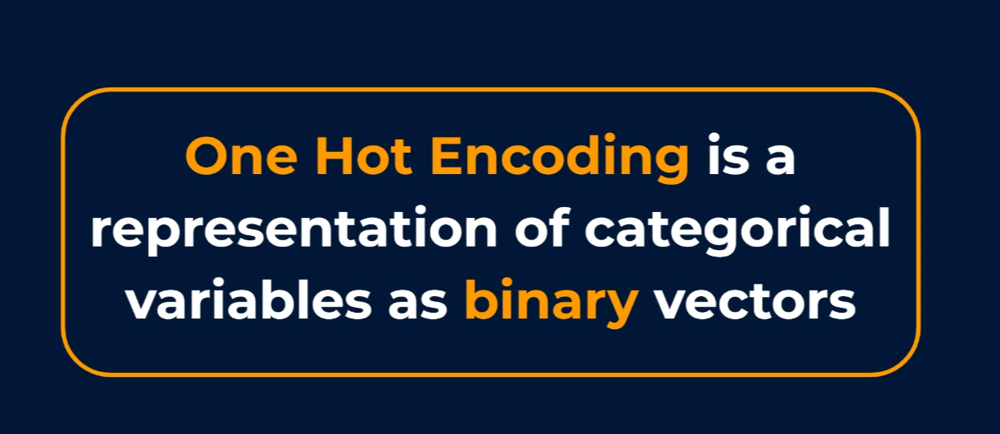
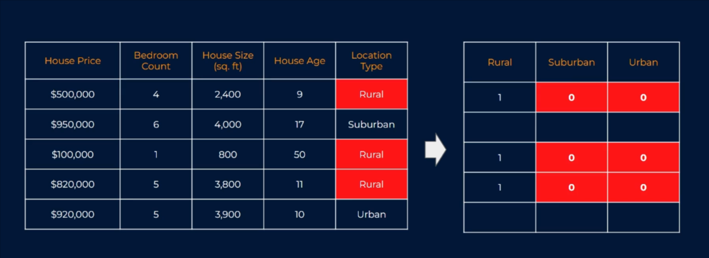
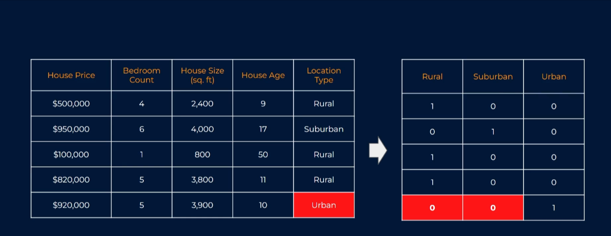
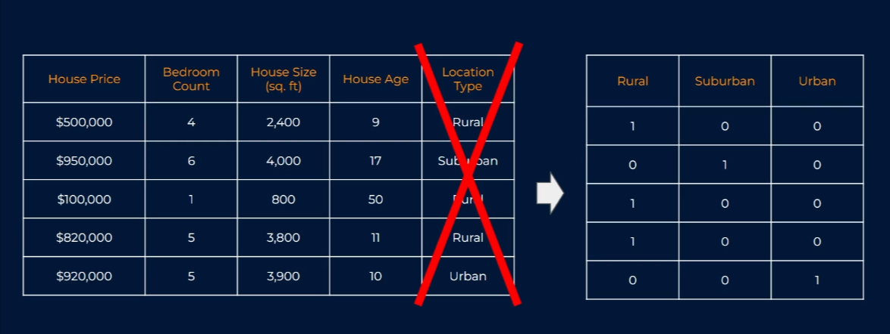
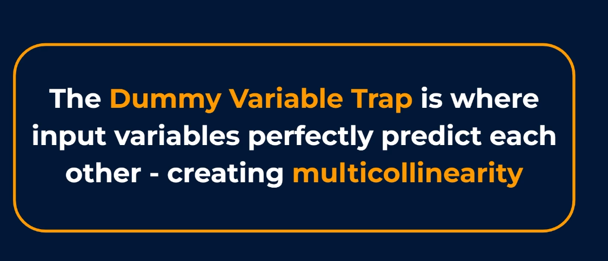
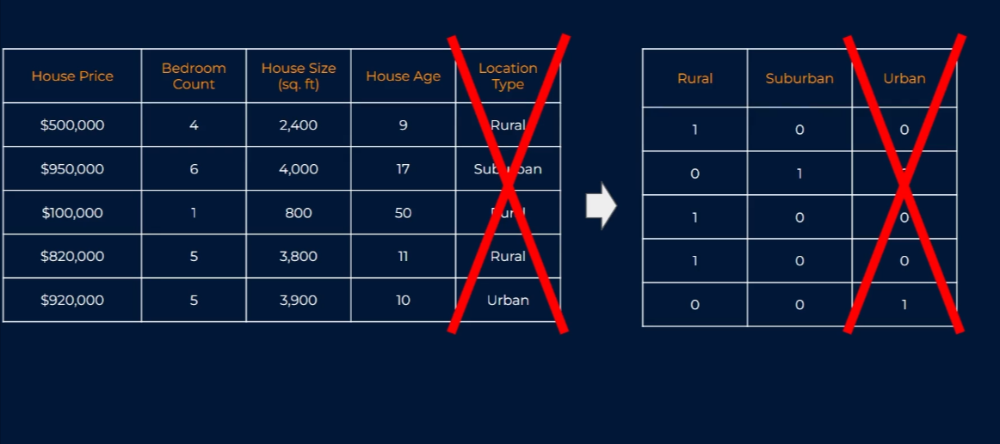

## Dealing with Categorical Variables (THEORY)

Categorical variables are variables that contain values that are made of things like names, labels, classes or text.

And while at first glance, these seems harmless enough, they can cause us difficulties. And the reason for this is that our models don't
often know how to assign some numerical importance to them. In simple terms, ML models want everything to be provided to them in a
numerical form. But in reality data comes in different shapes, sizes and form.
Sometimes, you may want to classify or categorised (Categorical variables) data based on some features that you really want to
include for your model as you believe they hold a lot of predictive power. To be able to do this, We need to figure out exactly how to
deal with these Categorical variables to ensure that our model can extract the meaningful information that the variable holds.

One hot encoding

1 hot encoding is a representation of categorical variables as binary(0s & 1s) vectors. Now vectors are simply newly created columns in our

data set with binary values- which are zeroes and ones.

**Example: Looking to predict house prices.**

As this is a supervised problem, we of course have a col for the prices themselves, or in other words, the output or target variable, and then we have several input variables - the ones that we will use for our predictions as we believe they'll have some sort of relationship with that house price variable. But one of these input variables poses a bit of a problem for us here. `Bedroom count`, `House size` and `House age` all look completely fine to use as they are as their numerical values but `Location Type` is not. This exist as a `categorical variable`.

It is providing a label for each house based on its location type, namely whether it's located in a rural or urban neighbourhood, we can't possibly understand numerical differences between classes like this. They don't have any order or scale that we know of. So we're in a bit of a bind, but the `Location Type` seems like something that could be really useful for predicting `house prices`. So we don't want to throw this variable away.

### What We Need To Do

> Turn the categorical variable into something that can be used within our model.

A possible solution that might come to mind would be to convert each class to a number.

- Rural -> 1
- Suburban -> 2
- Urban -> 3

Our model will take in this new variable without a fuss. But this might not be the best approach and the reason is that we've assigned an order or a scale to a data where we don't actually know if an order or a scale exists.
We'll essentially be telling our ML model that houses in an urban neighborhoods are 3 times better or bigger than those in rural locations and those in suburban are twice as good or bigger than those in rural neighborhoods. With this, we have imposed an order on this data and most likely this will result in the model either finding a false relationship or no relationship between this imposed order and our output variable, meaning will potentially ruined a very informative input variable,

### A Better Way To Deal With Categorical Variables Such As This

We create some new variables that are often called `Dummy variables`. To do this, we use a process called `One Hot Encoding`.

Thing of `vectors` as newly created columns in our data set with binary values- which `1s` and `0s` (like machine language).

So what we do is to have one new column for every distinct class or group that exists in our location type column. We'll put a value of `1` in the new `Rural` column and values of zero in the other 2 columns.

And similarly, we drop a value of `1` where we have `suburban` and `0s` for others and so on.

With this, we have now not assigned any particular order or scale to the data. We've just created new columns that the model can easily and fairly assess as to whether any predictive relationship exists.

These new cols would now go into our ML model as input variables and hence the information contained in the `Location Type` is now completely represented by these 3 new numerical columns that the model can deal with.

But we need to be wary of one thing and that is known as the `Dummy variable trap` which is where our newly created dummy variables perfectly predict one another, which breaks the assumption of there being no multi-collinearity within the model, a requirement for some models such as linear regression. To give a little bit more context, multi-collinearity occurs when two or more input variables are highly or completely correlated with each other. It's a scenario that generally speaking, we attempt to avoid, as in short, while it won't necessarily affect the overall predictive accuracy of our model, it can make it difficult to trust this statistics around how well the model is performing and how much impact each input variable is truly having.

Thankfully, the solution to the dummy variable trap is actually a very easy one. All we need to do is to drop one of our new dummy variable, ensuring that we don't have perfect information between them.

Something worth noting quickly is that here we had three classes, and thus we created 3 new dummy variables. And we needed to drop one if we only had 2 classes in our original categorical variable, and thus 2 new dummy variables were created. Again, we would have to drop 1 and so on. So if we had another categorical column that needed the 1 hot encoding treatment, then we need to drop 1 column from that set as well.

Other encoding techniques includes label encoding, binary encoding, target encoding, ordinal encoding and feature hashing. When you are looking to train your next machine learning model and you want to deal with categorical variables, make sure you think hard about which is the most appropriate.

