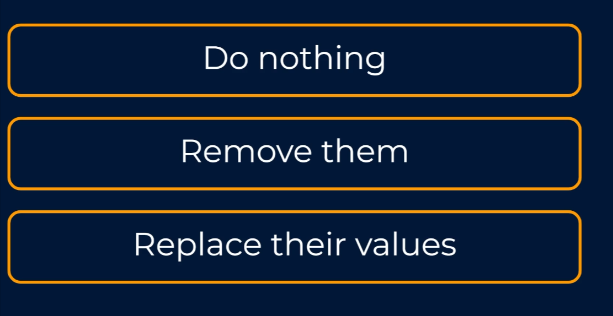
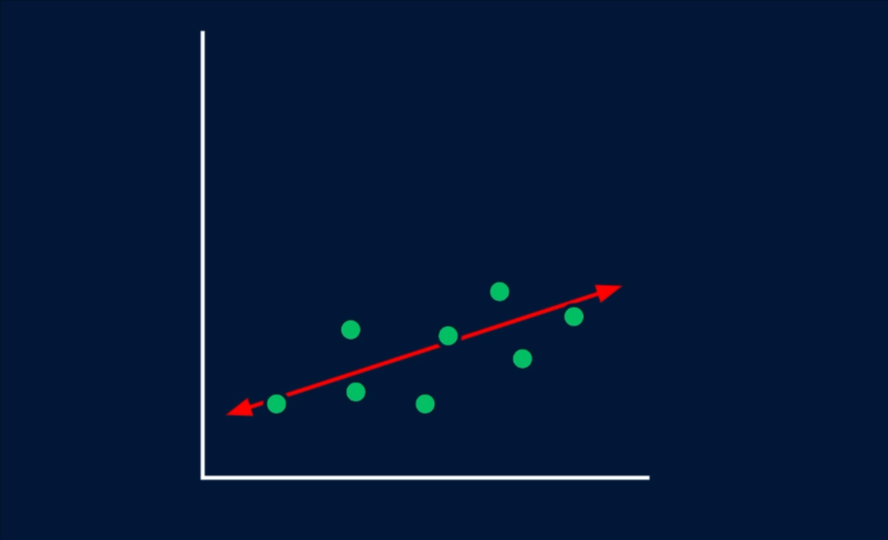
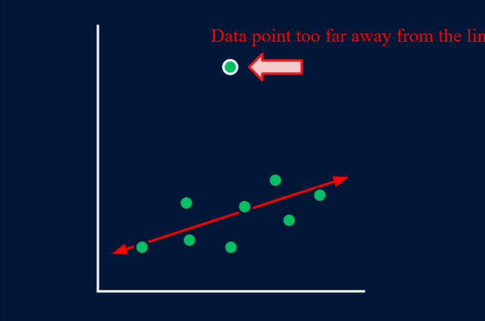
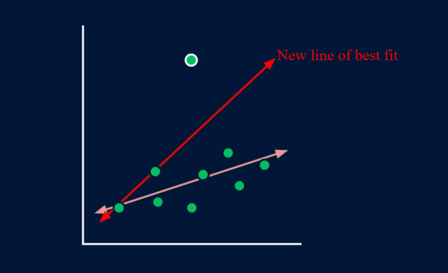
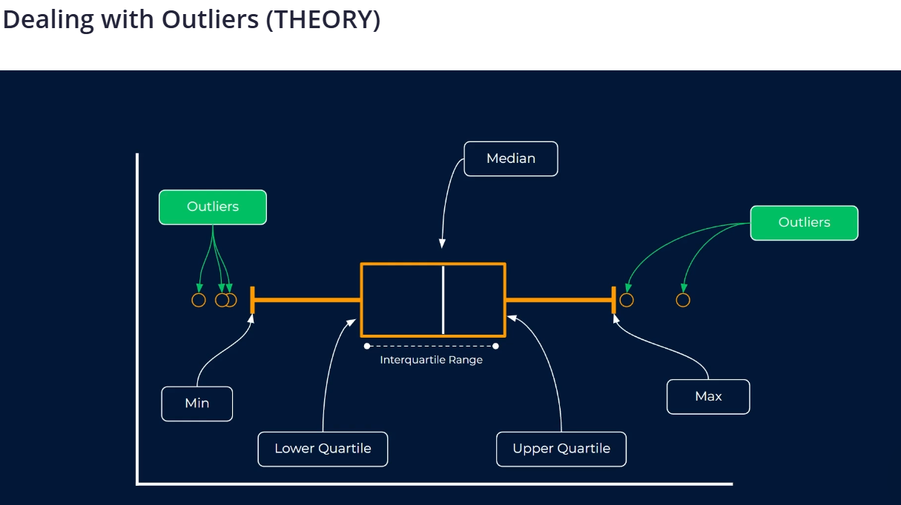
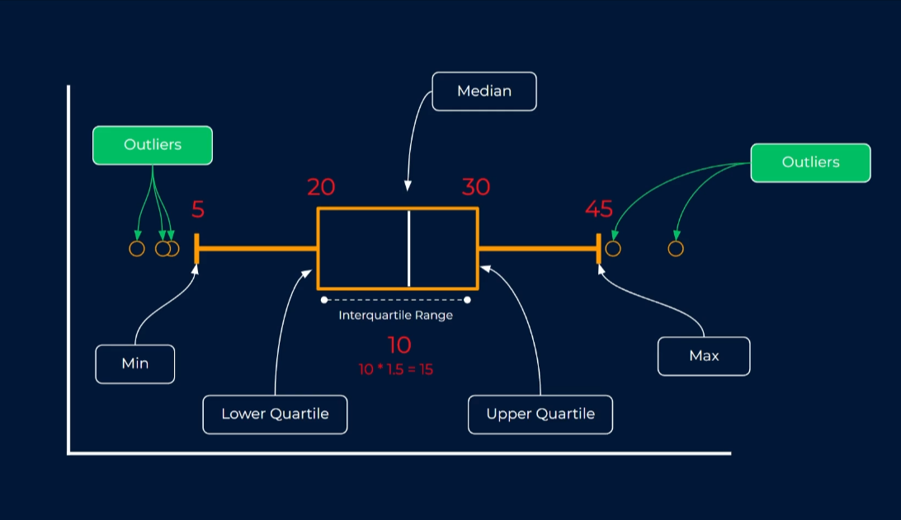
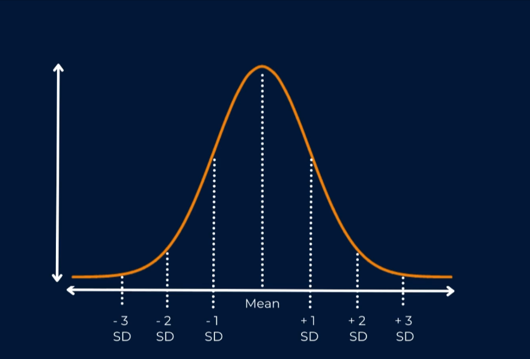
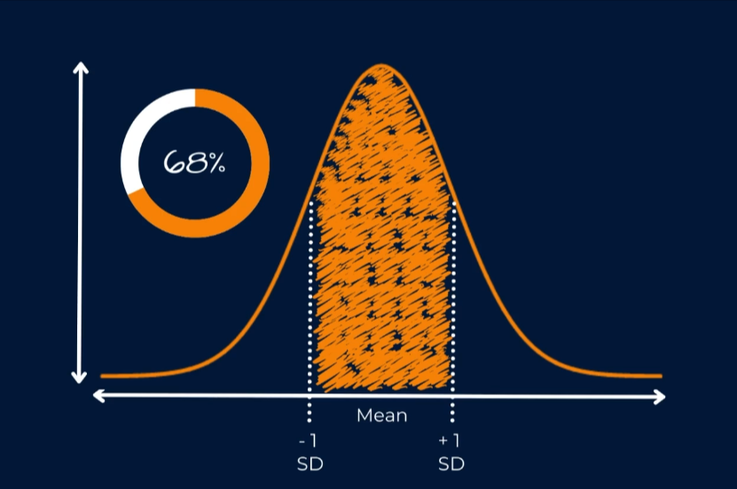
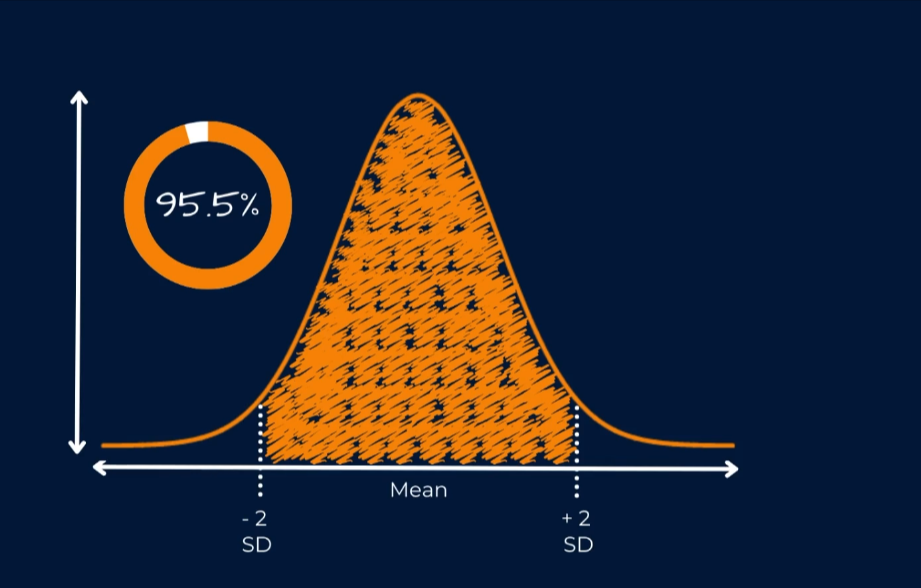
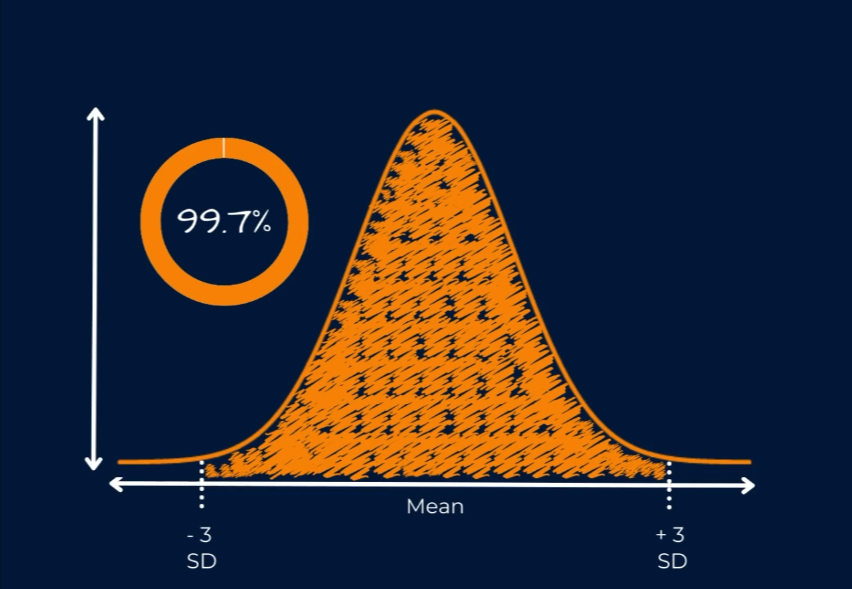

An `outlier` can be any value that `differs significantly` from other values.

The perception of what an `outlier` is depends on the scenario you're dealing with. Given a particular scenario, you could just say that an `outlier` is any value that seems out of place in our data. But just because a number is very large or very small, it doesn't instantly mean it shouldn't be there. You could argue that every value, no matter how high or low, is genuinely part of the data, and therefore we shouldn't consider removing them at all.

But the problem with `outlier` is that they can cause issues for understanding things like averages as well as skewing the learning in certain machine learning models, making them perform worse across the vast majority of data points.

## How to deal with `outliers`

> The easiest approach is to do nothing at all, we'll just leave the data as it is.

> The second option is to remove any rows of data that contain `outlier` values in one or more of the columns. This is a pretty good option if you're in a scenario where `outliers` will have a big impact on how the model learns.

> Thirdly, we could keep the `outliers` in our data, but replace their values with something else. This can be a good solution in cases where you're low on data, as it allows you to keep all rows, but avoid the problems that the `outliers` cause. One downside of this particular approach is that we're essentially manipulating the real data. If you have enough data, It might be often better to remove the rows rather than apply this approach.

In terms of replacing values, there isn't one way of doing this, You could easily replace all `outliers` with the `mean` or `median` value, or you could apply an approach known as `Windsor Rising`, where we replace `outliers` with the closest value in our data that isn't deemed to be an outlier anyway.

## Why we should deal with `outliers`

## Let's look at a sample data

If we were fit something like linear regression here (draw line of best fit), a model that looks to place the best fitting straight line through our data, we'd probably find that with this particular data, at least we'd manage to get a line that fits pretty nicely through it, which means this one straight line does a pretty good job of representing all of our data. None of our data points are too far away from the line. But suppose that there was one data point that was a lot different to the rest, like the one shown in the image below:

When the linear regression model is learning how to best represent all of our data, it has to take this data point into consideration too. And it will go about its business trying to create a line of best fit, which might now look like the image below:

It's done it best trying to fit a line that works well for all data points. But our line is now far worst fit for all our data, even though that data point was likely to be extremely rare,
It had a huge impact on the model, rather than finding a line which generalizes well to the majority of the data points. It's now tried to find a compromise between the majority and the outlier, resulting in a much worse model overall.
So what exactly can we do to detect potential outliers? And what should we do with them once we find them.
There's no specific solution to this, It really depends on the scenario we're in, as well as the type of model that we're using.
Well, a linear regression model might be quite badly affected by outliers. Models such as decision trees and random forests are not affected at all, so we need to always consider what is most appropriate in this.

## Approaches to deal with `outliers`

1. Box Plot

It's a very useful way to visualise a set of data as it gives us a lot of information about the spread of the values in our `box plot`. The `median` is shown by the white line in the centre, and the `median` is the middle value of our data. The `median` is often far more useful than the `mean` as it's not in any ways skewed by very large or small values in our data. It is literally just the middle value if we sorted out data from smallest to largest.

Our boxplot also shows us the `upper` and `lower` `quartiles`.

The `lower quartile` is the `25th percentile`. So if we were to order our data from smallest to largest, it would be the data point that is one quarter the way along. The upper quartile is exactly the same, but at the other end of the spectrum it would be `3/4` the way along our ordered data.

The range between these two is often called `interquartile` range. It contains the middle `50%` of our data.
This leads nicely to the next part of the boxplot chart, which are based on these `quartiles` values and the `interquartile` range. And these are referred to as the `maximum` and `minimum` borders. These don't actually represent the highest and lowest values in our data. They are calculated based on a factor being applied to the lower and upper quartile. Commonly, we calculate the `interquartile` range and multiply it by a factor of `1.5`, We then use this to calculate where the appropriate point for the maximum and minimum values of our data should be. And this is very important as any values that fall outside of these borders are deemed to be `outliers`.

If the lower and upper quartiles of our data were equal to 20 and 30 respectively, this would give an `interquartile` of 10. Uf we multiply this by a factor of 1.5 we get 15. And so when we add 15 onto the upper quartile, we get a max border value of 45. And if we subtract 15 from our lower quartile value of 20 we get our minimum border value of 5.

And any value outside of 5 or 45 would be deemed `outliers`. We could then remove these data points or replace them with the `mean` or `median` value, or if we were to `windsorize` them, we would apply any high `outliers`, a value of 45 and any low `outliers`, a value of 5. So this is a very simple approach but it's quite commonly applied.

1. `Standard deviations`

Instead of using quartiles as the basis, we rely on understanding the `mean` and `standard deviation` of our data to infer which data points are higher or lower than what we might consider to be normal values. The chart below represents a normal distribution curve with a line down the middle representing the mean of our data and several other vertical lines representing a number of standard deviations away from the mean.
Standard deviation is a measure of the spread of our data and what's most important to understand is that in `normal distribution`, most of the data is centered around the `mean`.

Because of the shape of a normal distribution, We can say that 68% of our values should fall within one standard deviation either side of the mean.

We can also say that 95.5% of our values should fall within two standard deviations of the mean.

We can also say that 99.7% of our values should fall within three standard deviations of the mean.

And similar to the `box plot` method of detecting `outliers`, this just gives us a sensible cut off point where we can say anything outside of these points i'll be considered to be a little abnormal compared to the rest of the data and perhaps it could be considered an `outlier`. It is quite common in `outlier` detection to focus on any values that are outside of three standard deviations from the mean. This means that we'll be treating quite a small number of data points in theory, it should be around `0.3%` but we can be quite confident that the values are very large or very small when compared to the average value.

So using `box plot` or `standard deviation` as a way to detect potential `outliers` are somewhat similar approaches but they both give us a nice sensible way to think about what could be considered normal values and what might be considered extreme.
