## FEATURE SCALING

Here, we shall be discussing ways to scale the values of our features or our columns with an approach known as `Feature Scaling`.

### What is `Feature Scaling`

`Feature Scaling` is where we force the values from different columns to exist on the same scale, in order to enhance the learning capabilities of the model.

The two most common techniques are `Standardization` and `Normalization`.

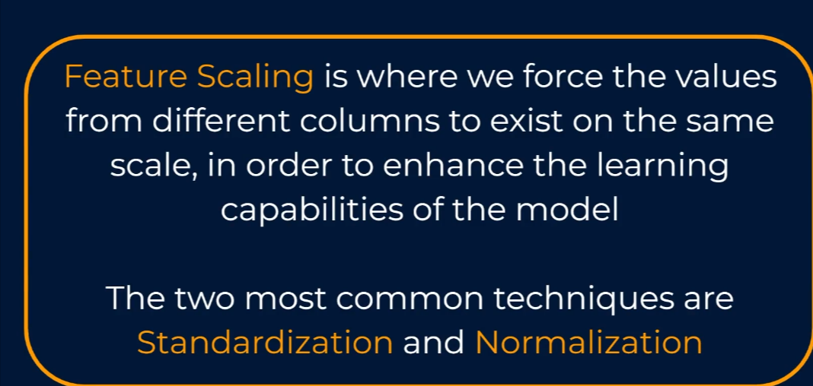
Let's look at an `example` to show why this is an important consideration for us to make. So here we have the height in meters and weights in kilograms of five men. The variation within each is somewhat similar. But if we were to plot this data on scatter plot with the same scale on each axis, we can clearly see that weight is much more spread out than height, which start to appear as if it is exactly the same, even though we know it absolutely isn't. And this is purely because our height and weight data exist on different scales. ML models, especially those that rely on distance measurements will really struggle with this problem. Two of those possible solutions to this problem are: `Standardization` and `Normalization`.

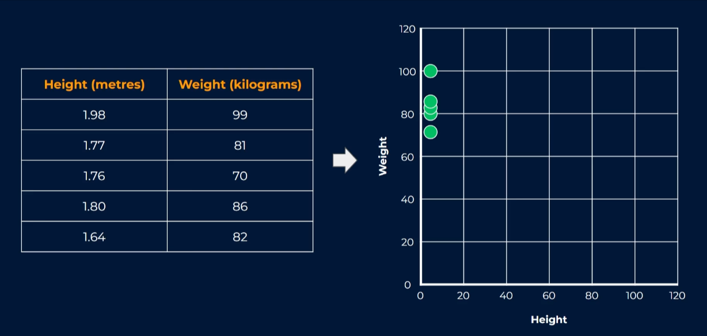

- Standardization

`Standardization` is an approach that rescales all of our data columns to have a `mean` of `0` and a `standard deviation` of `1`. So they'll essentially exist somewhere between about `-3` and `+3`. To standardise our data, we would take each individual value and subtract the `mean` of all values within and divide it by the `standard deviation`. Which means that each data point is now represented by the number of `standard deviations` that is away from the `mean` which itself is represented by `zero`.

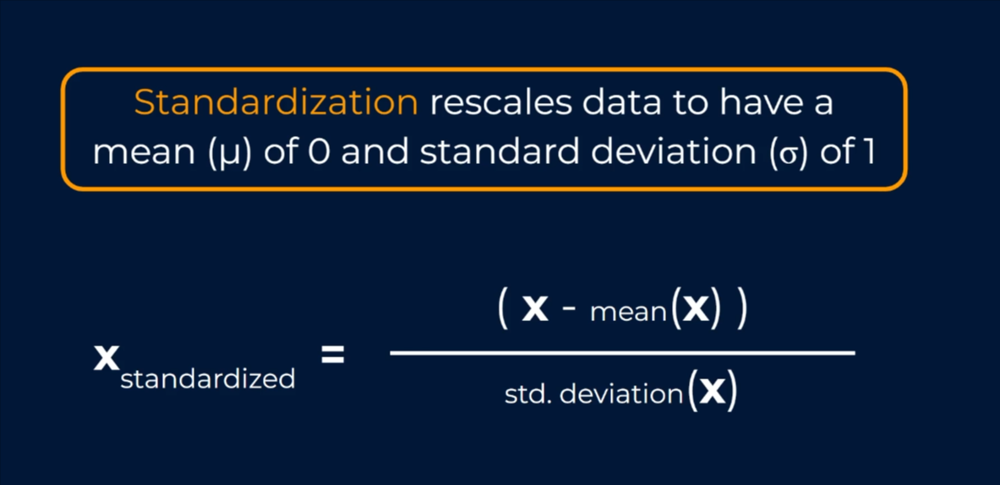

> The Calculations

> 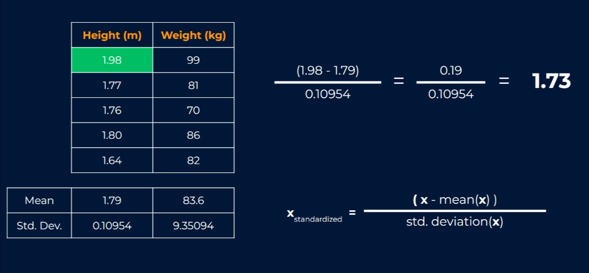
> `1.73` - means that the value `1.98` meters is `1.73` `standard deviations` above the mean of the column (`1.79`) and this being a positive value makes sense. `1.98` is much higher than the `mean` height of `1.79` meters.

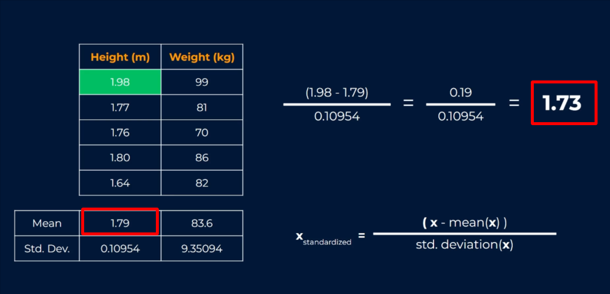

With this, we could create a new table for all our `standardized` values and we could plug in this one (1.73), and if we follow this process for all the rest of the values in our `height` column as well as doing the same for `weight` using the `mean` and `standard deviation` for the weight values, we would get the table below:

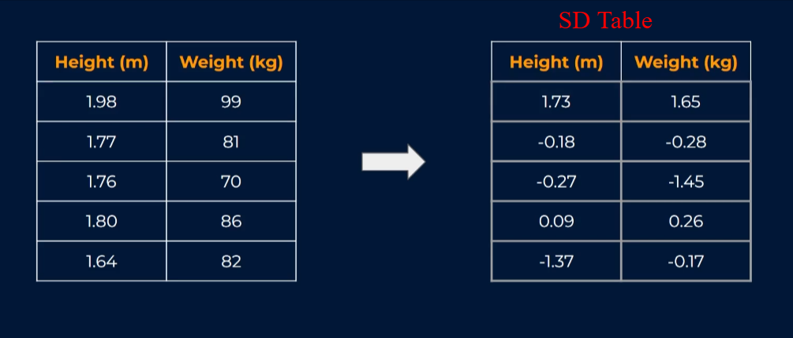

As a result of the `standardization`, we could see that they're now on a similar scale to each other. This becomes even more evident when we look at the `scatter plot` of our new values. We can clearly see that both `height` and `weight` are now comparable existing on the same scale.

For certain `ML models` this makes understanding patterns in relationships much easier.

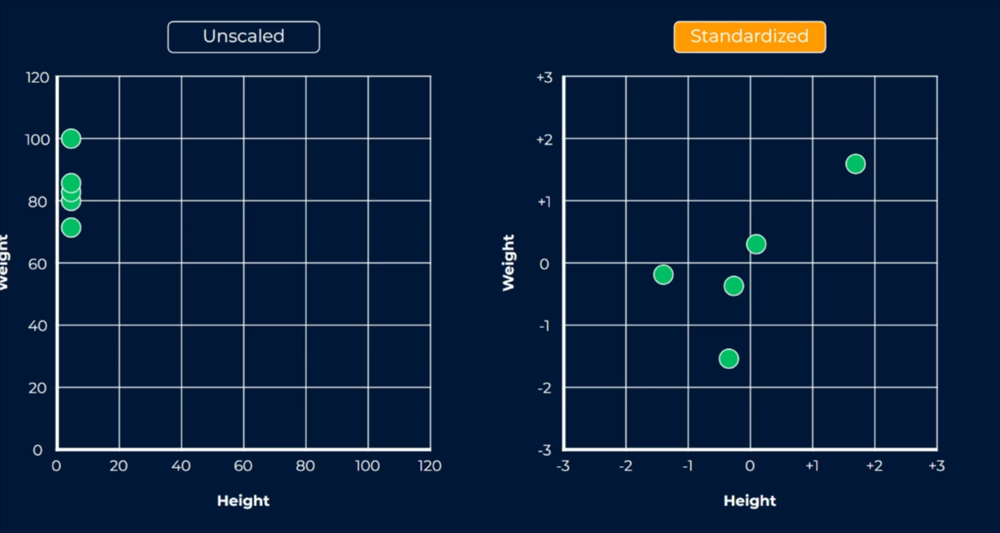

- `Normalization`

`Normalization` is an approach that rescales data so that it exists in a range between `0` and `1`. `Normalization` is sometimes referred to as `min-max` scaling.

The formula shows that our values will always exist between `0` and `1`, with our `maximum` getting a value of `1` and the `minimum` getting a value of `0` and the rest placed proportionately in between.

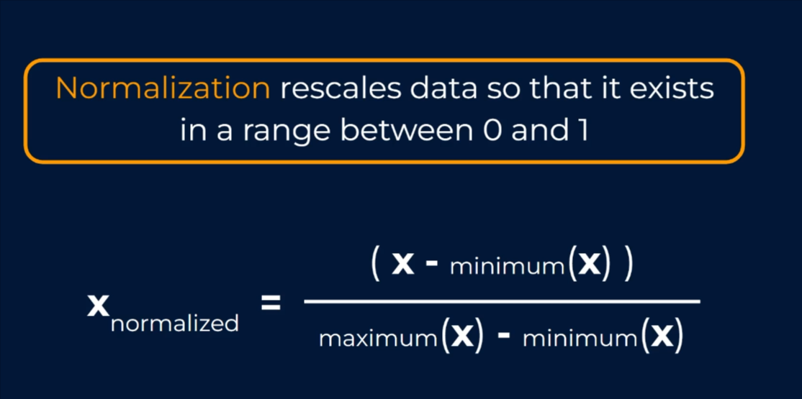

In `Normalization`, we don't need `mean` or `SD`. We just need the minimum and the maximum values for each column (heights & weights).

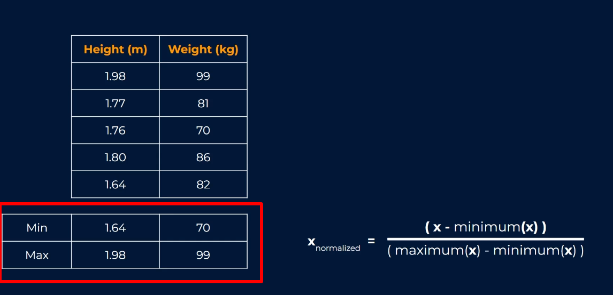

For the maximum value of `1.98`, we get a `normalized` value of `1` based on our formula. If our value was the `minimum` for the column, we'd get a normalized value of `zero`.

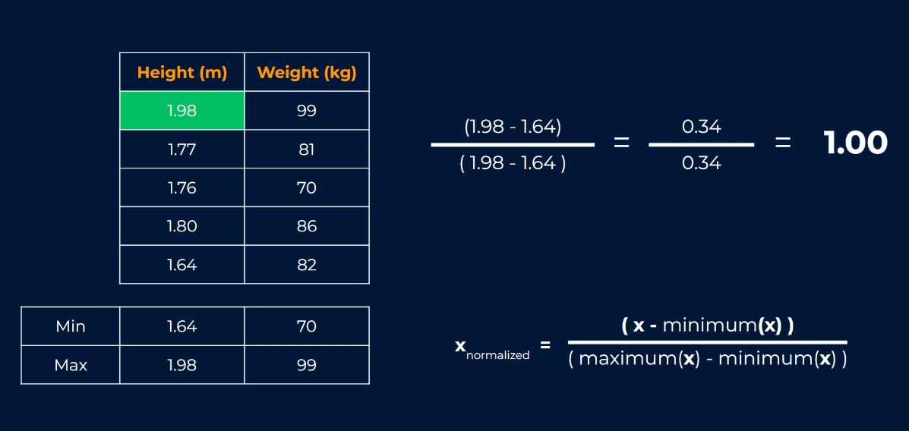

> Table for all the `normalized` values calculated.

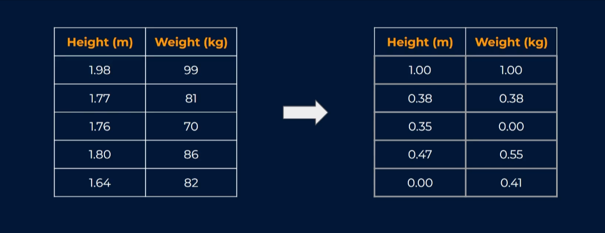

> Comparing the scatter plots for `Standardization` and `Normalization`

> 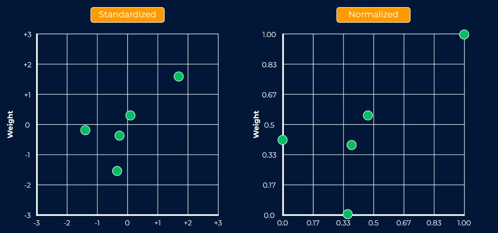

> Which to use?

If you need your values to remain `positive`, use `Normalization`. This would apply in situations where we're using image data with pixel intensities, or we're encoding categorical values to be zeroes and ones. And we want our numeric data to also be on that same scale.

In situations, especially for algorithms like linear and logistic regression, as well as cases where you want to preserve the intensity of any `outliers` in the data, `Standardization` would be the way to go. If you're not sure, experiment with both methods, validate the model performance and determine which is best.

Whether you implement feature scaling, could come down to a trade-off between accuracy and speed. If you scale your variables, it makes it harder to understand the true meanings of the coefficients in terms of their actual values. Again it is often worth trying the model with and without scaling if it doesn't appear to make any difference to accuracy, then you could argue that you don't need to do it.
