# Feature Selection in Machine Learning (THEORY)

`Feature Selection` is the process used to select the `input variables` that are `most important` to your `ML` task.

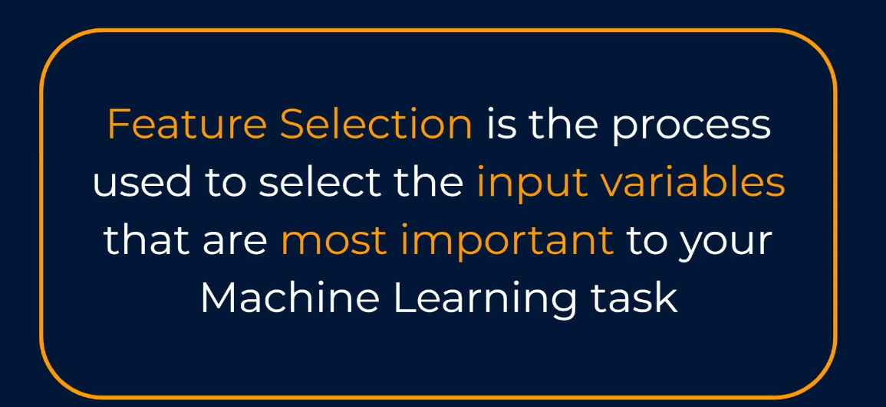

In `supervised Learning`, you are tasked with predicting an output variable, In some cases you'll only have a few input variables to work with, but there are times when you'll have access to a whole host of Potential Predictors. In this case it can often be detrimental to just throw all of the input variables into a model, and we should instead look to only include some of them. Let's look at the three main reasons why this is so:

`Firstly`, it can result in improved accuracy for the model. Some types of machine learning models or algorithms will handle noisy data better than others, but in general too much unnecessary noise can only be a bad thing.

`Secondly`, we end up with a model that is far quicker and easier to train, and when implementing the model into the real world, our predictions can be much faster too, and these are both extremely good reasons.

`But the third` is the one that really underpins everything for me, and that is that our model is much simpler and therefore easier to understand and to explain when justifying and explaining your model to the business your life is a whole lot easier with a simpler model, and ensuring that stakeholders buy into your model is often the difference between it being implemented and it being put on the shelf.

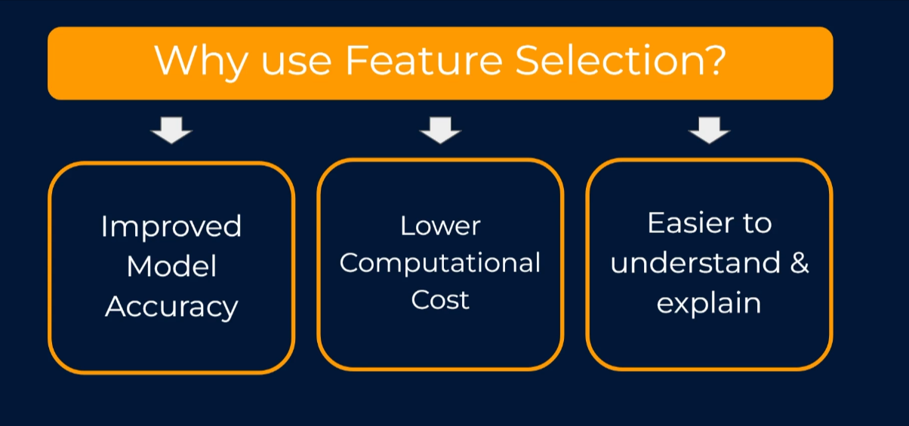

> So what are some of the ways that we can find the best features prior to building and training our model?

Well, there are no bounds on the ways that this can be done, but I'd like to run through a couple of nice ones that can be really effective.

`The first` is very, very simple, and that is to just `create a quick and easy correlation matrix between the features`.

`Correlation` is a score which gives us a view as to how associated two numeric variables are with each other, as well as telling us which direction this relationship exists in.

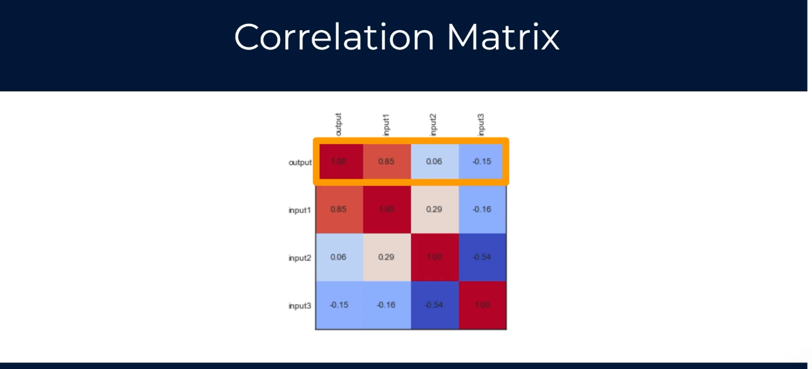

> Example

As an example, where two variables `x` and `y` are completely random and have no relationship whatsoever, or in other words, we could say that a change in X doesn't lead to any related change in Y. This would be represented as a correlation score of zero.
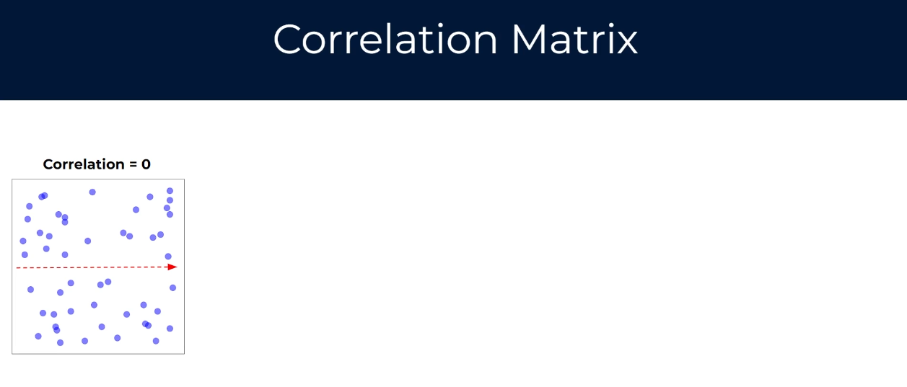

Correlation scores `near zero` are deemed to be `extremely weak correlations`. Conversely, a correlation `score of one` denotes a perfect positive correlation in that `a positive change in X leads to the exact same positive change in Y`.

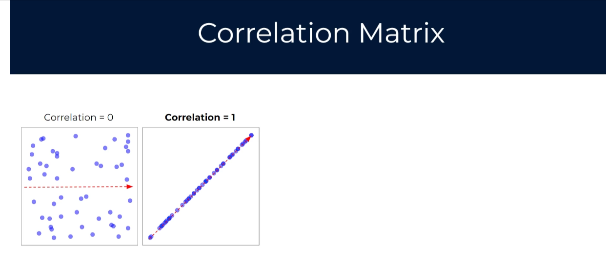

If `X` increments by two, then `Y` also increments by two. Now positive correlation scores range anywhere from zero to one. So some data similar to what we have on this third chart here would represent a pretty strong but not perfect positive correlation between X and Y as X increases Y also tends to increase, but not always at the same rate.

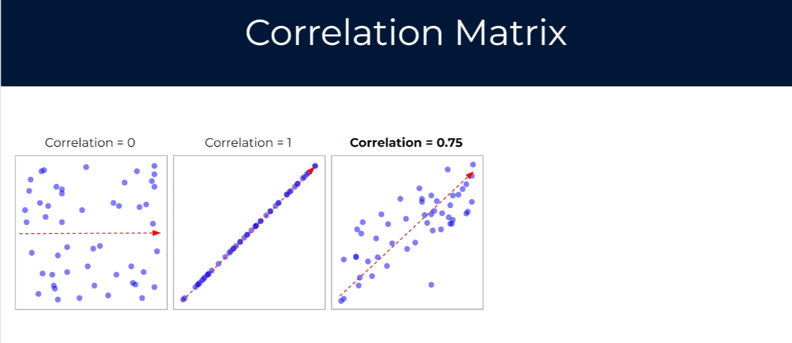

We can also have negative correlations. The fourth chart here shows a perfect negative correlation the relationship here is just as strong as that in the second chart it's just that an increase in X leads to the same change in Y just in the negative direction. Negative correlation scores range anywhere from zero to negative one, so some data similar to what we have on this final chart would represent pretty strong but not perfect negative correlation between X and Y as X increases Y tends to decrease, but not always at the exact same rate.

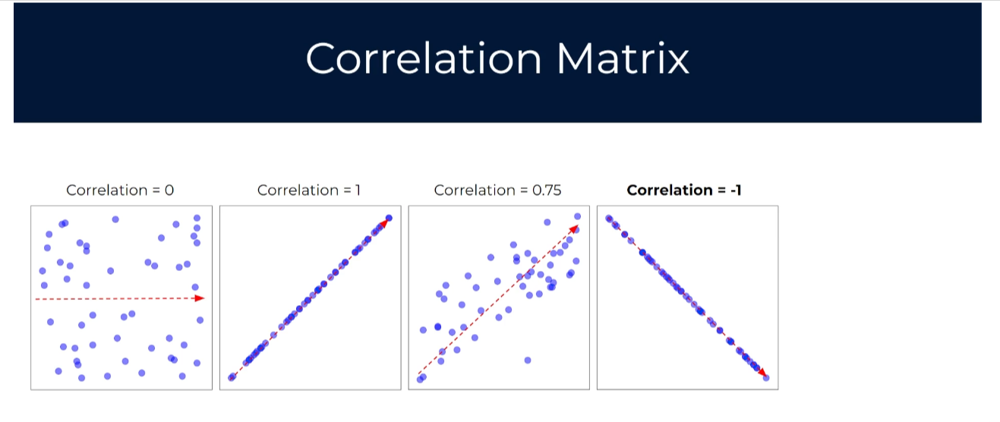

So if we head back to our original correlation matrix, you can see that we have a correlation score for the relationships between some different variables. If we just focus in on the top row, we can see each of the correlation scores with our output or our target variable. As you'd expect, the output has a correlation score of one with itself, so we don't need to worry about that. In the second box along, we can see that the variable input one has a correlation score of zero point eight five with the output variable. This is really strong in it would suggest that it should be included in the model. Conversely, inputs two and three have scores of zero point zero six and negative zero point one five, which both denote very weak relationship so you may look to remove them before running your model. This is obviously a very simple example with only four variables.

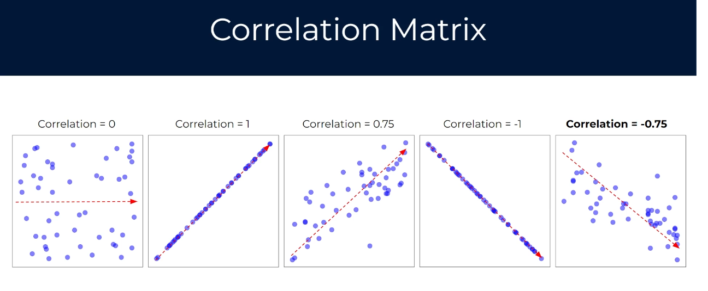

In practice, you may have tens or even hundreds, so this process can get a little tedious, but it is always a good first step.

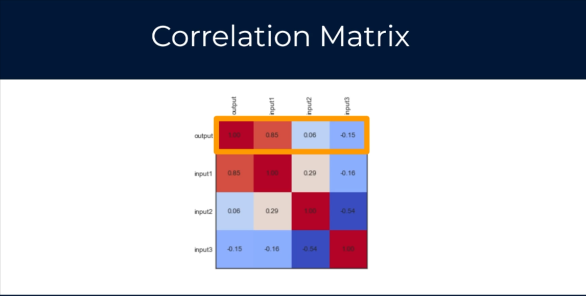

Let's now look at a slightly more automated way to do that, and this is to use something called `Univariate feature selection`, which sounds complicated, but in fact it just means that we're applying statistical tests to find relationships between the output or the target variable and each in isolation by in isolation I mean that we just examine each input variable's relationship with the output variable independently of any other relationships. We run the statistical test on one input variable at a time. Hence the name `Univariate`.

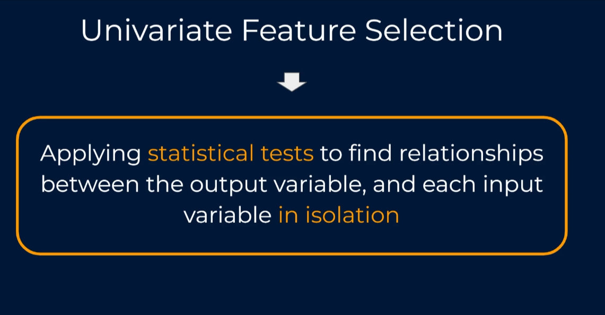

The particular statistical test that is used can be anything at all, and it will mostly depend on whether you're running a regression task or a classification task, an example output from these tests would be a table showing relationship scores between each input and the output for a regression task like we see on the image below,

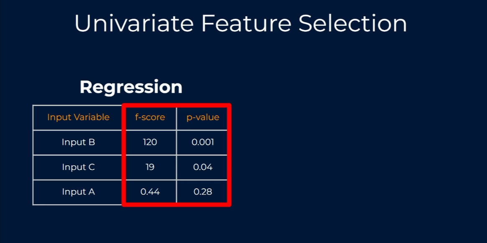
we may get provided an `f-score` and a `p-value` for each.

And both of these give us a view on the statistical significance of that relationship, and this can help us assess how confident we should be about the inclusion of each in our overall model.

In terms of a classification task, depending on which test we use, we might get provided a `chi-square` score and a `p-value` for each, and these both give us a view on the statistical significance of the relationship between each individual `input variable` and the `output or target` variable.

In either the `regression` or the `classification scenario` we get some basic information around which variables may be more important than others, and we could potentially put in place a threshold for the statistical test score the `p-value` or both, to say that we only want to include variables in the model that appear to have a reliable relationship with the output that we're looking to predict.

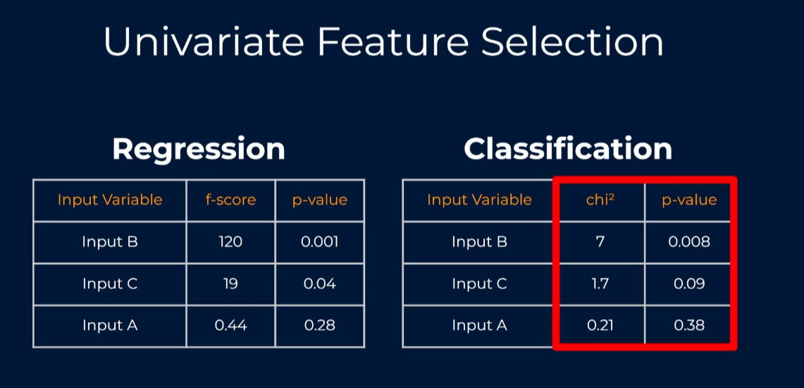

Now, while this approach is a step up from the correlation matrix, it could be argued that a downside of testing is that it only considers variables in isolation, it doesn't account for variables interacting with each other, and while there are many, many other approaches for feature selection in this course, I'm going to cover one other popular one that is a bit more rigorous than `univariate` testing. That is called `recursive feature elimination`.

## Recursive Feature Elimination (RFE)

So `recursive feature elimination` fits a model that starts with all input variables and then iteratively removes those with the weakest relationship with the output until the desired number of features is reached.

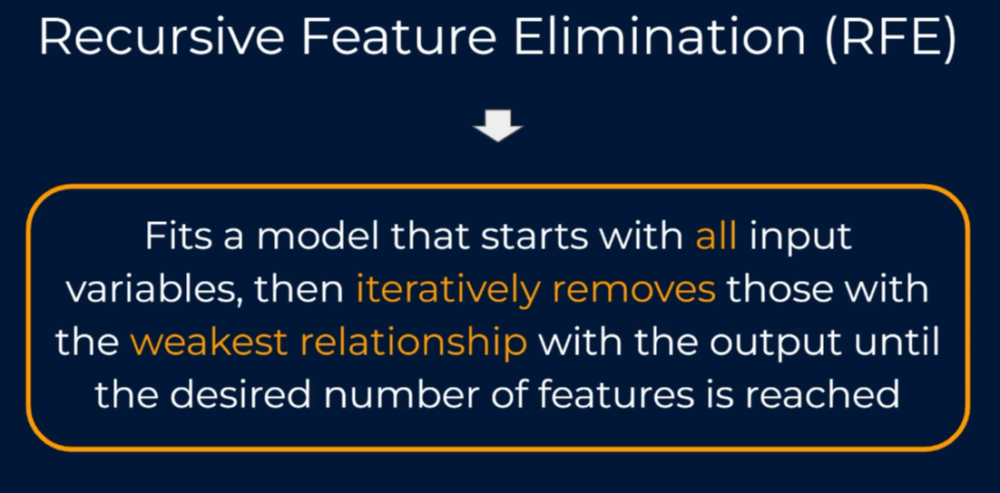

So this sounds interesting. It works by actually fitting a model rather than just running statistical tests like we saw with `univariate testing`. So if we were running a linear regression model, leap recursive feature elimination process would actually make use of the linear regression model itself, but it's how it applies it that is clever. Let's go step by step at a super high level so we can see this process in action.

> Example

So in our example, let's imagine that we are looking to predict an output variable. And to do this, we have access to four input variables, and you can see this on screen output is going to be predicted by input A, B, C, and D.

> 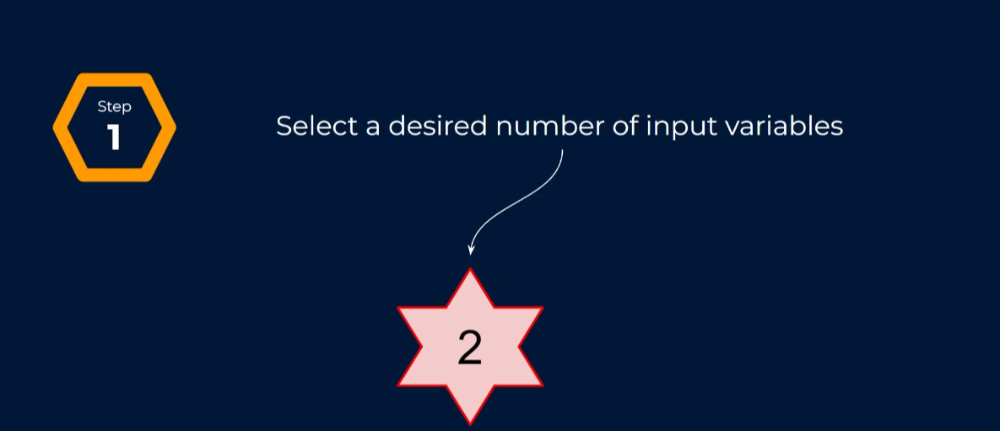

In reality, we probably wouldn't need to run a fancy feature selection algorithm if we only have four input variables, but for the sake of example, this makes it a lot easier. Let's say that we want to reduce the number of input variables down to two. The first step is just that we just select our desired number of input variables, and like I said, we want to go from four down to two.

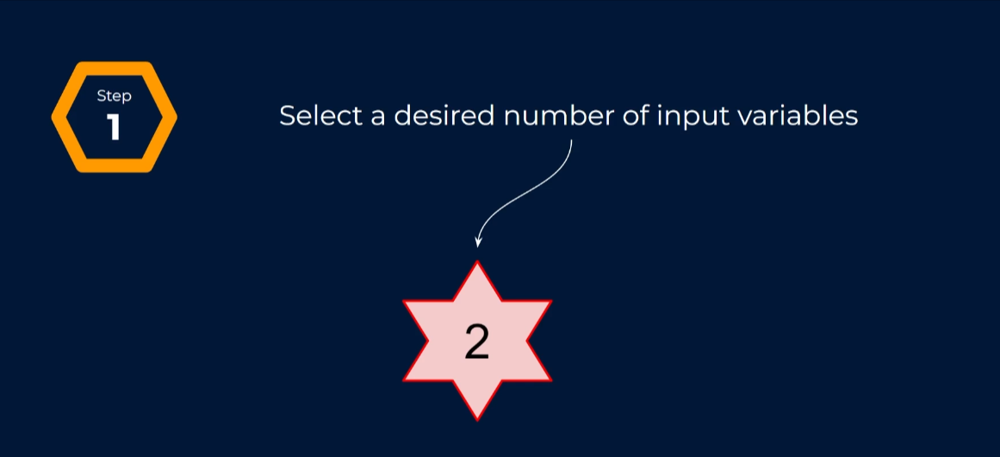

The first thing that the recursive feature elimination process will do is to fit our model with all four input variables then using the coefficients and the important metrics of the model, we rank each input variable based on how important it is. The variable that is deemed to be the least important will then be dropped.

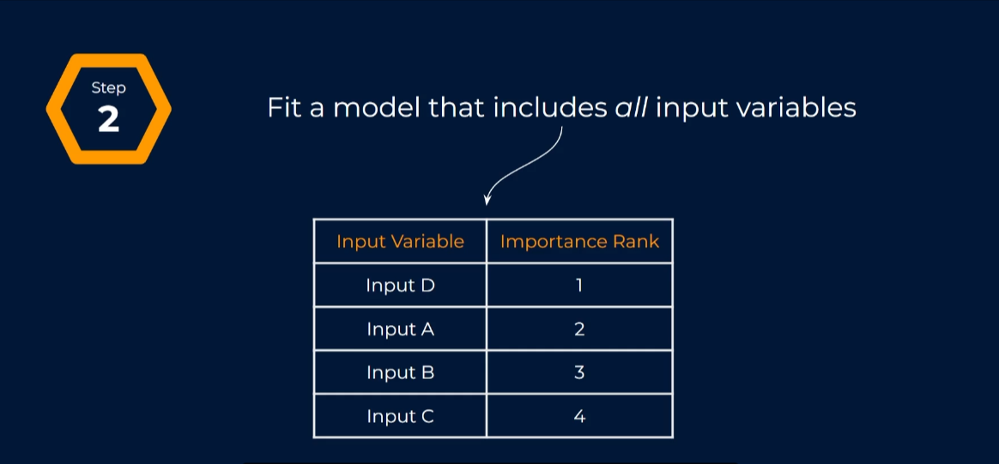
The algorithm will then re-fit a new model that includes all the variables apart from the one that was eliminated. Now some of you may have noticed that now we've refit the new model, the importance rank for input variable A and B have now swapped.

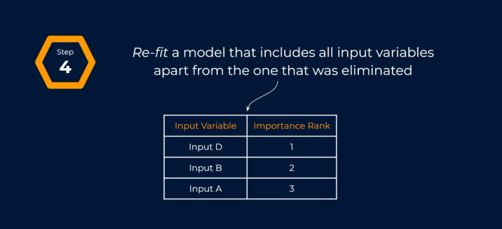

In the first with all four input variables, input A was ranked second most important, and input B was the most important. Once we removed input variable C, any effects from that variable are removed so the other variables will have minor changes in their contributions. This is why we re-fit the model with the new set of variables, as we want to get the updated importance rankings.

And once we've done that, we move on. We again isolate the input variable in this model with the lowest importance ranking, which is now input A again just like before, this is dropped and we repeat the process, refitting a new model with only input D and input B. However, as it turns out, we've now reals in the two best identity D and B.

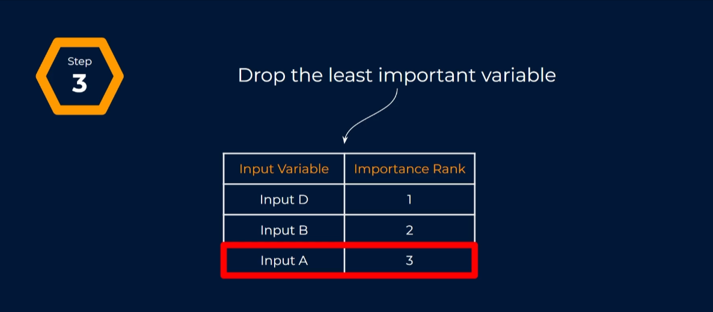

However, as it turns out we've now reached our desired number of input variables and the two best are deemed to be inputs D and B. So this is a really, really powerful way to understand which features are best suited to be in our model, but I have one problem with this approach.

If we go back to our definition we learned that recursive future elimination physics model that starts with all input variables iteratively removes those with the weakest relationship with the output until the decided number of features is reached. My problem is with the process `removes inputs until the desired number of features is reached`.

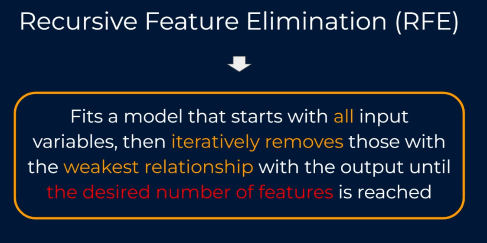

In most cases, I have no idea what this says what I'm relying on an approach like this to tell me luckily for us we can apply another clever twist in order to get a view of which variables should be included in the model without needing to specify a guess in the first place the very same approach, but we do it using cross validation. It splits all of the data into different chunks and iteratively trains and validates models on each chunk separately. This means that each time we assess different models with certain variables included or eliminated the algorithm also knows how accurate each model works from the suite author models scenarios the algorithm can determine which provided the best accuracy and thus can infer the best set of input variables to use.

We'll be covering `cross-validation` as a concept and its application within recursive feature elimination in more detail very soon
