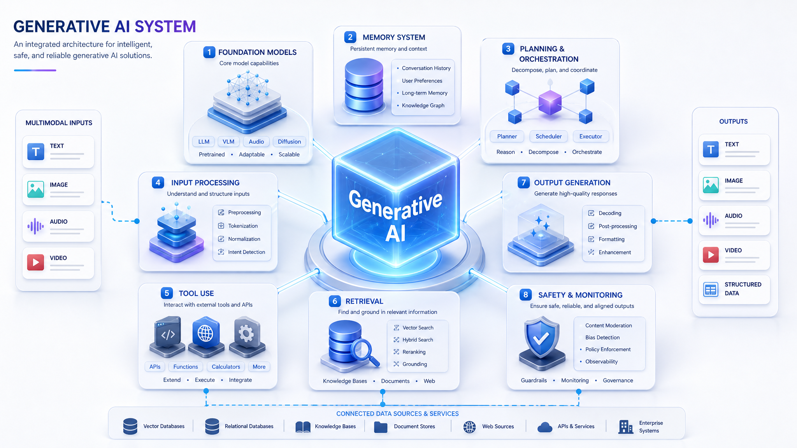

## Generative AI vs Agentic AI — A Beginner's Guide for Software Engineers

## 

## Structured vs Unstructured Data

**Structured data** has a predefined format, lives in rows/columns, and is easily searchable by a machine.

**Unstructured data** has no predefined format — it's raw, free-form, and requires interpretation to extract meaning.

---

### As a Software Engineer, think of it this way:

|                       | Structured Data                   | Unstructured Data            |
| --------------------- | --------------------------------- | ---------------------------- |
| **Format**            | Schema-defined (like a DB table)  | No fixed schema              |
| **Storage**           | SQL databases, CSV, spreadsheets  | Files, blobs, raw bytes      |
| **Examples**          | `user_id=1, age=30, salary=50000` | An email, a photo, a podcast |
| **Machine-readable?** | Directly                          | Only after processing        |

---

### Concrete Examples

**Structured:**

```json
{ "name": "Alice", "age": 30, "score": 95.5 }
```

A machine knows exactly what each field means.

**Unstructured:**

> _"Hey Alice, just wanted to follow up on our meeting yesterday about the project timeline..."_

A machine sees a blob of text. It doesn't inherently know who Alice is, what the meeting was, or what sentiment this carries — **until a model interprets it**.

---

### Other unstructured data examples:

- **Text** — emails, articles, tweets, books, code
- **Images** — photos, X-rays, satellite imagery
- **Audio** — voice recordings, music, calls
- **Video** — movies, surveillance footage, lectures
- **PDFs/documents** — contracts, invoices, resumes

---

### Why does this matter for Generative AI?

~80% of the world's data is unstructured. Traditional ML struggled with it because you had to manually engineer features from it first (e.g., converting text into numbers).

Generative AI models like transformers can **directly consume** unstructured data (raw text, pixels, audio waveforms) and learn the patterns within it — which is why they're so powerful and why Generative AI was such a breakthrough.

### What is Generative AI?

As your attached diagram shows, a Generative AI system is defined by **what it outputs**, not just what it learns.

**The core idea:** It takes **unstructured input data**, learns patterns from it, and produces **new unstructured content** as output.

```
Data → [Input] → Generative AI System → [Output]
```

#### It is NOT Generative AI if the output is:

| Output Type           | Example                  |
| --------------------- | ------------------------ |
| **Number**            | "House price = $450,000" |
| **Class Label**       | "This email = Spam"      |
| **Probability Value** | "90% chance of rain"     |

These are **traditional/predictive ML** — they predict or classify from structured outputs.

#### It IS Generative AI if the output is:

| Output Type | Example Model                        |
| ----------- | ------------------------------------ |
| **Text**    | GPT-4, Claude, Gemini                |
| **Image**   | DALL·E, Stable Diffusion, Midjourney |
| **Audio**   | ElevenLabs, Whisper, Suno            |
| **Video**   | Sora, Runway, Pika                   |

> **As a software engineer analogy:** Think of traditional ML as a function that returns `int`, `bool`, or `float`. Generative AI is a function that returns a `string`, `byte[]`, or a media stream — something _created_, not just _classified_.

#### How Generative AI works (simplified):

1. It's trained on massive amounts of unstructured data (text, images, etc.)
2. It learns the **statistical patterns** of that data
3. When given a prompt/input, it **generates new content** that matches those learned patterns
4. It does **not look up answers** — it _generates_ them token by token

---

### What is Agentic AI?

Agentic AI is the **next evolution** — it takes Generative AI and gives it **autonomy, memory, tools, and goals**.

Think of it this way:

|                     | Generative AI                        | Agentic AI                                          |
| ------------------- | ------------------------------------ | --------------------------------------------------- |
| **Behavior**        | Responds to a single prompt          | Plans and executes multi-step tasks                 |
| **Memory**          | Stateless (each call is independent) | Has short-term and long-term memory                 |
| **Tools**           | None — just generates                | Can call APIs, search the web, run code, read files |
| **Decision-making** | Single output                        | Loops, reasons, retries, adapts                     |
| **Goal**            | Complete one generation              | Achieve an objective                                |

#### The Agent Loop (how Agentic AI thinks):

```
Goal/Task
    ↓
[Think] → What do I need to do next?
    ↓
[Act]   → Call a tool (search, code exec, API)
    ↓
[Observe] → What did the tool return?
    ↓
[Reflect] → Did I achieve the goal? If not, repeat.
    ↓
Final Answer / Result
```

> **As a software engineer analogy:** Generative AI is like a **function call** — you pass input, you get output, done. Agentic AI is like a **running process or microservice** with a task queue, state management, external API integrations, and a control loop that runs until the task is complete.

---

### Side-by-Side Comparison

| Concept         | Generative AI                | Agentic AI                                                                   |
| --------------- | ---------------------------- | ---------------------------------------------------------------------------- |
| **Core job**    | Generate new content         | Autonomously complete goals                                                  |
| **Interaction** | One prompt → one response    | Multi-step reasoning & action                                                |
| **Tools**       | None                         | Web search, code execution, databases, APIs                                  |
| **Memory**      | None (by default)            | Short-term (context) + long-term (vector DB)                                 |
| **Example**     | ChatGPT answering a question | A coding agent that reads your repo, writes code, runs tests, and opens a PR |
| **Complexity**  | Input → Output               | Plan → Act → Observe → Reflect → Repeat                                      |

---

### Real-World Examples to Anchor This

**Generative AI in action:**

- You type: _"Write a REST API endpoint in Python"_
- It generates the code. Done. No further action.

**Agentic AI in action:**

- You say: _"Build me a REST API, add tests, run them, fix any failures, and push to GitHub"_
- The agent: reads your codebase → writes the API → writes tests → executes them → sees a failure → debugs → fixes → pushes the PR. All autonomously.

---

### Your Learning Path as an AI Engineer

Since you're coming from software engineering, here's how to think about the stack:

```
Foundation:  Python + Math basics (linear algebra, probability)
      ↓
Layer 1:     Traditional ML (scikit-learn) — classification, regression
      ↓
Layer 2:     Generative AI — LLMs, prompt engineering, embeddings
      ↓
Layer 3:     Agentic AI — LangChain/LangGraph, AutoGen, tool use, memory
      ↓
Advanced:    Fine-tuning, RAG pipelines, multi-agent orchestration
```

Your software engineering background is a **massive advantage** — you already understand APIs, state management, loops, and system design, which are exactly what Agentic AI systems are built on.

## What is an AI Model, and What are Transformers?

---

### What is an AI Model?

An AI model is, at its core, just a **mathematical function** — a very large, complex one.

As a software engineer, you can think of it like this:

```python
# A traditional function you write
def calculate_tax(income: float) -> float:
    return income * 0.2

# An AI model is also a function — but YOU don't write the logic
# The logic (weights) is LEARNED from data
def ai_model(input_data) -> output:
    # billions of internal parameters adjusted during training
    return prediction
```

The "learning" process is called **training** — the model adjusts millions (or billions) of internal numbers called **weights/parameters** until it gets good at its task.

---

### A Brief History (Why It Matters)

Before transformers, there were other model architectures:

| Era      | Architecture                         | Problem                                                |
| -------- | ------------------------------------ | ------------------------------------------------------ |
| ~1980s   | **Neural Networks**                  | Too shallow, couldn't handle sequences well            |
| ~1990s   | **RNNs** (Recurrent Neural Networks) | Could handle sequences but forgot early context        |
| ~2014    | **LSTMs** (Long Short-Term Memory)   | Better memory but still slow, hard to parallelize      |
| **2017** | **Transformers** ← Game changer      | Fast, parallelizable, handles long context brilliantly |

---

### Why is it Called a "Transformer"?

The name comes from the **2017 Google paper**: _"Attention Is All You Need"_.

The model **transforms** an input sequence into an output sequence — but the real breakthrough was **HOW** it does it: using a mechanism called **self-attention**.

> Think of it like this: when you read the sentence _"The animal didn't cross the street because **it** was too tired"_ — your brain immediately knows **"it"** refers to **"the animal"**, not the street. You do this by paying **attention** to the relationship between words.

RNNs/LSTMs had to process words **one by one**, left to right, like reading with a very short memory. Transformers look at **all words simultaneously** and compute how much each word should "attend to" every other word.

---

### The Transformer Architecture (Simplified)

```
Input Text: "The cat sat on the mat"
      ↓
[Tokenization] → Break into tokens: ["The", "cat", "sat", "on", "the", "mat"]
      ↓
[Embeddings]   → Convert each token into a vector (list of numbers)
                 "cat" → [0.2, -0.5, 0.8, 0.1, ...]  (768 numbers typically)
      ↓
[Self-Attention] → Each token looks at ALL other tokens and decides
                   what context is important
                   "sat" attends heavily to "cat" (who sat?) and "mat" (sat where?)
      ↓
[Feed-Forward Network] → Further processes the attended representations
      ↓
[Repeat N times] → Stack multiple "layers" (GPT-4 has 96 layers)
      ↓
Output: Next token prediction / translation / summary / etc.
```

---

### What is Self-Attention? (The Heart of Transformers)

Imagine you're in a meeting room and everyone is talking. Self-attention is like each person deciding **who to listen to most** before forming their response.

For each word/token, the model computes three things:

| Component     | Analogy                        | Role                                     |
| ------------- | ------------------------------ | ---------------------------------------- |
| **Query (Q)** | "What am I looking for?"       | The current word asking for context      |
| **Key (K)**   | "What do I offer?"             | Every other word advertising its content |
| **Value (V)** | "Here's my actual information" | The content passed if attention is high  |

```
Attention(Q, K, V) = softmax(QKᵀ / √d) × V
```

In plain English: _"How relevant is each other word to me? Weight their information by that relevance and combine."_

---

### Famous Transformer-Based Models

| Model       | Creator   | Type            | Used For                   |
| ----------- | --------- | --------------- | -------------------------- |
| **GPT-4**   | OpenAI    | Decoder-only    | Text generation, chat      |
| **Claude**  | Anthropic | Decoder-only    | Text generation, reasoning |
| **BERT**    | Google    | Encoder-only    | Text understanding, search |
| **T5**      | Google    | Encoder-Decoder | Translation, summarization |
| **DALL·E**  | OpenAI    | Multimodal      | Text → Image               |
| **Whisper** | OpenAI    | Encoder         | Audio → Text               |
| **ViT**     | Google    | Encoder         | Image understanding        |

---

### Encoder vs Decoder (Two halves of the original Transformer)

```
Original Transformer (designed for translation):

  [Encoder]                    [Decoder]
  Reads & understands          Generates output
  the input                    token by token

  "Bonjour monde"    →→→→→→   "Hello world"
  (French input)               (English output)
```

- **Encoder-only** (like BERT): Great at _understanding_ text — search, classification
- **Decoder-only** (like GPT): Great at _generating_ text — chatbots, code generation
- **Encoder-Decoder** (like T5): Great at _transforming_ text — translation, summarization

---

### Why Transformers Dominated Everything

| Problem with old models                      | How Transformers solved it                                                              |
| -------------------------------------------- | --------------------------------------------------------------------------------------- |
| Couldn't parallelize (sequential processing) | Process all tokens simultaneously → **much faster training on GPUs**                    |
| Forgot early context in long sequences       | Self-attention connects **any two positions directly**, regardless of distance          |
| Hard to scale                                | Stack more layers + more parameters = better performance (scaling laws)                 |
| Only worked on text                          | Attention works on any sequence — images (pixels), audio (spectrograms), video (frames) |

> **Software engineer analogy:** RNNs were like processing a list with a `for` loop (sequential). Transformers are like processing a list with `Promise.all()` (parallel) — and also letting every element communicate with every other element before finishing.

---

### The Scale That Makes Modern AI

| Model        | Parameters (weights)    | Training data       |
| ------------ | ----------------------- | ------------------- |
| GPT-2 (2019) | 1.5 billion             | 40GB of text        |
| GPT-3 (2020) | 175 billion             | 570GB of text       |
| GPT-4 (2023) | ~1 trillion (estimated) | Trillions of tokens |

Each "parameter" is just a floating point number. The magic is that after training, these numbers encode knowledge about language, reasoning, facts, and patterns — all from seeing raw text.

---

### The One-Line Summary

> A **Transformer** is an AI model architecture that uses **self-attention** to process entire sequences in parallel, allowing each element to consider the context of all other elements simultaneously — making it fast to train, easy to scale, and extraordinarily good at understanding and generating unstructured data like text, images, and audio.
